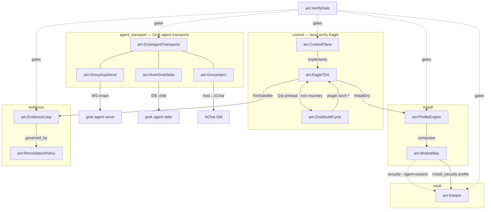

# arch-machine — ontology viz

Evidence: [docs/archy.md](../../docs/archy.md) · [docs/groxy.md](../../docs/groxy.md) · `tools/archy` jobs · `modules/security/install.sh` (2026-07-22).

## Do not confuse

| Surface | Is | Is not |
|---------|----|--------|
| **archy** (local Eagle TUI) | Menu → satellites → NEXT; `G`/`p` opens **Grok Build** with preload; exit returns to archy | Remote phone/laptop control |
| **GrokBuildCycle** | Plugin `/arch-*` ↔ archy handoff | groxy |
| **groxy acp serve** | Long-lived WS remote control of a cwd | archy co-pilot; Neovim daily path |
| **Neovim stdio** | avante spawns `grok agent stdio` | Needs `acp serve` |
| **groxy inject** | Host → XChat **notify** only | Inbound DM control |

Intent → start: [INDEX.md](INDEX.md).
