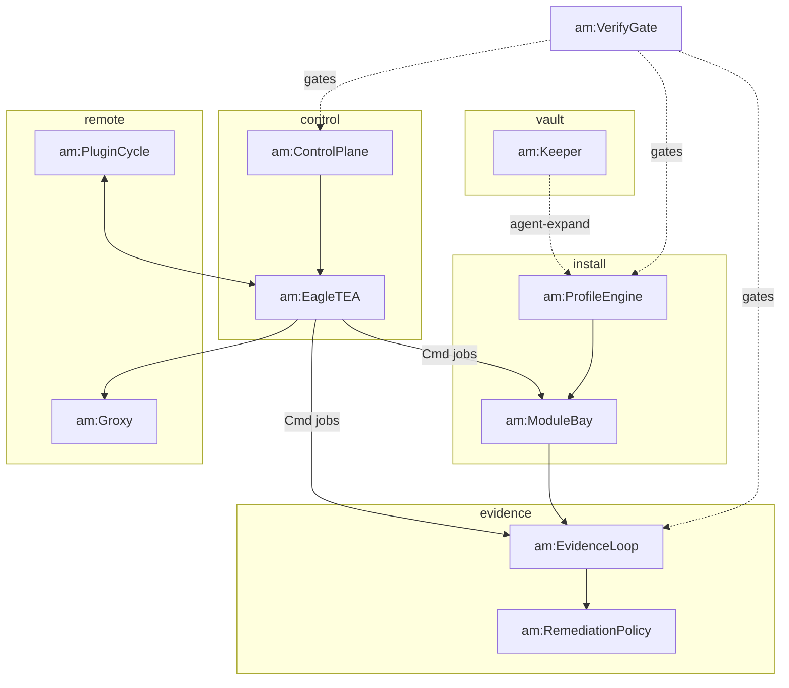

# arch-machine — ontology viz

```mermaid
flowchart TB
  subgraph control["control"]
    Eagle[am:EagleTEA]
    CP[am:ControlPlane]
  end
  subgraph install["install"]
    PE[am:ProfileEngine]
    MB[am:ModuleBay]
  end
  subgraph evidence["evidence"]
    EL[am:EvidenceLoop]
    RP[am:RemediationPolicy]
  end
  subgraph remote["remote"]
    GX[am:Groxy]
    PL[am:PluginCycle]
  end
  subgraph vault["vault"]
    KP[am:Keeper]
  end
  VG[am:VerifyGate]

  CP --> Eagle
  Eagle -->|Cmd jobs| MB
  Eagle -->|Cmd jobs| EL
  PE --> MB
  MB --> EL
  EL --> RP
  Eagle --> GX
  PL <--> Eagle
  KP -.->|agent-expand| PE
  VG -.->|gates| CP
  VG -.->|gates| PE
  VG -.->|gates| EL
```

Intent → start: see [INDEX.md](INDEX.md).
