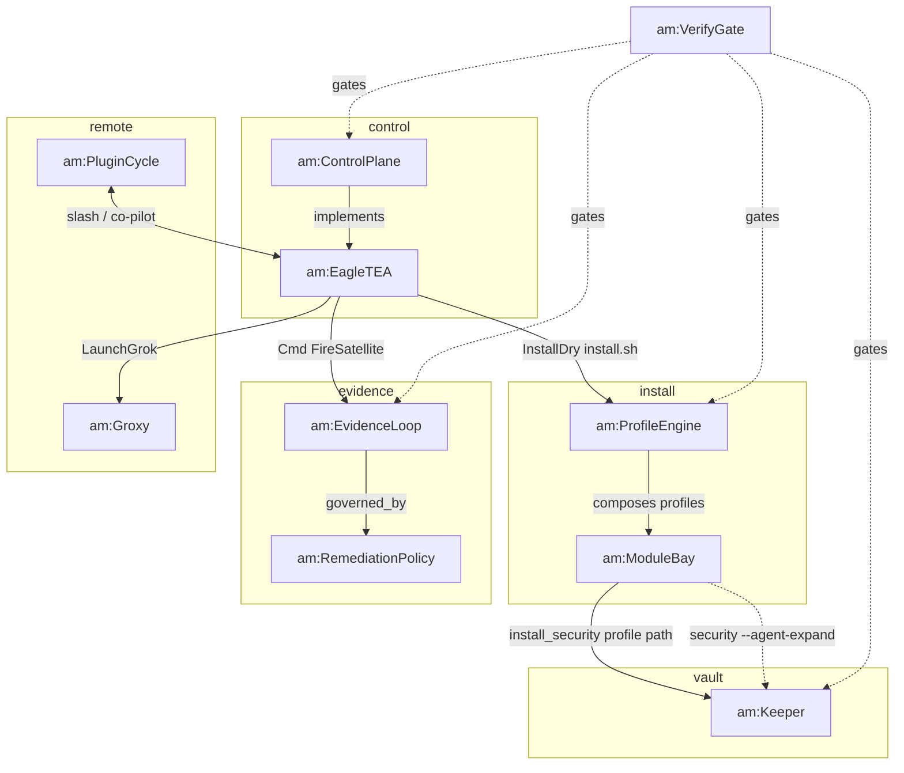

# arch-machine — ontology viz

Evidence-checked against `tools/archy` jobs + `modules/security/install.sh --agent-expand` (2026-07-22).

**Not an edge:** Keeper → ProfileEngine. `--agent-expand` is the **security module** standalone entry; it builds/installs `tools/keeper`. It does **not** call ProfileEngine.

Intent → start: see [INDEX.md](INDEX.md).
