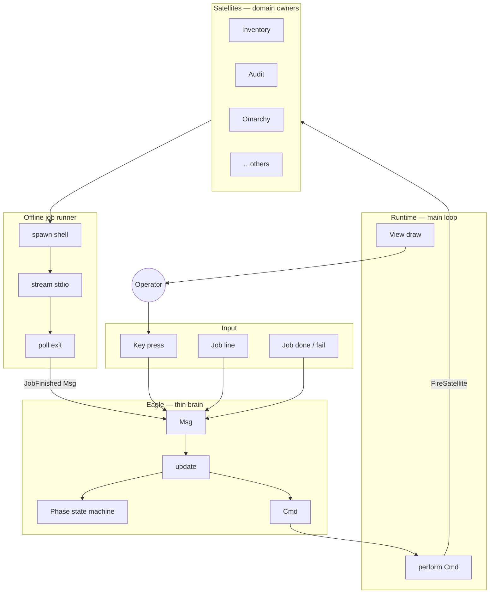
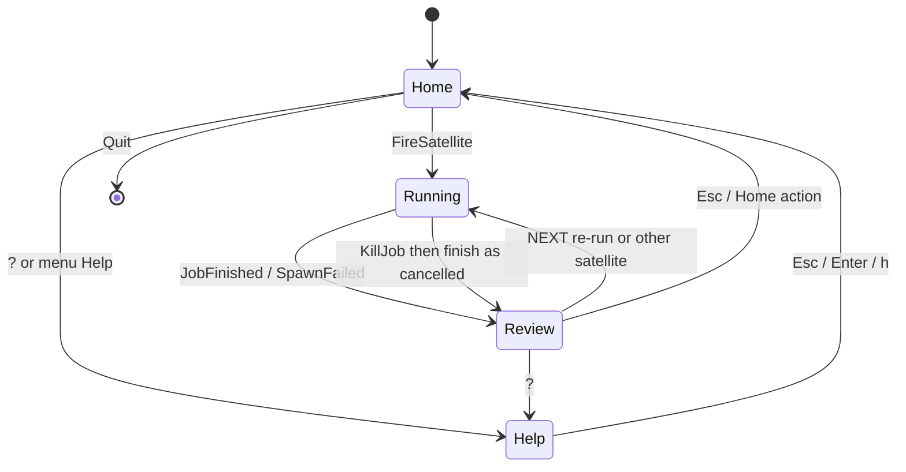
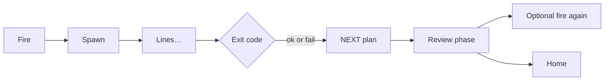
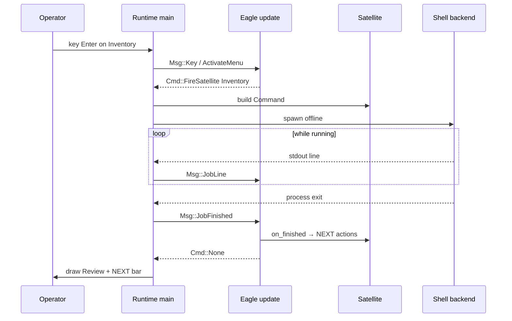
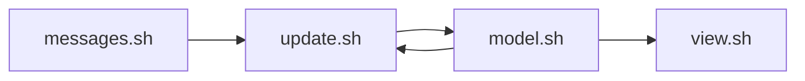

# Machine graph — Eagle, satellites, Elomaxz messages

Simple English reference for agents and humans. Implementation: `crates/archy`.

## 1. Big picture



## 2. Phase state machine (xstate-style)



| State | Meaning in plain English |
|-------|--------------------------|
| Home | You pick what to run |
| Running | A script is working; lines scroll |
| Review | Script finished; pick the next best step |
| Help | Long help text only |

## 3. One offline job DAG



No heartbeat. Eagle does **not** watch the process every tick for “liveness stories” — it drains lines and polls exit.

## 4. Message → command (Elomaxz / TEA)



## 5. File map (read like the diagram)

```text
crates/archy/src/
  main.rs          Runtime host (draw, perform, poll)
  eagle.rs         update(Msg) → Cmd
  fsm.rs           Phase states
  msg.rs           Events
  cmd.rs           Effects
  app.rs           Model / context + perform
  satellites/      Domain owners + MENU registry
  jobs.rs          Offline spawn + stream + poll
  actions.rs       NEXT action types + inventory hints
  ui.rs            View only
  nav.rs           Pure focus helpers
  theme.rs         Light/dark palettes
```

## 6. Gum TEA twin



Same idea: messages in, model change, view out — no drawing inside update.
