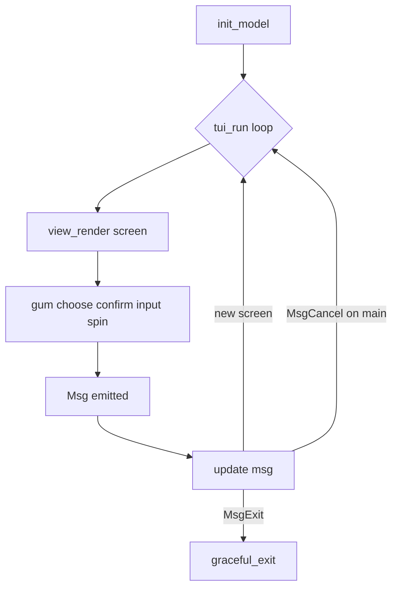

# TUI Gum Fix + Elm Architecture + Full-Terminal Overlay

## Root cause (Remediation crash)

In [`lib/tui.sh`](lib/tui.sh), line 12 stores a command in a string and lines 131/193 invoke it unquoted (`$GUM_CONFIRM`). Bash word-splits `"Yes, I am vigilant enough"` so `gum` receives `am` as a stray argument.

**Fix:** remove `GUM_CONFIRM` string; call a function with properly quoted args:

```bash
gum_confirm_vigilant() {
  gum confirm --affirmative "Yes, I am vigilant enough" --negative "Abort, the aliens win"
}
```

## Architecture: Elm (TEA) in bash + gum

Refactor the monolithic [`lib/tui.sh`](lib/tui.sh) into a **Model → View → Update** loop. This replaces the current nested `main_menu` / `run_*_flow` call stack with explicit state transitions — stable UX without the ad-hoc wrappers that broke flows previously.



### File layout

| File | Role |
|------|------|
| [`lib/tui.sh`](lib/tui.sh) | Entry: `find_root`, source modules, `tui_run`, trap |
| [`lib/tui/model.sh`](lib/tui/model.sh) | **Model** — state init and accessors |
| [`lib/tui/messages.sh`](lib/tui/messages.sh) | **Msg** — event constants (`MsgMainSelect`, `MsgCancel`, `MsgConfirm`, `MsgBack`, …) |
| [`lib/tui/view.sh`](lib/tui/view.sh) | **View** — presentation + gum rendering per screen |
| [`lib/tui/update.sh`](lib/tui/update.sh) | **Update** — pure transitions + side-effect dispatch |

`install.sh` already copies `lib/*` recursively to `/usr/share/tinfoil/lib/` — no install changes needed. [`bin/tinfoil.go`](bin/tinfoil.go) still launches `lib/tui.sh`.

---

## Model

Central session state (bash globals or a single associative array namespace `TUI_*`):

```bash
TUI_SCREEN=main          # current screen id
TUI_PREV_SCREEN=         # for MsgBack
TUI_MSG=                 # last event from view

# Per-flow fields (set only when relevant)
TUI_AUDIT_MODE=          # global | project
TUI_AUDIT_TARGET=.
TUI_INSTALL_PROFILE=
TUI_INSTALL_DRY_RUN=true
TUI_EVIDENCE_SCOPE=
TUI_EVIDENCE_TARGET=
TUI_VIGILANCE_LEVEL=
```

**Screen ids** (replace `run_*_flow` functions):

- `main`
- `audit_mode` → `audit_confirm` → `audit_running` → `audit_done`
- `remediation_policy` → `remediation_confirm` → `remediation_kill` → `remediation_done`
- `install_profile` → `install_modules` → `install_mode` → `install_running`
- `evidence_scope` → `evidence_confirm` → `evidence_running`
- `maintenance_menu` → `maintenance_running`
- `logs_browse`
- `settings_level` → `settings_verbose`
- `exit`

`model_init()` sets defaults; `model_goto(screen)` updates `TUI_PREV_SCREEN` + `TUI_SCREEN`.

---

## View

All gum I/O and rendering lives here. **No state transitions** — views emit messages only.

### Presentation (overlay)

In `view.sh`, shared helpers (Omarchy-inspired):

- `tui_init_screen()` — `stty size </dev/tty`, set `TUI_PANEL_WIDTH`, export `GUM_*_PADDING` env vars
- `tui_clear_screen()` — full-terminal clear (`\033[H\033[2J`)
- `tui_screen(title, ...)` — cleared canvas + full-width bordered panel (`--width "$TUI_PANEL_WIDTH"`)
- `tui_status(level, msg)` — inline status line

Every `view_*` function starts with `tui_clear_screen` + `tui_screen` header so each screen feels like a full-terminal overlay.

### View functions (one per screen)

```bash
view_main() {
  tui_screen "The Good Sentinel" "v0.2.0-sentinel + gum edition" ...
  choice=$(gum choose ...) || { TUI_MSG=MsgCancel; return; }
  TUI_MSG="MsgMainSelect:$choice"
}

view_remediation_policy() { ... }
view_remediation_confirm() { gum_confirm_vigilant || { TUI_MSG=MsgDeny; return; }; TUI_MSG=MsgConfirm; }
```

**Esc handling:** views set `TUI_MSG=MsgCancel` on gum cancel; they never exit the process. No global `set -e` removal needed if cancel paths assign `TUI_MSG` and `return` before a failing exit.

---

## Update

Single dispatcher; **no gum calls** here (keeps logic testable and predictable):

```bash
update() {
  case "$TUI_MSG" in
    MsgCancel)
      case "$TUI_SCREEN" in
        main) ;;                          # stay on main
        *) model_goto "${TUI_PREV_SCREEN:-main}" ;;
      esac
      ;;
    MsgMainSelect:*)
      local choice="${TUI_MSG#MsgMainSelect:}"
      case "$choice" in
        *"Remediation"*) model_goto remediation_policy ;;
        *"Security Audit"*) model_goto audit_mode ;;
        ...
      esac
      ;;
    MsgConfirm)  ... # advance within current flow
    MsgDeny)     ... # abort sub-flow → main
    MsgBack)     model_goto "${TUI_PREV_SCREEN:-main}"
    MsgExit)     graceful_exit
  esac
}
```

Existing side-effect logic (tinfoil audit, install.sh dry-run, security-audit.sh --help, weekly-check, etc.) moves into **update handlers** for the relevant `*_running` screens, preserving current behavior verbatim.

### Runtime loop

```bash
tui_run() {
  model_init
  tui_init_screen
  while [[ "$TUI_SCREEN" != "exit" ]]; do
    "view_${TUI_SCREEN}"   # sets TUI_MSG
    update "$TUI_MSG"
  done
}
```

Replace current `banner; main_menu` entry with `tui_run`.

---

## Mapping from current code

| Current function | Becomes |
|------------------|---------|
| `banner()` + `main_menu()` loop | `view_main` + `update` MsgMainSelect |
| `run_audit_flow()` | screens `audit_*` + update transitions |
| `run_remediation_flow()` | screens `remediation_*`; `gum_confirm_vigilant` in `view_remediation_confirm` |
| `run_installer_flow()` | screens `install_*`; vigilant confirm in `view_install_mode` |
| `run_evidence_flow()` | screens `evidence_*` |
| `run_maintenance_flow()` | screens `maintenance_*` |
| `browse_logs()` | `view_logs_browse` |
| `vigilance_settings()` | screens `settings_*` |
| `graceful_exit()` | `MsgExit` → unchanged goodbye view |

---

## What we explicitly avoid (learned from revert)

- Removing `set -e` globally — cancel paths handled in View via `|| { TUI_MSG=MsgCancel; return; }`
- Blanket `gum_choose` wrappers replacing every gum call outside View
- `read`-based pauses between screens
- Changing `find_root()` behavior
- Go/bubbletea deps — stays pure bash + gum

---

## Verification

1. `bash -n lib/tui.sh lib/tui/*.sh`
2. Remediation: confirm prompt works (no `unexpected argument am`)
3. Esc on main menu → stays in TUI (`MsgCancel` → remain on `main`)
4. Esc in sub-screens → `MsgBack` / return to main (not process exit)
5. All 7 main-menu flows reachable; each opens on cleared full-width screen
6. `sudo ./install.sh && tinfoil tui` — installed tree includes `lib/tui/*.sh`
