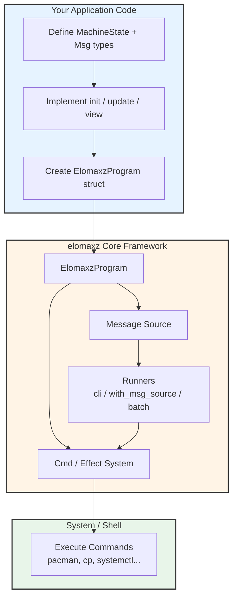

# Detailed Implementation Plan: Integrate elomaxz into arch-machine

**Target**: Make this plan clear enough that **any model** (Grok, Composer 2.5, Claude, etc.) can implement it cleanly and correctly.

**Project**: arch-machine (https://github.com/p10ns11y/arch-machine)
**Goal**: Replace complex shell logic with a clean, predictable, hybrid C core using elomaxz.

---

## 1. High-Level Goals

1. Make `arch-machine` more **maintainable** and **testable**
2. Use **elomaxz** as the **core state machine** for installation, maintenance, and auditing
3. Keep **Go** (`tinfoil`) as the user interface layer
4. Keep **Shell** only for actual system command execution
5. Follow **Functional Core + Imperative Shell** + **MVU** pattern
6. Use modern build practices (CMake FetchContent recommended)

---

## 2. Recommended Architecture



```
Go (bin/tinfoil.go)
   ↓ (calls via cgo or separate binary + JSON)
elomaxz Core (C)
   ├── ElomaxzProgram
   ├── MachineState (Model)
   ├── Msg types
   └── Cmd system (executes shell commands safely)
   ↓
Shell Commands (pacman, cp, systemctl, etc.)
```

---

## 3. Build System Options (Updated 2026)

| Option                    | Recommendation                          | When to Choose |
|---------------------------|-----------------------------------------|----------------|
| **CMake + FetchContent**  | **Best long-term choice**               | Clean, modern, reproducible |
| **Git Submodule**         | Good middle ground                      | Simple git-based workflow |
| **Manual Copy**           | Acceptable for early experiments        | Quick prototyping |

**Recommended**: Start with **CMake + FetchContent** (most future-proof).

---

## 4. Phased Implementation Plan

### Phase 1: Project Setup & Build System

#### Option A: CMake + FetchContent (Recommended)

Create `CMakeLists.txt` in project root:

```cmake
cmake_minimum_required(VERSION 3.20)
project(arch-machine LANGUAGES C)

include(FetchContent)

FetchContent_Declare(
    elomaxz
    GIT_REPOSITORY https://github.com/yourusername/elomaxz.git
    GIT_TAG        v0.3
    GIT_SHALLOW    TRUE
)

FetchContent_MakeAvailable(elomaxz)

add_executable(arch-machine
    src/main.c
    core/machine_core.c
)

target_link_libraries(arch-machine PRIVATE elomaxz)
target_include_directories(arch-machine PRIVATE
    ${elomaxz_SOURCE_DIR}/include
    include
)
```

#### Option B: Git Submodule (Alternative)

```bash
git submodule add https://github.com/yourusername/elomaxz.git core/elomaxz
```

Then add to your existing `Makefile` or create a simple build script.

---

### Phase 2: Core State Machine (Highest Priority)

#### Step 2.1: Define Data Structures

Create `include/machine_state.h`:

```c
typedef struct {
    char profile[32];           // "minimal", "ml-dev", "security-dev"
    bool fresh_install;
    int packages_installed;
    SecurityLevel security_level;
    AuditStatus last_audit;
    // Extend as needed
} MachineState;

typedef enum {
    MSG_APPLY_PROFILE,
    MSG_INSTALL_PACKAGES,
    MSG_RUN_AUDIT,
    MSG_MAINTENANCE_CYCLE,
    MSG_GENERATE_EVIDENCE,
} MsgType;

typedef struct {
    MsgType type;
    char profile[32];
    // Add payload as needed
} Msg;
```

#### Step 2.2: Implement Core Functions

Create `core/machine_core.c`:

- `MachineState init_machine_state(void)`
- `MachineState update_machine_state(MachineState current, Msg msg, Cmd* cmds, size_t* n)`
- `void view_machine_state(MachineState state)`
- `const char* machine_msg_name(Msg msg)`
- `void free_machine_state(MachineState state)`

#### Step 2.3: Create Main Entry Point

Create `core/arch_machine.c`:

```c
#include "elomaxz.h"
#include "machine_state.h"

int main(void) {
    ElomaxzProgram prog = {
        .init       = init_machine_state,
        .update     = update_machine_state,
        .view       = view_machine_state,
        .msg_name   = machine_msg_name,
        .free_model = free_machine_state,
        .debug      = true,           // Enable during development
    };

    elomaxz_run_with_msg_source(&prog, get_next_command, NULL);
    return 0;
}
```

---

### Phase 3: Integration with Go (`tinfoil`)

**Recommended Approach** (Start Simple):

1. Build `elomaxz` as a separate binary
2. Call it from Go using `exec.Command()` + JSON communication
3. Later migrate to **cgo** for tighter integration

---

### Phase 4: Move Logic from Shell to C

Priority order for migration:

1. Profile application logic (`install.sh`)
2. Maintenance cycle logic
3. Security audit + remediation
4. Evidence generation

Use the `Cmd` system to safely execute shell commands.

---

### Phase 5: Testing & Documentation

- Unit test the `update()` function with various messages
- Add `.debug = true` during development
- Document the new message types in `docs/`

---

## 5. Final File Structure (After Integration)

```
arch-machine/
├── CMakeLists.txt                 ← NEW (recommended)
├── bin/
│   └── tinfoil.go                 ← Keep (Go frontend)
├── core/                          ← NEW
│   ├── include/
│   │   ├── machine_state.h
│   │   └── elomaxz.h              ← From FetchContent or submodule
│   ├── src/
│   │   ├── machine_core.c
│   │   └── arch_machine.c
│   └── CMakeLists.txt             ← Optional
├── modules/                       ← Keep (shell command modules)
├── maintenance/
├── legacy/                        ← Original shell scripts (for reference)
└── docs/
```

---

## 6. Key Design Decisions

| Decision                    | Recommendation                              | Reason |
|----------------------------|---------------------------------------------|--------|
| Build System               | CMake + FetchContent (preferred)            | Modern, clean, reproducible |
| State Management           | `ElomaxzProgram` + `MachineState`           | Predictable + easy to debug |
| Shell Commands             | Execute only via `Cmd` system               | Clean separation of concerns |
| Go Integration             | Start with separate binary + JSON           | Simpler, then upgrade to cgo |
| Profile Logic              | Move into `update()` function               | Single source of truth |

---

## 7. Implementation Order (for any model)

1. Choose build system (**CMake + FetchContent** recommended)
2. Set up directory structure (`core/`)
3. Define `MachineState` and `Msg` types
4. Implement `init()`, `update()`, `view()` functions
5. Create main entry point (`arch_machine.c`)
6. Test with simple profile application
7. Connect from Go `tinfoil`
8. Gradually migrate shell logic into C

---

## 8. Success Criteria

- Core installation and maintenance logic lives in `update()` function
- State changes are predictable and debuggable (`.debug = true`)
- `tinfoil` can trigger actions through messages
- Shell is used **only** for actual command execution
- The codebase becomes significantly easier to test and maintain

---

**This plan is designed to be unambiguous and future-proof.** Any competent model can follow it step-by-step.

*Updated: May 2026 — Includes CMake FetchContent support*