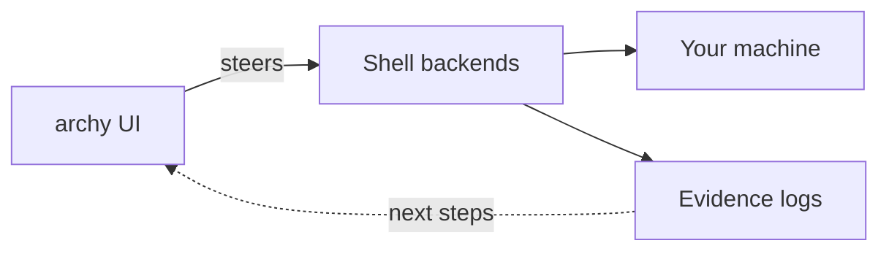

# arch-machine


Arch Linux workstation toolkit steered by **`archy`**: thin install first, then optional YAML profiles for ML/AI and security. Shell backends do the work; evidence closes the loop. Works well on Omarchy.

[](https://github.com/p10ns11y/arch-machine/actions/workflows/ci.yml)

For lore and humor, see [FUNREADME.md](FUNREADME.md). Safety: [SAFETY.md](SAFETY.md). Roadmap: [arch-design/coming-next.md](arch-design/coming-next.md). Control plane: [docs/archy.md](docs/archy.md) (`tools/archy`). XChat remote control: [docs/groxy.md](docs/groxy.md) (`tools/groxy`, `bin/groxy`).

## How it fits together



**archy** shows a menu, runs a script, then highlights the **next** useful action.  
It does not reimplement pacman logic in Rust.

## What you can use this for

| Goal | Path |
|------|------|
| Interactive control plane | `archy` (or `make archy` from this repo) |
| Full ML/AI workstation | `./install.sh --profile ml-dev` |
| Security-focused workstation | `./install.sh --profile security-dev` |
| Light base tools only | `./install.sh --profile minimal` |
| Inventory / ownership | `./maintenance/inventory.sh --json` (also in archy menu) |
| Omarchy host status | `./maintenance/omarchy-status.sh` |
| XChat DM remote control | `./bin/groxy` (see [docs/groxy.md](docs/groxy.md)) |
| Search tools & profiles | `./maintenance/catalog.sh docker` |
| Package change plan (dry-run) | `./maintenance/package-actuate.sh --update jq` |
| Security audit | `./maintenance/security-audit.sh` |
| Evidence bundles | `./maintenance/extract-evidence.sh` |
| Weekly updates + scans | `maintenance/systemd-setup.sh setup` |

Primary target: **Arch Linux** (including Omarchy). Not a multi-distro installer.

## Prerequisites

- Arch Linux, network, `sudo`, `git`
- **Rust / cargo** for `archy` (main controller)
- `yq` or `jq` when needed (often auto-installed)

Review [SAFETY.md](SAFETY.md) before `security-dev`.

## Install

### A — Thin runtime + control plane (recommended first)

```bash
git clone https://github.com/p10ns11y/arch-machine.git
cd arch-machine
chmod +x install.sh

./install.sh
# same as: ./install.sh --thin

# Main controller (until SN-ARCHY-1 ships archy on PATH from thin install):
make archy
TINFOIL_ROOT="$PWD" ./tools/archy/target/debug/archy
```

`./install.sh --thin` installs the shared runtime under `/usr/share/tinfoil/` (backends + profiles). Day-1 interaction is **`archy`**, not the optional Go shim.

### B — Full workstation profile

```bash
./install.sh --list-profiles
./install.sh --show-profile ml-dev
./install.sh --profile ml-dev --dry-run
./install.sh --profile minimal|ml-dev|security-dev
```

After a full profile:

```bash
# Log out/in if groups changed (docker, ROCm, …)
maintenance/systemd-setup.sh setup
```

### Flags

| Flag | Meaning |
|------|---------|
| (none) / `--thin` | Thin runtime (default) |
| `--profile NAME` | Full profile install |
| `--dry-run` | Full-profile preview (pair with `--profile`) |
| `--validate` | Readiness checks only |
| `--tui` | Launch control plane (archy if present, else gum legacy) |

## Usage by job

### Control plane

```bash
make archy
TINFOIL_ROOT="$PWD" ./tools/archy/target/debug/archy
# after SN-ARCHY-1 / when on PATH:
archy
```

```text
Home → run job → watch output → NEXT bar → Home
```

Keys: ↑↓ select · Enter run · `g` brief · `G`/`p` Grok · `?` help · `q` quit.  
Simple guide: [docs/archy.md](docs/archy.md) · crate: [tools/archy/README.md](tools/archy/README.md).

### Backends (scripts archy steers)

```bash
./maintenance/inventory.sh --json
./maintenance/omarchy-status.sh
./maintenance/catalog.sh docker
./maintenance/package-actuate.sh --update jq    # dry-run default
./maintenance/security-audit.sh
./maintenance/extract-evidence.sh --dry-run
```

Omarchy playbook: [docs/omarchy.md](docs/omarchy.md).

### Profiles

- **minimal** — git, mise (python/node/rust), essentials
- **ml-dev** — + ROCm, conda (`ai_amd`, `xai_exp`), data science
- **security-dev** — + vault, k8s/security tooling, scanners

See [docs/INSTALLATION.md](docs/INSTALLATION.md) · [docs/MODULES.md](docs/MODULES.md).

## Verify

```bash
./install.sh --validate
make validate-profiles
make archy
./tools/archy/target/debug/archy --print-root
./maintenance/extract-evidence.sh --dry-run
```

## Project layout

```
arch-machine/
├── tools/archy/            # MAIN controller — Ratatui entry + loop
├── tools/groxy/            # XChat DM remote control (Eagle satellite, binary groxy)
├── maintenance/            # shell backends (iron peak)
├── install.sh              # thin default; --profile for full
├── config/profiles/        # minimal | ml-dev | security-dev
├── modules/                # system, development, ml_ai, security, …
├── lib/                    # installer, evidence, gum TUI (legacy)
├── bin/groxy               # launches tools/groxy binary
├── bin/tinfoil.go          # optional thin dispatcher (not the product)
└── docs/                   # start at docs/INDEX.md
```

## Remote surfaces (`groxy`) — any Grok workspace

groxy is **session-aware plumbing**, not “only arch-machine.” Several Grok TUIs can be open; **none listen to XChat** unless something **delivers a prompt** (ACP or human typing).

| Goal | How | Who is targeted? |
|------|-----|------------------|
| **Control** a Grok agent | `./bin/groxy acp serve --cwd /path/to/project` | **ACP client chooses** bind + session/cwd |
| **Notify** on XChat | `./bin/groxy --live inject "status" --session-label name` | Outbound only; label disambiguates multi-project |
| **DM → “the right TUI”** | *not productized* | Needs inbound transport **and** session registry/addressing |

```bash
make groxy-test
# Control this workspace via ACP (any project path):
./bin/groxy acp serve --cwd "$PWD"
# Notify (optional label when many projects share one X account):
export GROXY_ALLOW_SELF=1
./bin/groxy --live inject "status" --session-label arch-machine
```

Guide (routing model + **Neovim ACP setup**): [docs/groxy.md](docs/groxy.md).

```text
ACP client ── picks agent/cwd ──► grok agent serve ──► that workspace   ✅
inject [--session-label] ──► XChat notify                               ✅
Phone DM ──► “which of my 3 Grok windows?”                              ❌ no ambient listeners
```

## Documentation

- [docs/archy.md](docs/archy.md) — control plane in simple English + diagrams (incl. **Grok plugin ↔ archy** cycle)
- [docs/groxy.md](docs/groxy.md) — XChat DM remote control + multi-Grok routing
- Grok plugin (slash `/arch-*`): [p10ns11y/plugins](https://github.com/p10ns11y/plugins) → `arch-machine/`; local `~/Work/personal/plugins/arch-machine` · `docs/CROSS-REF.md`
- [docs/INDEX.md](docs/INDEX.md) — architecture index
- [arch-design/coming-next.md](arch-design/coming-next.md) — backlog
- [SAFETY.md](SAFETY.md) · [docs/INSTALLATION.md](docs/INSTALLATION.md) · [docs/MAINTENANCE.md](docs/MAINTENANCE.md)
- [docs/omarchy.md](docs/omarchy.md) · [docs/BACKUP.md](docs/BACKUP.md) · [docs/TROUBLESHOOTING.md](docs/TROUBLESHOOTING.md)
- [AUTHORS-MOTTO.md](AUTHORS-MOTTO.md)
- Agent skill: `.agents/skills/eagle-satellite-elomaxz/`

## License

See [LICENSE](LICENSE).

## Contributing

1. Fork and branch  
2. Prefer new capability in `maintenance/*.sh`, surfaces in `tools/archy`  
3. Verify with the commands above (`make lint` when touching shell/docs)  
4. Open a pull request  

See [docs/CONTRIBUTING.md](docs/CONTRIBUTING.md).
