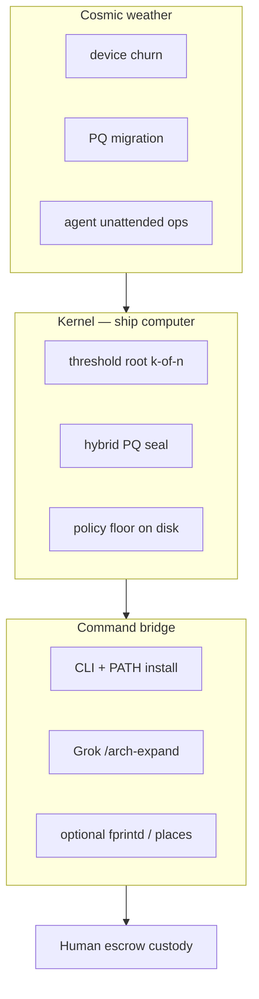
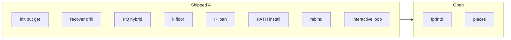
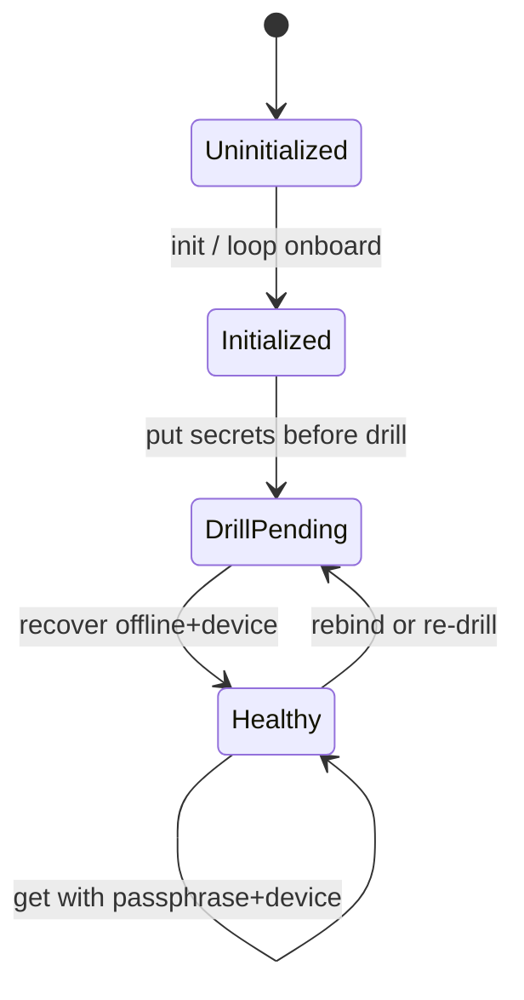
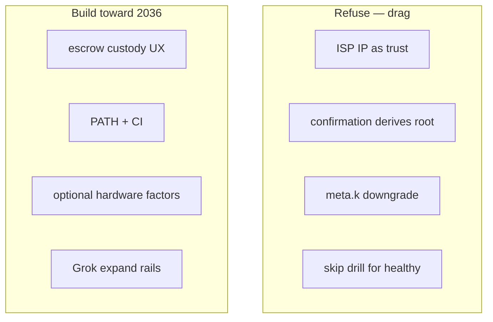
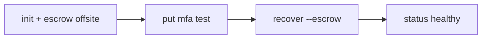
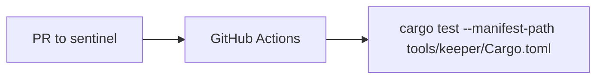
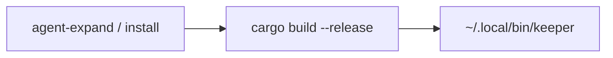
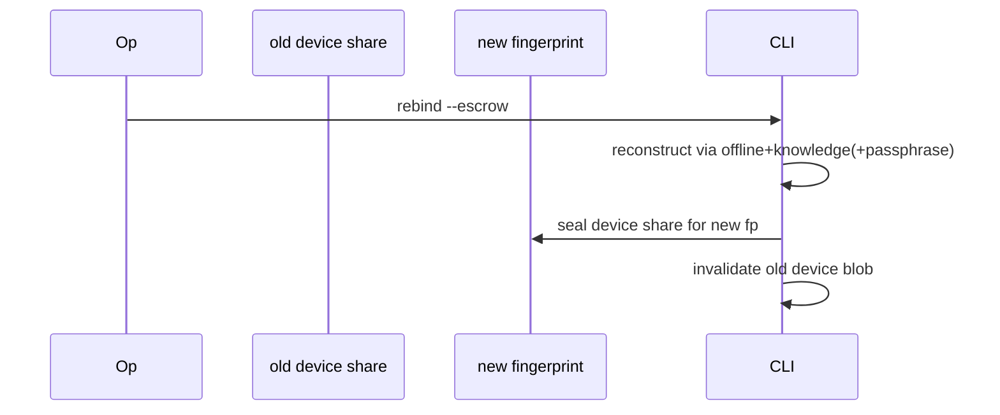
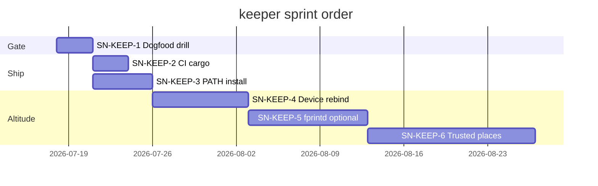
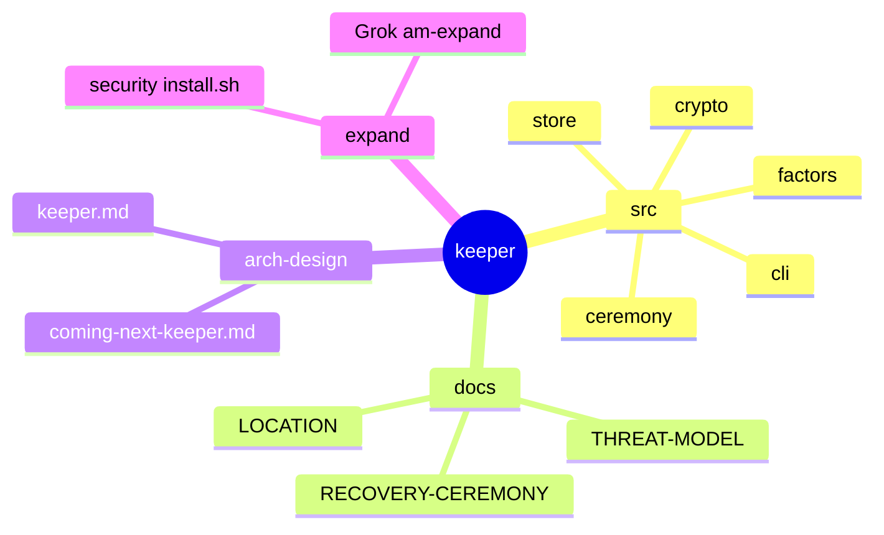

# Coming next — arch-machine keeper

**Audience:** You · implementer · agents  
**Style:** Short words. Diagrams over prose. Optimism grounded in evidence.  
**Contract:** [keeper architecture](./keeper.md) · [THREAT-MODEL](../tools/keeper/docs/THREAT-MODEL.md)  
**Method:** [stellar-roadmap](../.agents/skills/stellar-roadmap/SKILL.md) · collab-finder blueprint style  
**Parent backlog:** [coming-next.md](./coming-next.md)

*Last updated: 2026-07-21 · PATH · rebind · loop shipped*

---

## 0. Mission (one sentence)

Make **threshold multi-factor secrets** the default local vault for MFA/recovery material — drill-proven, PQ-sealed, agent-operable without gum theater.

---

## 0b. Ten-year thrive picture (2026–2036)



| Horizon | Outcome | Signal |
|---------|---------|--------|
| 2026 | Keeper MVP on `sentinel`; drill dogfood monthly | PR #28 merged; `cargo test` green |
| 2028 | PATH binary + CI; optional fprintd share | install target; workflow job |
| 2030 | Trusted places + multi-host re-bind ceremony | LOCATION.md phases shipped |
| 2036 | Agent-native vault ops under policy caps | expand + recover without gum TUI |

**Design bet:** threshold + offline escrow forever; biometric/GPS only as **share release**, never as root.

---

## 1. Scorecard — what landed



| Area | Grade | One line | Evidence |
|------|-------|----------|----------|
| Ceremony CLI | A | init/put/get/status/recover/rebind/loop | `ceremony.rs`, `cli.rs`, `interactive.rs` |
| Threshold | A | **k=2 n=3** default (any 2 of P/O/D); optional n=4 Yubi | `crypto.rs`, tests |
| PQ seal | A | ML-KEM-768 + AES-GCM | `crypto.rs` |
| Downgrade resist | A | effective_threshold | unit tests |
| Docs | A | threat + ceremony + operator + README | `docs/*`, README |
| Agent expand | A | release build + `~/.local/bin/keeper` | `modules/security/install.sh` |
| Device rebind | A | P+O → reseal device; old fp fails | `rebind_device` |
| Interactive loop | A | non-echo onboard; no argv secrets | `keeper loop` |
| CI | A | keeper job in CI | `.github/workflows/ci.yml` |
| Extra factors | — | fprintd/GPS deferred | THREAT-MODEL |

**Historical note:** Early drafts mentioned k=3 + knowledge factor. That is **not** the shipped default. Trust OPERATOR-MODEL + README.

**Plain rule:** Healthy status means the offline drill already worked once.

---

## 2. System map (today)

See [keeper.md §2](./keeper.md) — CLI → crypto plane → `KEEPER_ROOT` + escrow file.

---

## 3. Precedence: reconstruct paths



| Path | Shares | Opens |
|------|--------|-------|
| Daily | passphrase + device | secrets |
| Drill/recover | offline + device | canary → healthy |
| New machine | passphrase + offline → rebind → new device | resealed vault |

---

## 4. Musk five-step — backlog

| Step | Question | Verdict |
|------|----------|---------|
| 1 Question | Why no PATH install? | Dogfood friction blocks monthly drill |
| 2 Delete | Classical-only seal path | Already rejected — keep dead |
| 3 Simplify | One `keeper` binary install | `cargo install --path` or module install hook |
| 4 Accelerate | CI `cargo test` | Catch GF/PQ regressions on PR |
| 5 Automate | Calendar reminder for drill | later; human escrow first |

---

## 5. Trajectory forces

| Force | P(horizon) | Effect | Response |
|-------|------------|--------|----------|
| PQ urgency | high 2026–28 | classical AEAD break risk | hybrid seal already on |
| Agent unattended | med | env passphrase leakage | files + TTY; no argv secrets |
| Device reimage | high | fingerprint change | re-bind ceremony (SN-KEEP-3) |
| Biometric hype | med | fake 1FA theater | fprintd as share only |

**Acceleration trigger:** after monthly personal drill succeeds twice on production MFA blob.

---

## 6. Trajectory guardrails



| Refuse | Build |
|--------|-------|
| Public IP / GeoIP trust | LOCATION.md ban + weight 0 |
| k&lt;3 via disk edit | effective_threshold floor |
| Auto-full security-dev | Grok expand module only |
| Legacy vault undelete myth | new keeper init |

---

## 7. Blueprint cards

### SN-KEEP-1 · Dogfood recover drill (no new code) · **operator process**

**Problem:** Ceremony only real if operator runs recover without passphrase on a live escrow.



| File | Work |
|------|------|
| `tools/keeper/README.md` | already documents path |
| operator escrow path | store offline share off-laptop |

**Done when:** `status` reports healthy after no-passphrase recover; canary open.

**Verify:** (default **k=2 n=3** — passphrase + escrow share; no `KEEPER_KNOWLEDGE` required)
```bash
cd tools/keeper
export KEEPER_ROOT=/tmp/keeper-dogfood KEEPER_PASSPHRASE='dogfood-pass'
cargo run --quiet -- init --escrow /tmp/keeper-escrow.json
cargo run --quiet -- put demo --value 'x'
unset KEEPER_PASSPHRASE
cargo run --quiet -- recover --escrow /tmp/keeper-escrow.json   # prompts / uses escrow share
cargo run --quiet -- status   # healthy
```

### SN-KEEP-2 · CI cargo test job · **shipped**

**Problem:** Shamir/PQ regressions only caught locally.



| File | Work |
|------|------|
| `.github/workflows/ci.yml` | add `keeper` job (stable Rust) |
| `tools/keeper/` | keep tests offline/no network |

**Done when:** CI red if `cargo test` fails on keeper.

**Verify:** open PR with deliberate test fail → job fails; revert.

### SN-KEEP-3 · Install to PATH (`~/.local/bin/keeper`) · **shipped**

**Problem:** `cargo run` friction kills dogfood.



| File | Work |
|------|------|
| `modules/security/install.sh` | `--agent-expand` optional install release binary |
| `tools/keeper/README.md` | PATH install section |

**Done when:** `command -v keeper` after expand/install; `keeper status` works.

**Verify:** expand security --yes on clean env; `keeper --help`

### SN-KEEP-4 · Device re-bind ceremony · **shipped** (`keeper rebind`)

**Problem:** Reimage / new machine breaks device share without guided re-seal.



| File | Work |
|------|------|
| `src/ceremony.rs` | `rebind` command |
| `docs/RECOVERY-CEREMONY.md` | rebind section |
| tests | rebind roundtrip |

**Done when:** after rebind, daily path works on new host; old device blob fails open.

**Verify:** unit test with two fingerprints.

### SN-KEEP-5 · Optional fprintd share release (not root)

**Problem:** Hardware confirm is useful UX; must not become 1FA root.

| File | Work |
|------|------|
| `src/factors.rs` | fprintd confirmation → release existing share slot or n+1 policy |
| THREAT-MODEL | document non-root role |

**Done when:** fprintd absent → graceful skip; present → may replace knowledge **only if** k still ≥3 with offline.

**Verify:** tests with mock confirmation; no path where fprint alone opens secrets.

### SN-KEEP-YUBI · Strong YubiKey share (shipped)

**Shipped:** `enroll-yubikey`, `get --yubi`, `yubi-probe`, `KEEPER_YUBI_MOCK_SECRET` + live `ykchalresp`. YubiKey HMAC-SHA1 is share release only; any-2-of-4 after enroll.

### SN-KEEP-6 · Trusted places enrollment (GPS companion)

**Problem:** LOCATION.md specifies places; not implemented.

| File | Work |
|------|------|
| `docs/LOCATION.md` | already bans IP |
| `src/factors.rs` | place confirmation when companion present |
| companion app/spec | out of crate initially |

**Done when:** place confirm weight documented; IP still weight 0.

**Verify:** unit tests reject IP-shaped confirmations.

---

## 8. Scope lock

| In | Out |
|----|-----|
| Local disk vault + escrow file | Cloud sync / autofill |
| Grok expand prep | Full k3s via expand |
| Hybrid PQ seal | Classical-only v1 recovery |
| Rebind + CI + PATH | Browser extension |

---

## 9. Gantt (suggested)



---

## 10. Monitoring signals

- PR #28 not merged while CI green → merge friction
- `cargo test` local red → block expand
- Operator never ran recover → status stuck drill-pending (expected)
- Escrow only on laptop → custody failure (process, not code)

---

## 11. Done log

| Item | Evidence |
|------|----------|
| Multi-factor keeper MVP | PR #28 `de7faf2` |
| Threshold floor / meta.k | PR #28 `2612f3f` |
| Grok plugin TUI docs | PR #28 `1ed01fe` |
| Module `--agent-expand` | PR #28 `e9c264a` |
| Rebase on sentinel #25 | force-push `e9c264a` |
| Grok plugin package | `p10ns11y/plugins` arch-machine |

---

## 12. File touch mindmap



---

## 13. References

| Source | Use |
|--------|-----|
| [keeper.md](./keeper.md) | Architecture + mermaid system map |
| [coming-next.md](./coming-next.md) | Global arch-machine backlog |
| [plugins/arch-machine](https://github.com/p10ns11y/plugins) | Agent-as-TUI |
| collab-finder [batch-2-blueprints](https://github.com/p10ns11y/collab-finder/blob/main/reports/batch-2-engineering-blueprints.md) | Card format |
| FIPS 203 ML-KEM | PQ KEM choice |

---

**Plain rule:** Offline escrow off the machine — or the threshold is theater.
