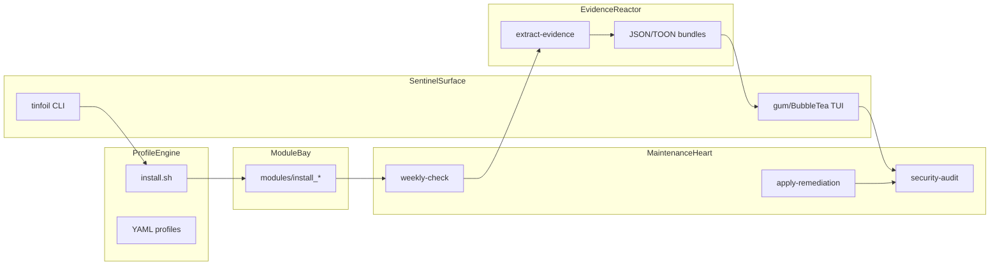
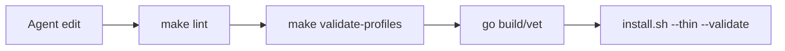
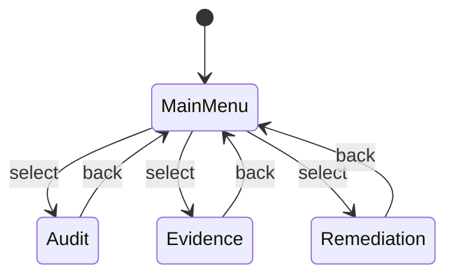
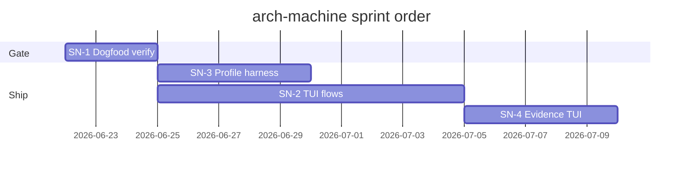

# coming-next — arch-machine architecture backlog

## §0 Mission

Ship and maintain a **thin-first, evidence-always, self-remediating** Arch Linux workstation guardian (`tinfoil`) with profile-driven ML/security modules.

## §0b Ten-year thrive picture

| Horizon | Outcome | Signal |
|---------|---------|--------|
| 2026 | TUI + evidence first-class; CI harness real | Issue #7 closed; profile harness green |
| 2028 | Autonomous weekly sentinel on fleet machines | systemd timer + evidence drift alerts |
| 2030 | Portable profile packs beyond Arch | adapter modules per distro |
| 2036 | Agent-native ops: bundles drive remediation plans | LLM consumes TOON without re-scout |

## §1 Scorecard

| Area | Grade | One line | Evidence |
|------|-------|----------|----------|
| Thin install | A- | Default `--thin` ships sentinel only | `install.sh`, README |
| tinfoil CLI | A | Global binary + subcommands | `bin/tinfoil.go`, merged PR #3 |
| TUI (Elm/gum) | B | Model/View/Update split; flows in progress | `lib/tui/*.sh`, Issue #7 |
| Profiles | B | YAML compose modules | `config/profiles/*.yaml` |
| Evidence | A- | JSON + TOON bundles | `maintenance/extract-evidence.sh`, `logs/` |
| Remediation policy | A | Repo applies own 6-step policy | `policies/security-remediation.md` |
| CI | B+ | shellcheck, go, yaml, evidence smoke | `.github/workflows/ci.yml` |
| Agent skills | B+ | Symlinked skills + overlays | `AGENTS.md`, `.agents/` |

## §2 System map today

See `docs/INDEX.md` mermaid. Runtime: `/usr/local/bin/tinfoil` + `/usr/share/tinfoil` copy of repo lib/modules/maintenance.

## §4 Musk 5-step on backlog

1. **Question** — CI profile validation still stubbed
2. **Delete** — root duplicate scripts (done per LEGACY)
3. **Simplify** — single module registry from `config/tools.yaml`
4. **Accelerate** — dogfood `make lint` in verification cockpit
5. **Automate** — weekly timer generates evidence without human

## §6 Guardrails

| Refuse | Build |
|--------|-------|
| Heavy install on `--thin` | Explicit `--profile` for ML/security |
| Destructive maintenance without confirm | gum + policy steps |
| Agent edits skill bodies in symlink target | Use `.agents/overlays/` |

## §7 Blueprint cards

### SN-1 · Dogfood verify gate (no new code)

**Problem:** Agents lack a single pre-PR command set.

| File | Work |
|------|------|
| `AGENTS.md` | document verify block |
| `Makefile` | keep targets stable |

**Done when:** All five commands exit 0 on sentinel branch.

**Verify:** `make lint && make validate-profiles && go build -o /tmp/tinfoil ./bin/tinfoil.go && ./install.sh --thin --validate`

### SN-2 · Complete TUI interactive flows

**Problem:** Issue #7 — menus must drive audit, remediation, evidence without raw shell.

| File | Work |
|------|------|
| `lib/tui/update.sh` | wire messages to maintenance scripts |
| `lib/tui/view.sh` | gum menus + confirms |
| `lib/tui/model.sh` | state for selected flow |

**Done when:** `tinfoil tui` runs audit + evidence list + remediation dry-run paths.

**Verify:** manual `tinfoil tui`; `shellcheck lib/tui/*.sh`

### SN-3 · Real profile validation harness

**Problem:** CI echoes stub; `includes[]` ↔ `install_<module>` not fully enforced.

| File | Work |
|------|------|
| `scripts/profile-validation-harness.sh` | assert symbols + module dirs |
| `.github/workflows/ci.yml` | fail job on harness failure |

**Done when:** CI fails on broken profile reference.

**Verify:** `make validate-profiles` in CI locally

### SN-4 · Evidence screen in TUI

**Problem:** CLI has `tinfoil evidence`; TUI parity missing.

| File | Work |
|------|------|
| `lib/tui/view.sh` | evidence list/latest UI |
| `bin/tinfoil.go` | shared helpers if needed |

**Done when:** Latest bundle preview visible in TUI.

**Verify:** `tinfoil tui` → Evidence shows `logs/evidence-bundle-*.json` tail

## §9 Gantt (suggested)

## §10 Monitoring signals

- CI red on `sentinel` branch
- `logs/evidence-bundle-*.json` age > 7d on active machines
- `tinfoil` version drift vs repo tag

## §11 Done log

| Item | Evidence |
|------|----------|
| tinfoil CLI shipped | PR #3 merge `2504e39` |
| Remediation policy | PR #4 merge `cb088cd` |
| Agent skills wired | `AGENTS.md`, `.agents/skills` symlinks |
| INDEX architecture doc | `docs/INDEX.md` |

## §13 References

| Source | Use |
|--------|-----|
| `docs/INDEX.md` | System map |
| `policies/security-remediation.md` | Boundary meta-rule |
| `AGENTS.md` | Agent verify + skills |
| `.agents/overlays/` | Repo-specific skill overlays |
| collab-finder [batch-2-blueprints](https://github.com/p10ns11y/collab-finder/blob/main/reports/batch-2-engineering-blueprints.md) | Card format |
| Skills library | `~/Work/personal/skills` symlinks |

---

**Plain rule:** Thin install, loud evidence, ruthless remediation — the sentinel must pass its own audit before it audits your machine.
