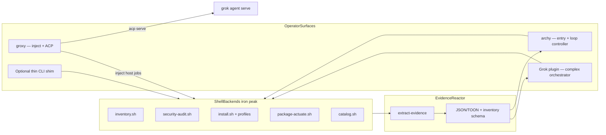
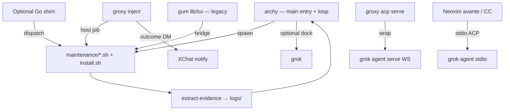
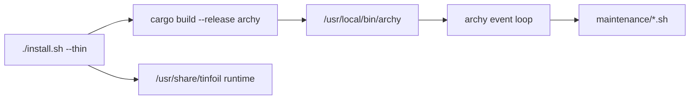
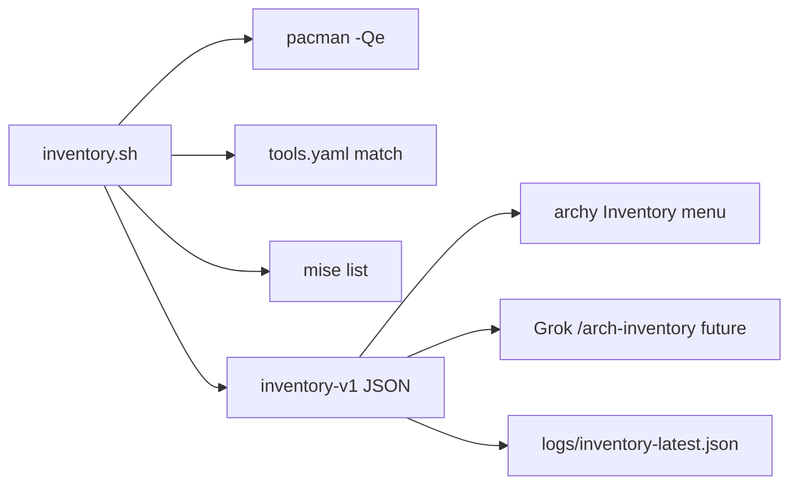
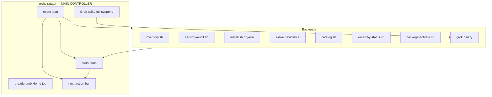
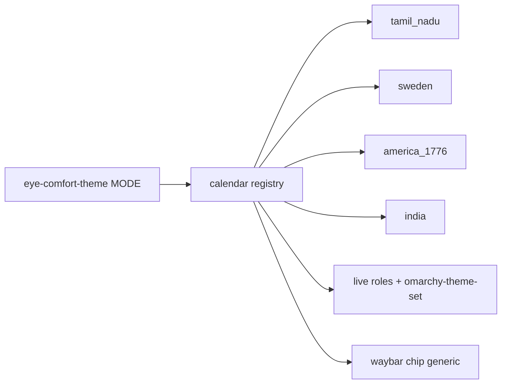
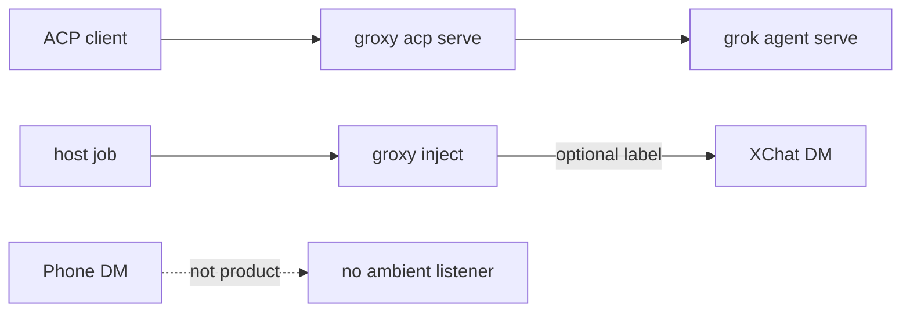
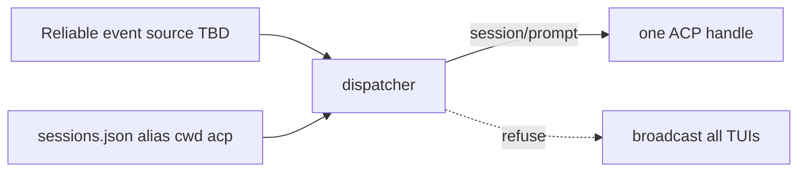
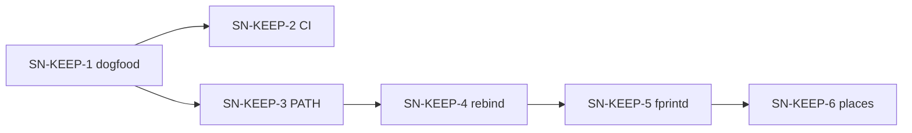
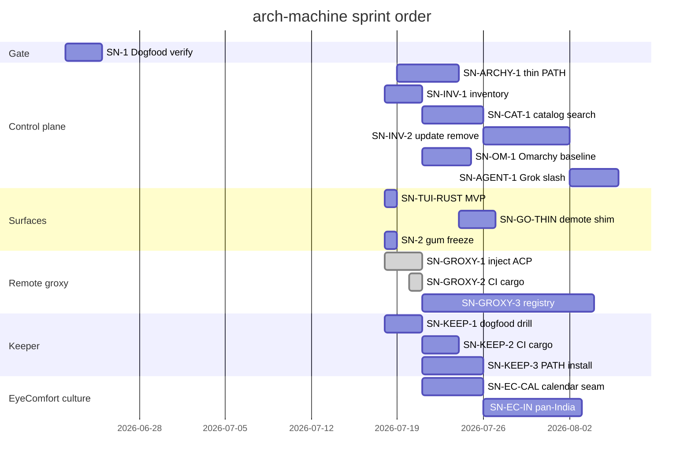

# coming-next — arch-machine architecture backlog

**Keeper deep-dive:** [keeper.md](./keeper.md) · [coming-next-keeper.md](./coming-next-keeper.md) (SN-KEEP-*)  
**Main control plane:** [`tools/archy`](../tools/archy/) (`archy` binary — entry + loop)  
**Remote surfaces:** [`tools/groxy`](../tools/groxy/) (`groxy` — inject notify + ACP serve) · [tools/groxy/README.md](../tools/groxy/README.md) · [docs/groxy.md](../docs/groxy.md)  
**Agent orchestration:** [p10ns11y/plugins](https://github.com/p10ns11y/plugins) `arch-machine/` (Grok slash)  
**Legacy:** gum `lib/tui/` · optional Go shim `bin/tinfoil.go` (dispatch only; not the product)

## §0 Mission

Ship and maintain a **thin-first, evidence-always, self-remediating** Arch Linux workstation platform steered by **`archy`** (Ratatui entry + loop), with shell backends as the iron peak, profile-driven ML/security modules, **session-aware remote surfaces** (`groxy`: ACP control + XChat notify), and a **threshold multi-factor keeper** for secrets that outlive passphrase loss.

## §0b Ten-year thrive picture

| Horizon | Outcome | Signal |
|---------|---------|--------|
| 2026 | **archy** on PATH from thin install; shell backends + inventory; Grok expand; gum frozen; **groxy inject+ACP** | SN-ARCHY-1; SN-INV-1; SN-GROXY-1 landed |
| 2028 | Autonomous weekly sentinel on fleet machines | systemd timer + evidence drift alerts |
| 2030 | Portable profile packs beyond Arch | adapter modules per distro |
| 2036 | Agent-native ops: bundles + keeper under policy; multi-session remote by registry | LLM consumes TOON; drill-proven vault; SN-GROXY-3 only if inbound exists |

**Surface bet (locked):** **`archy` is the main interactive controller** (entry + event loop + next actions + Grok dock). **Complex orchestration → Grok plugin.** **Remote control → ACP** (`groxy acp serve`); **remote notify → inject** (host→XChat). **Iron peak → `maintenance/*.sh` + `install.sh`.** Optional Go/`tinfoil` = thin subcommand shim only — shrink or exit once PATH/`archy` + shell cover day-1 jobs. Gum `lib/tui/` is a **legacy bridge**, not the product. **No ambient XChat→TUI listeners** without explicit session addressing.

## §1 Scorecard

| Area | Grade | One line | Evidence |
|------|-------|----------|----------|
| **archy control plane** | **B+** | Entry + loop MVP; menus steer shell backends | `tools/archy`, `make archy` |
| **archy on thin PATH** | **D** | MVP builds in-repo; thin install still ships Go shim only | `install.sh` → `/usr/local/bin/tinfoil`; no `archy` install yet |
| Thin install | A- | Default `--thin` ships sentinel runtime tree | `install.sh`, README |
| Shell backends | A- | Inventory/catalog/actuate/audit/evidence | `maintenance/*.sh` |
| Inventory backend | **B+** | Schema v1 + ownership tags | `maintenance/inventory.sh`, `config/baselines/omarchy.yaml` |
| Catalog search | **B** | Shell backend + archy menu | `maintenance/catalog.sh`, SN-CAT-1 |
| Select update/remove | **C** | Dry-run actuate + refuse-list; multi-select UX in archy next | `maintenance/package-actuate.sh`, SN-INV-2 |
| Grok agent TUI | **B+** | Slash status/init/audit/expand; fail closed | `plugins/arch-machine`, BOUNDARY.md |
| **groxy remote surfaces** | **B+** | inject (host→XChat) + `acp serve`; poll removed; multi-session docs | `tools/groxy`, `tools/groxy/README.md`, `docs/groxy.md`, SN-GROXY-1 |
| Gum TUI (legacy) | C+ | Works; freeze feature growth | `lib/tui/*.sh`, Issue #7 |
| Go shim (optional) | C+ | Dispatcher only; not the control plane | `bin/tinfoil.go` |
| Keeper (MFA vault) | **A-** | k=3 n=4 + PQ seal + drill; PR open | `modules/security/keeper`, PR #28 |
| Profiles | B+ | YAML compose; harness asserts module.category | `config/profiles/*.yaml`, SN-3 harness |
| Evidence | A- | JSON + TOON bundles | `maintenance/extract-evidence.sh`, `logs/` |
| Remediation policy | A | Repo applies own 6-step policy | `policies/security-remediation.md` |
| CI | B+ | shellcheck, go, yaml, evidence smoke; **groxy + archy + keeper cargo test** | `.github/workflows/ci.yml`; SN-GROXY-2 |
| Agent skills | B+ | Symlinked skills + overlays | `AGENTS.md`, `.agents/` |

## §2 System map today

Runtime today: thin install copies repo under `/usr/share/tinfoil/` and installs the **optional Go shim** at `/usr/local/bin/tinfoil`. **`archy` is the intended day-1 controller** but is not yet installed to PATH by `--thin` (gap = SN-ARCHY-1). Until then: `make archy` and run `./tools/archy/target/debug/archy` with `TINFOIL_ROOT` set to the checkout (or `/usr/share/tinfoil`).

**Remote today:** `./bin/groxy` — **control** via `acp serve` (any project cwd); **notify** via `inject [--session-label]`. Live `dm_events` poll is **gone** (rate-limited + never saw operator pings). Grok TUIs are not XChat listeners; addressing is client-chosen ACP cwd or inject label. Guides: [tools/groxy/README.md](../tools/groxy/README.md) · [docs/groxy.md](../docs/groxy.md).

## §4 Musk 5-step on backlog

1. **Question** — Why install a Go shim by default when archy is the product surface? Why poll DMs when push inbound is unavailable?
2. **Delete** — Stop documenting gum/`tinfoil tui` as the primary path; **delete live DM→host poll** (done SN-GROXY-1)
3. **Simplify** — Thin install ships **`archy` on PATH**; shell backends stay the contract; remote = **ACP + inject** only
4. **Accelerate** — Dogfood `make archy` + `make groxy-test` + `make lint` in verification cockpit
5. **Automate** — Weekly timer generates evidence without human; CI runs groxy tests (SN-GROXY-2)

## §6 Guardrails

| Refuse | Build |
|--------|-------|
| Heavy install on `--thin` | Explicit `--profile` for ML/security |
| Destructive maintenance without confirm | consent + policy steps (any surface) |
| Agent edits skill bodies in symlink target | Use `.agents/overlays/` |
| Grow gum or Go as primary UI | **archy** + shell backends + Grok orchestrator |
| Silent bulk uninstall | dry-run default + refuse-list for critical pkgs |
| Full Ubuntu Software / Electron store | Searchable catalog over tools.yaml + pacman |
| New business logic in Rust duplicating shell | archy steers; scripts execute |
| Live `dm_events` poll or fake “DM→open TUI” | **ACP** for control; **inject** for host→XChat notify |
| Inbound XChat control without reliable source **and** session registry | Park SN-GROXY-3 until both exist |
| Broadcast one DM to every Grok window | Explicit alias / cwd / ACP endpoint only |

## §7 Blueprint cards

### SN-ARCHY-1 · Thin install ships `archy` on PATH — **next**

**Problem:** Docs and design call archy the main controller, but `--thin` only installs the Go shim. Operators fall through to gum.

| File | Work |
|------|------|
| `install.sh` / thin path | Build + `install` release `archy` to `/usr/local/bin/archy` (Rust/cargo prerequisite or fetch) |
| post-install message | Lead with `archy`, not shim help |
| README / INSTALLATION | Day-1 = `archy` |
| Optional | Keep Go shim install behind flag or secondary |

**Done when:** Fresh `--thin` leaves `archy` on PATH; `archy --print-root` works against installed runtime; gum only if `archy` missing.

**Verify:** `./install.sh --thin` (VM/dogfood) · `command -v archy` · `archy --print-root`

### SN-1 · Dogfood verify gate (no new code)

**Problem:** Agents lack a single pre-PR command set.

| File | Work |
|------|------|
| `AGENTS.md` | document verify block with `make archy` + `make groxy-test` |
| `Makefile` | keep `archy` / `archy-release` / `groxy-test` stable |

**Done when:** lint + profiles + archy build + groxy tests + install validate exit 0 on sentinel.

**Verify:** `make lint && make validate-profiles && make archy && make groxy-test && ./tools/archy/target/debug/archy --print-root && ./install.sh --validate`

### SN-2 · gum TUI — **SUPERSEDED / freeze**

**Problem (historical):** Issue #7 gum menus.

**Decision:** Do **not** invest further in gum as primary UI. Legacy bridge only. Interactive product = **archy** (SN-TUI-RUST / SN-ARCHY-1). Complex orchestration = **Grok plugin**. Backend scripts remain the contract.

| File | Work |
|------|------|
| `lib/tui/*` | freeze; bugfix only |
| backends | all new capability lands in `maintenance/*.sh` first |

### SN-3 · Real profile validation harness — **landing**

**Problem:** CI echoes stub; `includes[]` ↔ `install_<module>` not fully enforced.

| File | Work |
|------|------|
| `scripts/profile-validation-harness.sh` | Parse `module.category`; assert `modules/<module>/install.sh` + `install_<module>()` |
| `.github/workflows/ci.yml` | fail job on harness failure (already via `make validate-profiles`) |

**Done when:** CI fails on broken profile reference.

**Verify:** `make validate-profiles` — all three profiles OK.

### SN-4 · Evidence screen in control plane — **redirect**

**Problem:** Evidence UX parity.

**Redirect:** Prefer Grok `/arch-status` + evidence list in **archy**. Optional gum polish only if zero-cost. Attach inventory snapshot into `extract-evidence.sh` (see SN-INV-1).

### SN-INV-1 · Inventory surface (read-only) — **landing**

**Problem:** Operator cannot browse installed tools from the control plane (Omarchy Software Center story).

| File | Work |
|------|------|
| `maintenance/inventory.sh` | Collect explicit pkgs + tools.yaml + mise + upgradable |
| `tools/archy` | Inventory job (already); richer list widget next |
| `logs/inventory-*.json` | Snapshots + `inventory-latest.json` |

**Done when:** `./maintenance/inventory.sh` prints summary; `--json` is schema `tinfoil.inventory.v1`; archy menu streams it; write path works.

**Verify:** `./maintenance/inventory.sh --json --no-write \| jq .summary`; compare count to `pacman -Qe \| wc -l`.

### SN-INV-2 · Multi-select update / remove (consent-gated) — **backend landing**

**Problem:** Inventory without actuate cannot “control for taste.”

| File | Work |
|------|------|
| `maintenance/package-actuate.sh` | `--remove` / `--update`; dry-run default; double confirm |
| `policies/package-refuse-list.txt` | critical refuse-list |
| archy | dry-run demo menu item; **multi-select UX next** |
| Grok `/arch-pkg` | only with `--yes` (next) |

**Done when (backend):** Select 1–N → dry-run plan JSON → refuse-list blocks critical removes → plan under `logs/actuate-*.json`.

**Verify:** `./maintenance/package-actuate.sh --update jq --dry-run --json`; `--remove base --dry-run` → blocked.

### SN-CAT-1 · Searchable install catalog — **landing**

**Problem:** Profile install is batch, not browse/search (Ubuntu Software feel).

| File | Work |
|------|------|
| `maintenance/catalog.sh` | tools.yaml + profile labels; schema `tinfoil.catalog.v1` |
| archy | Catalog search menu item |

**Done when:** Search “docker” or “rocm” shows entry + which profile includes it (shell + archy).

**Verify:** `./maintenance/catalog.sh --json docker \| jq .results`

### SN-OM-1 · Omarchy baseline map — **landing**

**Problem:** Omarchy preinstalls many tools; blind profile install muddies ownership.

| File | Work |
|------|------|
| `config/baselines/omarchy.yaml` | Snapshot of omarchy-base + other package lists |
| `inventory.sh` | Tag `omarchy-baseline` / `arch-machine` / `user-explicit` |
| live overlay | `$OMARCHY_PATH/install/omarchy-*.packages` when present |
| docs | `docs/omarchy.md` playbook + `docs/omarchy-commands.md` full CLI ref |
| status | `maintenance/omarchy-status.sh` → archy Omarchy menu |

### SN-SCAN-1 · Scan UX polish

**Problem:** Scan power exists (global + folder); results triage is script-native.

| File | Work |
|------|------|
| post-audit summary | high/crit counts + report path for Grok/archy |
| optional path clamav | project mode flag |

### SN-AGENT-1 · Grok inventory + catalog commands

| Intent | Slash (proposed) | Fail-closed |
|--------|------------------|-------------|
| List installed | `/arch-inventory` | read-only OK in FSD |
| Search catalog | `/arch-search …` | read-only |
| Remove / update | `/arch-pkg … --yes` | never without `--yes` |

Wire after SN-INV-1/2 backends exist. Plugin calls **shell**, not Go internals.

### SN-TUI-RUST · Ratatui entry + loop controller — **MVP landed**

**Problem:** Operator needs one home: steer shell backends, read stdio beautifully, take next fix actions, open Grok without getting lost.

| File | Work |
|------|------|
| `tools/archy/` | MVP done: menu, jobs, scrollable stdio, actions, Grok dock |
| Next | SN-ARCHY-1 PATH install; inventory list widget from JSON; live package multi-select; real install confirm |

**Done when (MVP):** `cargo build` + run shows Home; Inventory/Audit dry jobs stream stdio; next-action bar appears; `G` suspends and launches `grok`; Esc returns Home. **(Met for in-repo builds.)**

**Verify:** `make archy` · `./tools/archy/target/debug/archy --print-root` · manual interactive dogfood.

**Guardrails:** No business logic in Rust that duplicates shell. Grok embed is suspend/split-context (not fake live PTY yet).

### SN-GO-THIN · Shrink or exit Go shim

**Problem:** Go dispatcher is not the control plane; keeping it as the thin-install default confuses the product story.

| Option | When |
|--------|------|
| Demote | After SN-ARCHY-1: thin leads with `archy`; Go optional |
| Exit | When archy + shell + Grok cover all day-1 jobs |

**Done when:** Documented decision; CI green; no new Go feature beyond optional dispatch.

### SN-EC-CAL · Eye-comfort calendar plugin seam

**Problem:** Tamil Nadu calendar is hard-coded in CLI/waybar; Sweden / America 1776 / pan-India overlays cannot ship without forking the switcher.

**Problem context:** `modules/productivity/eye-comfort` — TN pattern works; next cultures need a registry.

| File | Work |
|------|------|
| `bin/eye-comfort-theme` | mode → registry resolve |
| `lib/*_schedule.py` | TN behind interface; no behavior change |
| `lib/waybar_status.py` | bar/tooltip from `state.calendar` |
| `lib/generate_packages.py` | multi-family package lists |

**Done when:** `tn` regression tests green; adding a calendar is new lib + packages only.

**Verify:** `PYTHONPATH=lib python3 lib/test_tamil_schedule.py` (+ future calendar suite)

### SN-EC-IN · Pan-India ṛtu / region overlay

**Problem:** Operators want subcontinental India rhythm, not only Tamil tinai; TN must stay.

| File | Work |
|------|------|
| `docs/PRODUCT-IN.md`, `DESIGN-IN.md` | ṛtu + region packages; TN coexistence |
| `lib/india_{schedule,palette}.py` | calendar + AA leans |
| `themes/eye-comfort-in-*` | ~5 regional packages |
| CLI | `eye-comfort-theme in` · `calendar: india` |

**Done when:** `in --json` AA-clean; TN untouched.

**Verify:** contrast matrix + dry-run apply one `eye-comfort-in-*`

### SN-EC-SE · Sweden seasons + saga/myth overlay

**Problem:** High-latitude light + Nordic year need structure; sagas/gods as restrained identity, not metal kitsch.

| File | Work |
|------|------|
| `docs/PRODUCT-SE.md`, `DESIGN-SE.md` | årstid + saga realms + lat defaults |
| `lib/sweden_{schedule,palette}.py` | solar-first SE |
| `themes/eye-comfort-se-*` | ~5 packages (asgard…nifl or landskap) |
| CLI | `eye-comfort-theme se` · `calendar: sweden` |

**Done when:** lat-honest midsummer/winter documented; AA tests pass.

**Verify:** `se --lat 59.3 --json` day/night extremes; contrast suite

### SN-EC-US · America 1776 + plain + modern/cowboy

**Problem:** Early-republic desk mood + Amish/plain craft + open modern America (cowboy/range, civic if AA) as optional culture mode.

| File | Work |
|------|------|
| `docs/PRODUCT-US.md`, `DESIGN-US.md` | 1776 spine; plain; range/modern welcome |
| `lib/america_{schedule,palette}.py` | seasons + craft leans |
| `themes/eye-comfort-us-*` | parchment, hearth, field, workshop, plain, range |
| CLI | `eye-comfort-theme us` · `calendar: america_1776` |

**Done when:** packages AA-clean; no ban on cowboy/modern when restrained.

**Verify:** contrast matrix; dry-run `us` apply

**Depends:** SN-EC-CAL preferred first; cultures can sequence IN → SE → US.

### SN-GROXY-1 · inject + ACP remote surfaces — **MVP landed**

**Problem:** Operators need phone/remote *notify* and IDE/remote *control* without pretending open Grok TUIs listen to XChat.

| File | Work |
|------|------|
| `tools/groxy/` | Rust satellite: Eagle inject path, outcome packages, allowlist |
| `tools/groxy/src/acp_remote.rs` | `acp {explain,status,serve}` wraps `grok agent serve` |
| `tools/groxy/src/main.rs` | Drop live `dm_events` poll/once from CLI |
| `docs/groxy.md` + `tools/groxy/README.md` | Multi-session routing; Neovim avante/CodeCompanion stdio ACP |
| `make groxy-test` | Unit tests (17+) for policy, packages, grok resolve |

**Done when (MVP):** dry-run + live inject sends/writes outcome; `--session-label` tags multi-project notifies; `acp serve --cwd` launches agent; docs state poll is out and TUIs are not DM listeners. **(Met; merged on sentinel as #31.)**

**Verify:** `make groxy-test` · `./bin/groxy acp explain` · `./bin/groxy --dry-run inject "ping" --session-label test`

### SN-GROXY-2 · CI `cargo test` for groxy — **landed (PR follow-up)**

**Problem:** `make groxy-test` was local-only; CI could ship regressions on inject/ACP helpers unnoticed.

| File | Work |
|------|------|
| `.github/workflows/ci.yml` | Job `groxy`: `make groxy-test` |
| `tools/groxy` host-bound test | `resolve_grok_binary_finds_real_executable` **skips** when `grok` absent (ubuntu CI) |
| `acp_remote` secret | CSPRNG via `/dev/urandom` (static file until operator rotates) |

**Done when:** CI fails on red `tools/groxy` tests on default PR branches. **(Met.)**

**Verify:** PR CI job `groxy` green; host with grok still exercises full resolve test.

### SN-GROXY-3 · Session registry + inbound addressing — **parked**

**Problem:** “DM → the right of N Grok windows” needs reliable inbound **and** a registry; poll alone never delivered.

| File | Work |
|------|------|
| `~/.local/state/groxy/sessions.json` | alias → cwd + ACP endpoint (design in docs) |
| dispatcher | resolve `!alias` → one prompt target |
| product gate | **Do not ship** registry-only without (1) reliable inbound |

**Done when:** Documented inbound product exists; registry + alias resolve dogfood’d; zero broadcast-default.

**Verify:** Single alias routes to one serve; unknown alias fails closed.

**Depends:** External inbound (not Account Activity poll). Until then: use ACP client addressing + inject labels only.

### SN-KEEP · Keeper follow-ups (see coming-next-keeper.md)

Full cards: [coming-next-keeper.md](./coming-next-keeper.md) · architecture: [keeper.md](./keeper.md)

| Card | Problem (one line) |
|------|--------------------|
| **SN-KEEP-1** | Dogfood no-passphrase recover drill (no new code) |
| **SN-KEEP-2** | CI `cargo test` for keeper crate |
| **SN-KEEP-3** | Install release binary to `~/.local/bin/keeper` |
| **SN-KEEP-4** | Device re-bind after reimage |
| **SN-KEEP-5** | Optional fprintd as share release (not root) |
| **SN-KEEP-6** | Trusted places enrollment (IP still banned) |

## §9 Gantt (suggested)

## §10 Monitoring signals

- CI red on `sentinel` branch
- `logs/evidence-bundle-*.json` age > 7d on active machines
- `archy` missing from PATH after thin install (SN-ARCHY-1 regression)
- Control-plane build drift: `tools/archy` vs installed binary
- `make groxy-test` red; docs re-introduce DM poll as supported path
- ACP serve cannot resolve `grok` on PATH (avante / `acp status` miss)

## §11 Done log

| Item | Evidence |
|------|----------|
| Remediation policy | PR #4 merge `cb088cd` |
| Agent skills wired | `AGENTS.md`, `.agents/skills` symlinks |
| INDEX architecture doc | `docs/INDEX.md` |
| Multi-factor keeper + PQ seal | PR #28 (open) `modules/security/keeper` |
| Grok arch-machine plugin | [p10ns11y/plugins](https://github.com/p10ns11y/plugins) `arch-machine/` |
| Module `--agent-expand` hooks | PR #28 `e9c264a` |
| UWSM graphical-session race | PR #25 merge |
| Inventory v1 (shell backend) | `maintenance/inventory.sh` |
| Surface pivot: gum freeze; **archy = main controller** | SN-TUI-RUST / SN-ARCHY-1 / SN-GO-THIN |
| Ratatui control plane MVP | `tools/archy` (`archy` binary) |
| SN-CAT-1 catalog search | `maintenance/catalog.sh` + archy menu |
| SN-OM-1 ownership tags | `config/baselines/omarchy.yaml` + inventory `ownership` |
| SN-INV-2 actuate dry-run | `maintenance/package-actuate.sh` + refuse-list |
| SN-3 profile harness | `scripts/profile-validation-harness.sh` (module.category) |
| Loop controller name | `archy` (was tinfoil-tui) |
| **SN-GROXY-1** inject + ACP; drop DM poll | `tools/groxy`, `docs/groxy.md`; branch `feat/groxy-xchat-remote` |
| **SN-GROXY-2** CI groxy tests | `.github/workflows/ci.yml` job `groxy`; host-`grok` test skips on CI |
| Multi-session routing + `--session-label` | `docs/groxy.md`, `outcome_package` session tag |
| Neovim ACP setup (avante / CodeCompanion) | `docs/groxy.md` IDE section; `scripts/verify-nvim-avante.sh` |

## §13 References

| Source | Use |
|--------|-----|
| `tools/archy/README.md` | Control plane keys + backends |
| `docs/groxy.md` | Remote surfaces: inject, ACP, multi-session, Neovim |
| `docs/INDEX.md` | System map |
| `arch-design/keeper.md` | Keeper architecture + mermaid |
| `arch-design/coming-next-keeper.md` | SN-KEEP-* backlog |
| `policies/security-remediation.md` | Boundary meta-rule |
| `AGENTS.md` | Agent verify + skills |
| `.agents/overlays/` | Repo-specific skill overlays |
| collab-finder [batch-2-blueprints](https://github.com/p10ns11y/collab-finder/blob/main/reports/batch-2-engineering-blueprints.md) | Card format |
| Skills library | `~/Work/personal/skills` symlinks |

---

**Plain rule:** **archy** steers; shell backends work; evidence stays loud — the platform must pass its own audit before it audits your machine. Offline escrow off-box, or the keeper is theater. **Remote: ACP controls, inject notifies; no ambient DM listeners.**