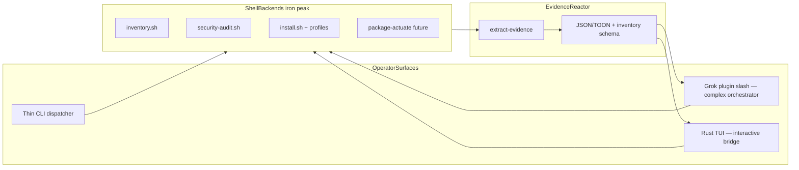
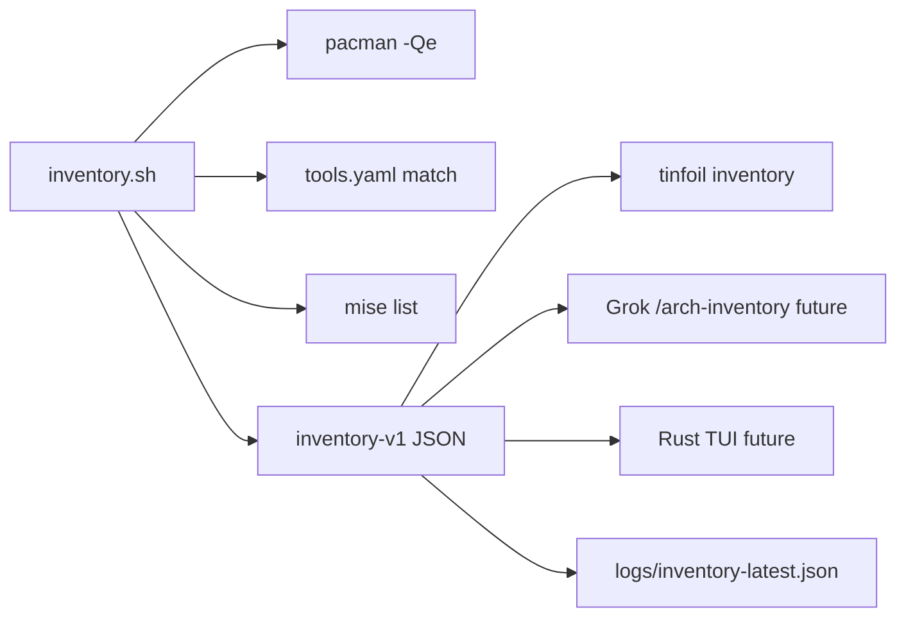
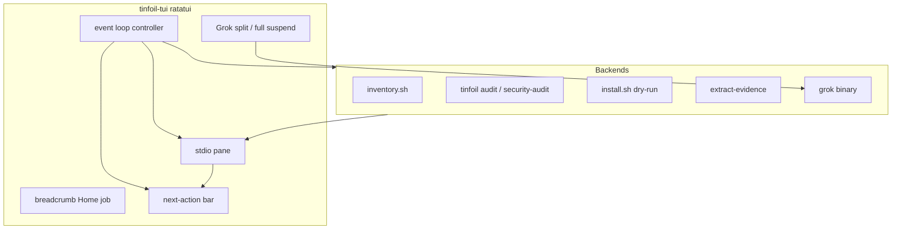
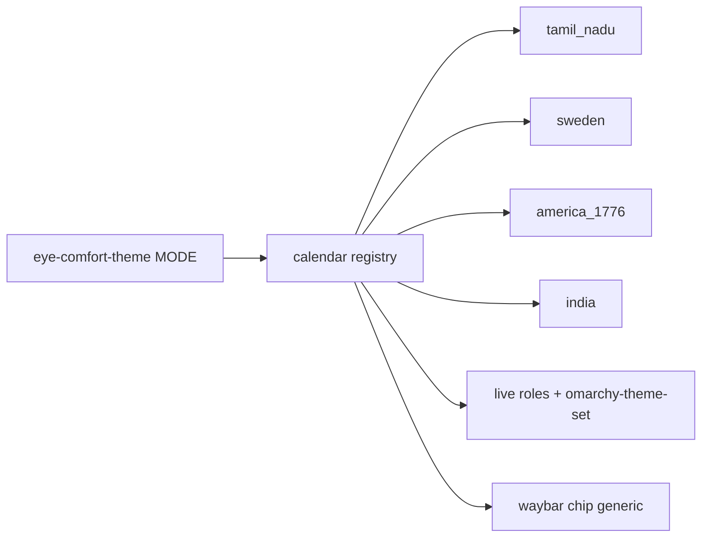
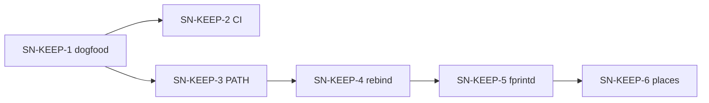
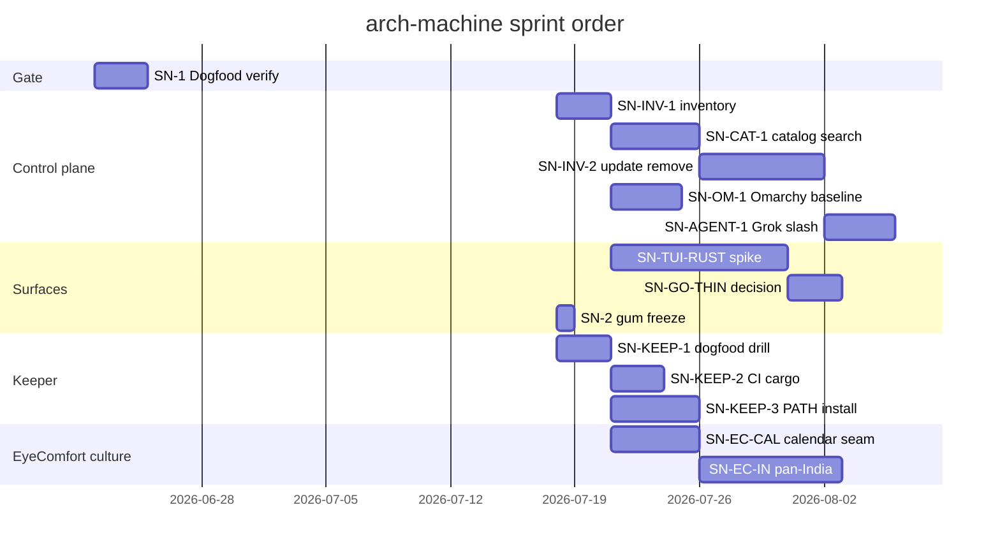

# coming-next — arch-machine architecture backlog

**Keeper deep-dive:** [keeper.md](./keeper.md) · [coming-next-keeper.md](./coming-next-keeper.md) (SN-KEEP-*)  
**Grok agent-as-TUI:** [p10ns11y/plugins](https://github.com/p10ns11y/plugins) `arch-machine/` (prefer over gum `tinfoil tui` for ops)

## §0 Mission

Ship and maintain a **thin-first, evidence-always, self-remediating** Arch Linux workstation guardian (`tinfoil`) with profile-driven ML/security modules — and a **threshold multi-factor keeper** for secrets that outlive passphrase loss.

## §0b Ten-year thrive picture

| Horizon | Outcome | Signal |
|---------|---------|--------|
| 2026 | Shell backends + inventory schema; Grok expand; gum freeze; Rust TUI spike | SN-INV-1 landed; SN-TUI-RUST |
| 2028 | Autonomous weekly sentinel on fleet machines | systemd timer + evidence drift alerts |
| 2030 | Portable profile packs beyond Arch | adapter modules per distro |
| 2036 | Agent-native ops: bundles + keeper under policy | LLM consumes TOON; drill-proven vault |

**Surface bet (2026-07):** Drop Go as the interactive TUI home. **Complex orchestration → Grok plugin.** **Rich interactive UI → new Rust TUI** (ratatui-class; harvest patterns from open-sourced Grok Build where useful). **Go (if kept) = thin subcommand dispatcher only** — or exit once shell/`tinfoil` shim covers audit/install/inventory. Gum `lib/tui/` is a **legacy bridge**, not the iron peak.

## §1 Scorecard

| Area | Grade | One line | Evidence |
|------|-------|----------|----------|
| Thin install | A- | Default `--thin` ships sentinel only | `install.sh`, README |
| tinfoil CLI (Go) | B+ | Thin dispatcher; inventory added; TUI de-emphasized | `bin/tinfoil.go` |
| **Inventory backend** | **B** | Read-only snapshot schema v1; shell-first | `maintenance/inventory.sh`, `logs/inventory-*.json` |
| TUI (gum legacy) | C+ | Works; freeze feature growth — bridge only | `lib/tui/*.sh`, Issue #7 |
| **Grok agent TUI** | **B+** | Slash status/init/audit/expand; fail closed | `plugins/arch-machine`, BOUNDARY.md |
| **Rust TUI** | **B** | Entry + loop controller; stdio + next actions + Grok dock | `crates/tinfoil-tui` |
| **Keeper (MFA vault)** | **A-** | k=3 n=4 + PQ seal + drill; PR open | `modules/security/keeper`, PR #28 |
| Profiles | B | YAML compose modules | `config/profiles/*.yaml` |
| Catalog search UI | D | tools.yaml exists; no Software Center search yet | SN-CAT-1 |
| Select update/remove | F | Scripts partial; no multi-select actuate | SN-INV-2 |
| Evidence | A- | JSON + TOON bundles | `maintenance/extract-evidence.sh`, `logs/` |
| Remediation policy | A | Repo applies own 6-step policy | `policies/security-remediation.md` |
| CI | B+ | shellcheck, go, yaml, evidence smoke | `.github/workflows/ci.yml` |
| Agent skills | B+ | Symlinked skills + overlays | `AGENTS.md`, `.agents/` |

## §2 System map today

See `docs/INDEX.md` mermaid. Runtime: `/usr/local/bin/tinfoil` + `/usr/share/tinfoil` copy of repo lib/modules/maintenance.

## §4 Musk 5-step on backlog

1. **Question** — CI profile validation still stubbed
2. **Delete** — root duplicate scripts (done per LEGACY)
3. **Simplify** — single module registry from `config/tools.yaml`
4. **Accelerate** — dogfood `make lint` in verification cockpit
5. **Automate** — weekly timer generates evidence without human

## §6 Guardrails

| Refuse | Build |
|--------|-------|
| Heavy install on `--thin` | Explicit `--profile` for ML/security |
| Destructive maintenance without confirm | consent + policy steps (any surface) |
| Agent edits skill bodies in symlink target | Use `.agents/overlays/` |
| Grow gum/Go TUI as primary product | Shell backends + Grok orchestrator + Rust TUI |
| Silent bulk uninstall | dry-run default + refuse-list for critical pkgs |
| Full Ubuntu Software / Electron store | Searchable catalog over tools.yaml + pacman |

## §7 Blueprint cards

### SN-1 · Dogfood verify gate (no new code)

**Problem:** Agents lack a single pre-PR command set.

| File | Work |
|------|------|
| `AGENTS.md` | document verify block |
| `Makefile` | keep targets stable |

**Done when:** All five commands exit 0 on sentinel branch.

**Verify:** `make lint && make validate-profiles && go build -o /tmp/tinfoil ./bin/tinfoil.go && ./install.sh --thin --validate`

### SN-2 · Complete TUI interactive flows — **SUPERSEDED / freeze**

**Problem (historical):** Issue #7 gum menus.

**Decision (2026-07):** Do **not** invest further in gum as primary UI. Keep existing flows working as **legacy bridge**. Interactive future = **SN-TUI-RUST**; complex orchestration = **Grok plugin**. Backend scripts remain the contract.

| File | Work |
|------|------|
| `lib/tui/*` | freeze; bugfix only |
| backends | all new capability lands in `maintenance/*.sh` first |

### SN-3 · Real profile validation harness

**Problem:** CI echoes stub; `includes[]` ↔ `install_<module>` not fully enforced.

| File | Work |
|------|------|
| `scripts/profile-validation-harness.sh` | assert symbols + module dirs |
| `.github/workflows/ci.yml` | fail job on harness failure |

**Done when:** CI fails on broken profile reference.

**Verify:** `make validate-profiles` in CI locally

### SN-4 · Evidence screen in TUI — **redirect**

**Problem:** Evidence UX parity.

**Redirect:** Prefer Grok `/arch-status` + evidence list in **Rust TUI** (SN-TUI-RUST). Optional gum polish only if zero-cost. Attach inventory snapshot into `extract-evidence.sh` (see SN-INV-1).

### SN-INV-1 · Inventory surface (read-only) — **landing**

**Problem:** Operator cannot browse installed tools from tinfoil (Omarchy Software Center story).

| File | Work |
|------|------|
| `maintenance/inventory.sh` | Collect explicit pkgs + tools.yaml + mise + upgradable |
| `bin/tinfoil.go` | Thin `inventory` dispatch only |
| `logs/inventory-*.json` | Snapshots + `inventory-latest.json` |

**Done when:** `tinfoil inventory` / `./maintenance/inventory.sh` prints summary; `--json` is schema `tinfoil.inventory.v1`; write path works.

**Verify:** `./maintenance/inventory.sh --json --no-write \| jq .summary`; compare count to `pacman -Qe \| wc -l`.

### SN-INV-2 · Multi-select update / remove (consent-gated)

**Problem:** Inventory without actuate cannot “control for taste.”

| File | Work |
|------|------|
| `maintenance/package-actuate.sh` (new) | `--remove` / `--update`; dry-run default; double confirm |
| `policies/` | critical refuse-list |
| Grok `/arch-pkg` | only with `--yes` |
| Rust TUI | multi-select UX |

**Done when:** Select 1–N → dry-run plan → confirm → evidence line.

**Verify:** dry-run only in CI; manual disposable package dogfood.

### SN-CAT-1 · Searchable install catalog

**Problem:** Profile install is batch, not browse/search (Ubuntu Software feel).

| File | Work |
|------|------|
| `lib/catalog.sh` (new) | tools.yaml + profile labels + optional `pacman -Ss` |
| thin CLI / Grok / Rust | `search` → install one tool or whole profile dry-run |

**Done when:** Search “docker” or “rocm” shows entry + which profile includes it.

### SN-OM-1 · Omarchy baseline map

**Problem:** Omarchy preinstalls many tools; blind profile install muddies ownership.

| File | Work |
|------|------|
| `config/baselines/omarchy.yaml` | Maintained expected set |
| `inventory.sh` | Tag `omarchy-baseline` / `arch-machine` / `user-explicit` / `unknown` |
| docs | Day-1 Omarchy + thin tinfoil playbook |

### SN-SCAN-1 · Scan UX polish

**Problem:** Scan power exists (global + folder); results triage is script-native.

| File | Work |
|------|------|
| post-audit summary | high/crit counts + report path for Grok/Rust |
| optional path clamav | project mode flag |

### SN-AGENT-1 · Grok inventory + catalog commands

| Intent | Slash (proposed) | Fail-closed |
|--------|------------------|-------------|
| List installed | `/arch-inventory` | read-only OK in FSD |
| Search catalog | `/arch-search …` | read-only |
| Remove / update | `/arch-pkg … --yes` | never without `--yes` |

Wire after SN-INV-1/2 backends exist. Plugin calls **shell**, not Go internals.

### SN-TUI-RUST · Ratatui entry + loop controller — **landing (MVP)**

**Problem:** Operator needs one home: steer shell/Go, read stdio beautifully, take next fix actions, open Grok without getting lost.

| File | Work |
|------|------|
| `crates/tinfoil-tui/` | MVP: menu, jobs, scrollable stdio, actions, Grok dock |
| `bin/tinfoil.go` | `tui` prefers `tinfoil-tui` then gum |
| Next | Inventory list widget from JSON; live package multi-select; real install confirm |

**Done when (MVP):** `cargo build` + run shows Home; Inventory/Audit dry jobs stream stdio; next-action bar appears; `G` suspends and launches `grok`; Esc returns Home.

**Verify:** `make tinfoil-tui` · `./crates/tinfoil-tui/target/debug/tinfoil-tui --print-root` · manual interactive dogfood.

**Guardrails:** No business logic in Rust that duplicates shell. Grok embed is suspend/split-context (not fake live PTY yet).

### SN-GO-THIN · Shrink or exit Go entrypoint

**Problem:** Go is only a dispatcher today; maintenance cost for little value.

| Option | When |
|--------|------|
| Keep thin Go | While `/usr/local/bin/tinfoil` is the install contract |
| Replace with shell shim + Rust | After Rust TUI + plugin cover all subcommands |

**Done when:** Documented decision; CI still green; no new Go feature beyond dispatch.

### SN-EC-CAL · Eye-comfort calendar plugin seam

**Problem:** Tamil Nadu calendar is hard-coded in CLI/waybar; Sweden / America 1776 / pan-India overlays cannot ship without forking the switcher.

**Problem context:** `modules/productivity/eye-comfort` — TN pattern works; next cultures need a registry.

| File | Work |
|------|------|
| `bin/eye-comfort-theme` | mode → registry resolve |
| `lib/*_schedule.py` | TN behind interface; no behavior change |
| `lib/waybar_status.py` | bar/tooltip from `state.calendar` |
| `lib/generate_packages.py` | multi-family package lists |

**Done when:** `tn` regression tests green; adding a calendar is new lib + packages only.

**Verify:** `PYTHONPATH=lib python3 lib/test_tamil_schedule.py` (+ future calendar suite)

### SN-EC-IN · Pan-India ṛtu / region overlay

**Problem:** Operators want subcontinental India rhythm, not only Tamil tinai; TN must stay.

| File | Work |
|------|------|
| `docs/PRODUCT-IN.md`, `DESIGN-IN.md` | ṛtu + region packages; TN coexistence |
| `lib/india_{schedule,palette}.py` | calendar + AA leans |
| `themes/eye-comfort-in-*` | ~5 regional packages |
| CLI | `eye-comfort-theme in` · `calendar: india` |

**Done when:** `in --json` AA-clean; TN untouched.

**Verify:** contrast matrix + dry-run apply one `eye-comfort-in-*`

### SN-EC-SE · Sweden seasons + saga/myth overlay

**Problem:** High-latitude light + Nordic year need structure; sagas/gods as restrained identity, not metal kitsch.

| File | Work |
|------|------|
| `docs/PRODUCT-SE.md`, `DESIGN-SE.md` | årstid + saga realms + lat defaults |
| `lib/sweden_{schedule,palette}.py` | solar-first SE |
| `themes/eye-comfort-se-*` | ~5 packages (asgard…nifl or landskap) |
| CLI | `eye-comfort-theme se` · `calendar: sweden` |

**Done when:** lat-honest midsummer/winter documented; AA tests pass.

**Verify:** `se --lat 59.3 --json` day/night extremes; contrast suite

### SN-EC-US · America 1776 + plain + modern/cowboy

**Problem:** Early-republic desk mood + Amish/plain craft + open modern America (cowboy/range, civic if AA) as optional culture mode.

| File | Work |
|------|------|
| `docs/PRODUCT-US.md`, `DESIGN-US.md` | 1776 spine; plain; range/modern welcome |
| `lib/america_{schedule,palette}.py` | seasons + craft leans |
| `themes/eye-comfort-us-*` | parchment, hearth, field, workshop, plain, range |
| CLI | `eye-comfort-theme us` · `calendar: america_1776` |

**Done when:** packages AA-clean; no ban on cowboy/modern when restrained.

**Verify:** contrast matrix; dry-run `us` apply

**Depends:** SN-EC-CAL preferred first; cultures can sequence IN → SE → US.

### SN-KEEP · Keeper follow-ups (see coming-next-keeper.md)

Full cards: [coming-next-keeper.md](./coming-next-keeper.md) · architecture: [keeper.md](./keeper.md)

| Card | Problem (one line) |
|------|--------------------|
| **SN-KEEP-1** | Dogfood no-passphrase recover drill (no new code) |
| **SN-KEEP-2** | CI `cargo test` for keeper crate |
| **SN-KEEP-3** | Install release binary to `~/.local/bin/keeper` |
| **SN-KEEP-4** | Device re-bind after reimage |
| **SN-KEEP-5** | Optional fprintd as share release (not root) |
| **SN-KEEP-6** | Trusted places enrollment (IP still banned) |

## §9 Gantt (suggested)

## §10 Monitoring signals

- CI red on `sentinel` branch
- `logs/evidence-bundle-*.json` age > 7d on active machines
- `tinfoil` version drift vs repo tag

## §11 Done log

| Item | Evidence |
|------|----------|
| tinfoil CLI shipped | PR #3 merge `2504e39` |
| Remediation policy | PR #4 merge `cb088cd` |
| Agent skills wired | `AGENTS.md`, `.agents/skills` symlinks |
| INDEX architecture doc | `docs/INDEX.md` |
| Multi-factor keeper + PQ seal | PR #28 (open) `modules/security/keeper` |
| Grok arch-machine plugin | [p10ns11y/plugins](https://github.com/p10ns11y/plugins) `arch-machine/` |
| Module `--agent-expand` hooks | PR #28 `e9c264a` |
| UWSM graphical-session race | PR #25 merge |
| Inventory v1 (shell backend) | `maintenance/inventory.sh` + `tinfoil inventory` |
| Surface pivot: gum freeze; Rust+Grok | `coming-next` SN-TUI-RUST / SN-GO-THIN |
| Ratatui control plane MVP | `crates/tinfoil-tui` + `tinfoil tui` prefers it |

## §13 References

| Source | Use |
|--------|-----|
| `docs/INDEX.md` | System map |
| `arch-design/keeper.md` | Keeper architecture + mermaid |
| `arch-design/coming-next-keeper.md` | SN-KEEP-* backlog |
| `policies/security-remediation.md` | Boundary meta-rule |
| `AGENTS.md` | Agent verify + skills |
| `.agents/overlays/` | Repo-specific skill overlays |
| collab-finder [batch-2-blueprints](https://github.com/p10ns11y/collab-finder/blob/main/reports/batch-2-engineering-blueprints.md) | Card format |
| Skills library | `~/Work/personal/skills` symlinks |

---

**Plain rule:** Thin install, loud evidence, ruthless remediation — the sentinel must pass its own audit before it audits your machine. Offline escrow off-box, or the keeper is theater.
