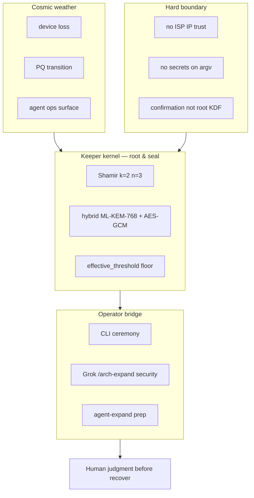
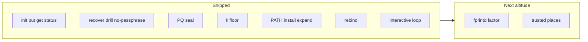
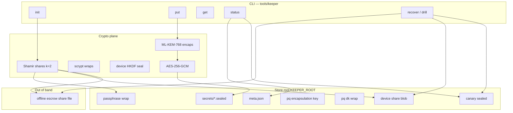
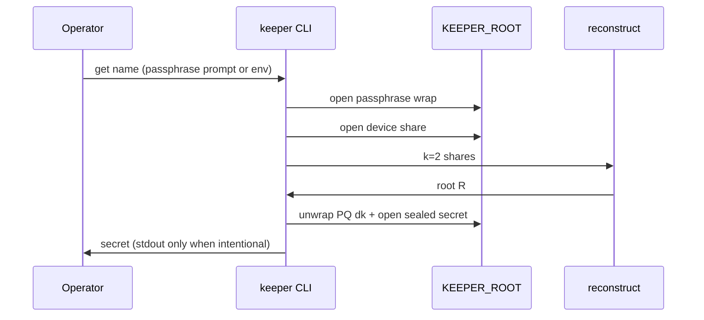
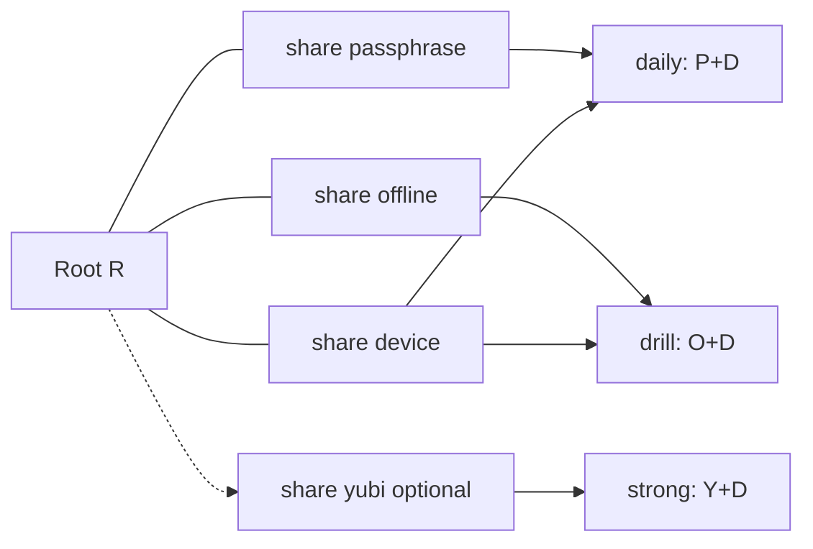
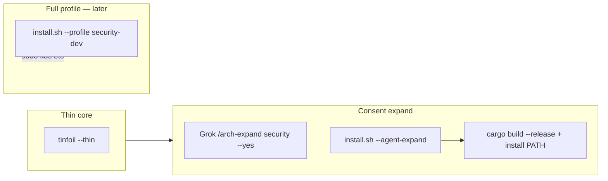

# Keeper — architecture design (arch-machine)

**Audience:** operators · implementers · agents  
**Contract:** [THREAT-MODEL](../tools/keeper/docs/THREAT-MODEL.md) · [RECOVERY-CEREMONY](../tools/keeper/docs/RECOVERY-CEREMONY.md) · [LOCATION](../tools/keeper/docs/LOCATION.md)  
**Backlog:** [coming-next-keeper.md](./coming-next-keeper.md) · parent [coming-next.md](./coming-next.md)  
**Method:** stellar-roadmap · evidence columns · diagrams over prose  

*Last updated: 2026-07-21 · PATH install · rebind · interactive loop*

---

## 0. Mission

Hold high-value secrets under **any 2 of 3** (passphrase · offline · device): **one** secret to remember, **one** file offline, device free — survive passphrase loss without a second knowledge password or IP theater.

**Shipped default:** k=2 n=3. Knowledge factor is **not** required. Optional YubiKey expands to any-2-of-4.

---

## 0b. Thrive picture (hull bay in the security module)



| Role | What it is | Why it still wins in 2036 |
|------|------------|---------------------------|
| **Kernel** | Threshold root + PQ-sealed blobs on disk | Survives host loss + classical crypto break |
| **Bridge** | CLI + thin Grok expand (not gum TUI) | Agent ops without theater confirmations |
| **Boundary** | IP ban, k floor, offline escrow | Trust stays out-of-band |

**Design bet:** root reconstruction is always threshold crypto; UX factors only **release shares**.

---

## 1. Scorecard (current)



| Area | Grade | One line | Evidence |
|------|-------|----------|----------|
| Shamir k=2 n=3 (default) | A | any 2 of P/O/D; optional n=4 Yubi | `crypto.rs`, `ceremony.rs`, tests |
| Confirmation ≠ root | A | Factors gate share open only | `factors.rs`, THREAT-MODEL |
| No-passphrase drill | A | offline+device | `ceremony.rs`, README |
| PQ hybrid seal | A | ML-KEM-768 + AES-GCM + HKDF | `crypto.rs`, sealed blobs |
| meta.k downgrade | A | `effective_threshold` floors k | unit tests |
| ISP IP trust | A | weight 0; reject | `factors.rs`, LOCATION.md |
| Grok expand + PATH | A | `--agent-expand` release install `~/.local/bin/keeper` | `modules/security/install.sh` |
| Device rebind | A | P+O reconstruct; reseal device; old fp fails | `rebind_device`, tests |
| Interactive loop | A | non-echo prompts; no argv secrets | `interactive.rs`, CLI `loop` |
| CI cargo | A | `keeper` job in workflows | `.github/workflows/ci.yml` |
| fprintd / GPS | — | deferred | THREAT-MODEL out of scope |

**Plain rule:** If disk can lower k, or confirmation alone opens secrets, the design is broken.

---

## 2. System map (today)



**Paths:** crate `tools/keeper/` · `keeper loop` interactive UX · agent expand installs PATH binary via `modules/security/install.sh --agent-expand`.

---

## 3. Ceremony data-flow

### Daily unlock (passphrase path)



### Recover / mandatory drill (no passphrase)


| Layer | Owns | Must not |
|-------|------|----------|
| `factors` | share seals, fingerprint, IP reject | derive root from confirmations |
| `crypto` | Shamir, scrypt, PQ hybrid | lower k from untrusted meta alone |
| `ceremony` | init/put/get/recover/rebind/status | skip drill gate for healthy |
| `interactive` | non-echo onboard loop | put secrets on argv |
| `store` | JSON/blob paths | put secrets on argv in docs |

---

## 4. Factor topology



| Role | Seal | Typical release |
|------|------|-----------------|
| passphrase | scrypt wrap | daily |
| offline | plaintext escrow file (operator custody) | recover / rebind |
| device | HKDF(machine fingerprint) | daily + recover |
| yubikey (optional) | HMAC-SHA1 challenge-response | strong get; never alone |

---

## 5. Fit in arch-machine + Grok TUI



Agent surface prefers **Grok plugin** over `tinfoil tui` for expand. Expand installs `keeper` to `~/.local/bin`. Full k3s remains profile path (never default thin). Primary secure UX is **CLI interactive loop** (not Waybar/archy panel).

---

## 6. Module layout

```
tools/keeper/
  Cargo.toml
  README.md
  docs/
    THREAT-MODEL.md
    RECOVERY-CEREMONY.md
    LOCATION.md
  src/
    main.rs cli.rs lib.rs
    ceremony.rs crypto.rs factors.rs store.rs
  tests/
```

---

## 7. Invariants (bind agents)

1. **Confirmation ≠ root KDF**  
2. **k floor = DEFAULT_K (3)** even if disk says lower  
3. **Public ISP IP / GeoIP weight = 0**  
4. **Healthy requires proven no-passphrase drill**  
5. **No secrets on argv** in happy-path operator docs  
6. **Classical-only pre-PQ blobs rejected**  

---

## 13. References

| Source | Use |
|--------|-----|
| `tools/keeper/README.md` | Operator quick start |
| `tools/keeper/docs/*` | Threat, ceremony, location ban |
| `arch-design/coming-next-keeper.md` | SN-KEEP-* backlog |
| `Work/personal/plugins/arch-machine` | Grok agent-as-TUI expand |
| collab-finder batch-2 blueprints | Card format |

---

**Plain rule:** Escrow lives out-of-band; the laptop alone must never be enough.
