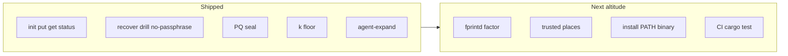
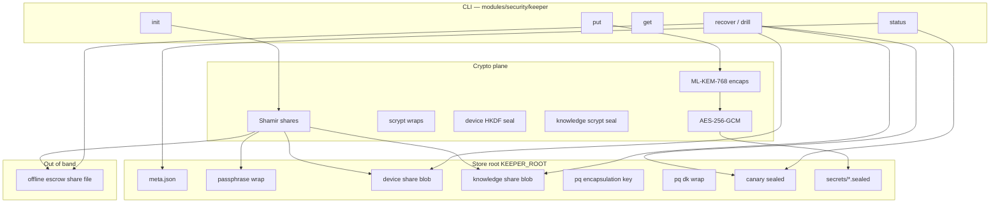
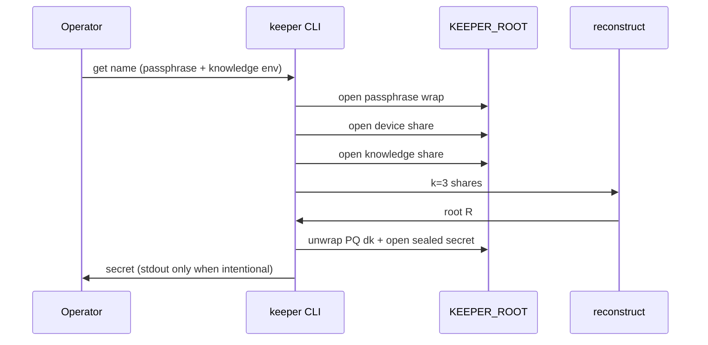
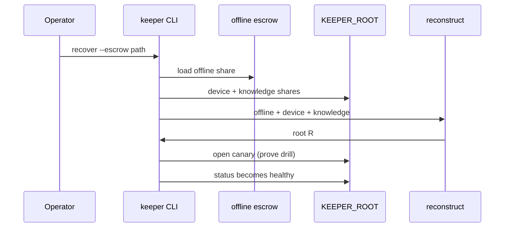
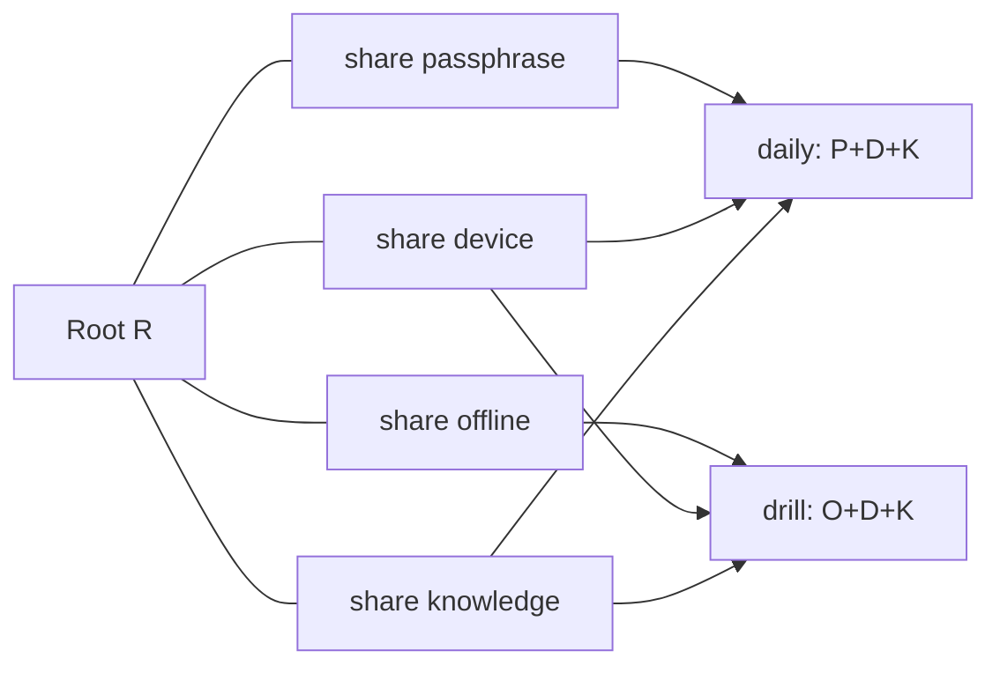
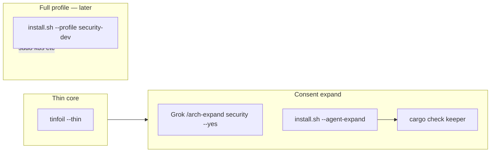

# Keeper — architecture design (arch-machine)

**Audience:** operators · implementers · agents  
**Contract:** [THREAT-MODEL](../modules/security/keeper/docs/THREAT-MODEL.md) · [RECOVERY-CEREMONY](../modules/security/keeper/docs/RECOVERY-CEREMONY.md) · [LOCATION](../modules/security/keeper/docs/LOCATION.md)  
**Backlog:** [coming-next-keeper.md](./coming-next-keeper.md) · parent [coming-next.md](./coming-next.md)  
**Method:** stellar-roadmap · evidence columns · diagrams over prose  

*Last updated: 2026-07-18 · PR #28*

---

## 0. Mission

Hold high-value secrets (MFA backup codes, recovery tokens) under a **k-of-n multi-factor root** that survives passphrase loss via **mandatory offline drill**, without treating public IP or confirmations as key material.

---

## 0b. Thrive picture (hull bay in the security module)


| Role | What it is | Why it still wins in 2036 |
|------|------------|---------------------------|
| **Kernel** | Threshold root + PQ-sealed blobs on disk | Survives host loss + classical crypto break |
| **Bridge** | CLI + thin Grok expand (not gum TUI) | Agent ops without theater confirmations |
| **Boundary** | IP ban, k floor, offline escrow | Trust stays out-of-band |

**Design bet:** root reconstruction is always threshold crypto; UX factors only **release shares**.

---

## 1. Scorecard (PR #28)



| Area | Grade | One line | Evidence |
|------|-------|----------|----------|
| Shamir k=3 n=4 | A | Primitive-safe GF; 4 roles | `crypto.rs`, tests |
| Confirmation ≠ root | A | Factors gate share open only | `factors.rs`, THREAT-MODEL |
| No-passphrase drill | A | offline+device+knowledge mandatory | `ceremony.rs`, README |
| PQ hybrid seal | A | ML-KEM-768 + AES-GCM + HKDF | `crypto.rs`, sealed blobs |
| meta.k downgrade | A | `effective_threshold` floors k | `91826cb` / `2612f3f` |
| ISP IP trust | A | weight 0; reject | `factors.rs`, LOCATION.md |
| Grok expand hook | B+ | `--agent-expand` + stamp | `modules/security/install.sh` |
| Binary on PATH | C | cargo run only today | no `install` target yet |
| CI cargo | C | local `cargo test` only | not in `.github/workflows` |
| fprintd / GPS | — | deferred | THREAT-MODEL out of scope |

**Plain rule:** If disk can lower k, or confirmation alone opens secrets, the design is broken.

---

## 2. System map (today)



**Paths:** crate `modules/security/keeper/` · agent expand via Grok plugin `am-expand security --yes`.

---

## 3. Ceremony data-flow

### Daily unlock (passphrase path)



### Recover / mandatory drill (no passphrase)



| Layer | Owns | Must not |
|-------|------|----------|
| `factors` | share seals, fingerprint, IP reject | derive root from confirmations |
| `crypto` | Shamir, scrypt, PQ hybrid | lower k from untrusted meta alone |
| `ceremony` | init/put/get/recover/status | skip drill gate for healthy |
| `store` | JSON/blob paths | put secrets on argv in docs |

---

## 4. Factor topology



| Role | Seal | Typical release |
|------|------|-----------------|
| passphrase | scrypt wrap | daily |
| offline | plaintext escrow file (operator custody) | recover only |
| device | HKDF(machine fingerprint) | daily + recover |
| knowledge | scrypt on normalized answer | daily + recover |

---

## 5. Fit in arch-machine + Grok TUI



Agent surface prefers **Grok plugin** over `tinfoil tui` for expand. Full k3s remains profile path (never default thin).

---

## 6. Module layout

```
modules/security/keeper/
  Cargo.toml
  README.md
  docs/
    THREAT-MODEL.md
    RECOVERY-CEREMONY.md
    LOCATION.md
  src/
    main.rs cli.rs lib.rs
    ceremony.rs crypto.rs factors.rs store.rs
  tests/
```

---

## 7. Invariants (bind agents)

1. **Confirmation ≠ root KDF**  
2. **k floor = DEFAULT_K (3)** even if disk says lower  
3. **Public ISP IP / GeoIP weight = 0**  
4. **Healthy requires proven no-passphrase drill**  
5. **No secrets on argv** in happy-path operator docs  
6. **Classical-only pre-PQ blobs rejected**  

---

## 13. References

| Source | Use |
|--------|-----|
| `modules/security/keeper/README.md` | Operator quick start |
| `modules/security/keeper/docs/*` | Threat, ceremony, location ban |
| `arch-design/coming-next-keeper.md` | SN-KEEP-* backlog |
| `Work/personal/plugins/arch-machine` | Grok agent-as-TUI expand |
| collab-finder batch-2 blueprints | Card format |

---

**Plain rule:** Escrow lives out-of-band; the laptop alone must never be enough.
