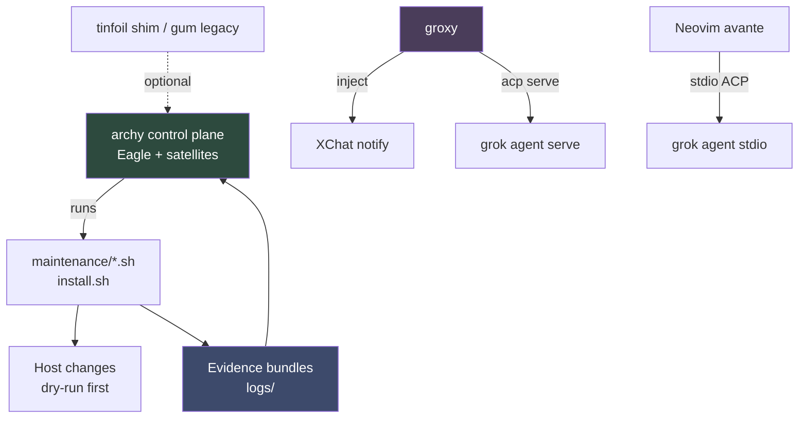
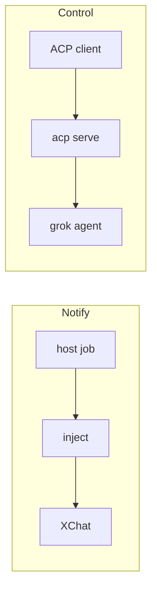

# Arch Machine — Index & Architecture

Thin-first Arch Linux toolkit: **archy** steers, shell backends work, evidence closes the loop.

## Quick start

1. Clone the repo.
2. `./install.sh` (or `--thin`) — runtime under `/usr/share/tinfoil/`.
3. Run the control plane:

   ```bash
   make archy
   TINFOIL_ROOT="$PWD" ./tools/archy/target/debug/archy
   ```

4. Optional full workstation: `./install.sh --profile minimal|ml-dev|security-dev` (try `--dry-run` first).
5. Weekly: timer or `weekly-check.sh` → evidence under `logs/`.

Details: [INSTALLATION.md](INSTALLATION.md) · [archy.md](archy.md) · [MAINTENANCE.md](MAINTENANCE.md).

---

## Big picture



| Layer | What it does | Where |
|-------|----------------|-------|
| **Control plane** | Menu, live output, next steps | `tools/archy` |
| **Remote surfaces** | Host→XChat notify + ACP control | `tools/groxy` |
| **Threshold vault** | MFA / break-glass secrets (any 2 of 3) | `tools/keeper` |
| **Backends** | Real inventory, audit, install | `maintenance/`, `install.sh` |
| **Profiles / modules** | What a full install may add | `config/profiles/`, `modules/` |
| **Evidence** | JSON/TOON for agents | `logs/`, `lib/evidence.sh` |

How archy routes work (simple English + diagrams): **[archy.md](archy.md)**.  
Agent skill: **eagle-satellite-elomaxz** (`.agents/skills/eagle-satellite-elomaxz/`).

**Remote surfaces:** **[groxy.md](groxy.md)** · **[tools/groxy/README.md](../tools/groxy/README.md)** — **inject** (host→XChat) + **acp serve** (remote Grok). No live DM→host poll. Open TUIs are not XChat listeners.

**Grok plugin ↔ archy:** from Grok use `/arch-*`; from archy use `G`/`p` to reopen Grok with preload. See [archy.md § Grok plugin](archy.md) and the plugin’s `docs/CROSS-REF.md` (`~/Work/personal/plugins/arch-machine` or [p10ns11y/plugins](https://github.com/p10ns11y/plugins)).

### archy control loop


Eagle receives **messages** (keys, job lines, job done). Satellites own each domain job. Jobs are **offline**: start → stream → exit — no busy heartbeats.

### groxy paths (notify vs control)



---

## Key docs

| Topic | Doc |
|-------|-----|
| Control plane | [archy.md](archy.md) · [tools/archy/README.md](../tools/archy/README.md) |
| Remote surfaces (inject + ACP; **Neovim ACP setup**) | [groxy.md](groxy.md) · [tools/groxy/README.md](../tools/groxy/README.md) |
| Threshold vault | [tools/keeper/README.md](../tools/keeper/README.md) · [arch-design/keeper.md](../arch-design/keeper.md) |
| Install | [INSTALLATION.md](INSTALLATION.md) |
| Maintenance | [MAINTENANCE.md](MAINTENANCE.md) |
| Modules / profiles | [MODULES.md](MODULES.md) · profiles under `config/profiles/` |
| Omarchy host | [omarchy.md](omarchy.md) · [omarchy-commands.md](omarchy-commands.md) |
| Eye comfort / themes | [eye-comfort.md](eye-comfort.md) |
| Secrets | [SECRETS-EVERYDAY.md](SECRETS-EVERYDAY.md) |
| Legacy / killed paths | [LEGACY.md](LEGACY.md) |
| Contributing | [CONTRIBUTING.md](CONTRIBUTING.md) · [DEVELOPMENT.md](DEVELOPMENT.md) |
| Roadmap | [arch-design/coming-next.md](../arch-design/coming-next.md) |

---

## Directories

- `tools/archy/` — **main** operator UI (Ratatui, Eagle FSM, satellites)
- `tools/groxy/` — remote surfaces: inject notify + ACP serve (binary `groxy`)
- `tools/keeper/` — threshold secrets vault (binary `keeper`; install via security expand)
- `maintenance/` — shell backends (iron peak)
- `install.sh` + `lib/` — thin default; `--profile` for full
- `modules/` — installable capabilities (`install_<name>()`)
- `config/` — profiles + baselines
- `lib/tui/` — gum TEA legacy (same message idea as archy)
- `bin/tinfoil.go` — optional thin dispatcher
- `policies/` — project rules (e.g. security-remediation)

---

## Evidence

Runs should leave token-friendly bundles for agents:

- `maintenance/extract-evidence.sh`
- `tinfoil evidence` when installed
- Weekly timer path in [MAINTENANCE.md](MAINTENANCE.md)

---

## Before you PR

```bash
make lint
make validate-profiles
cargo test --manifest-path tools/archy/Cargo.toml
cargo test --manifest-path tools/groxy/Cargo.toml   # or: make groxy-test
cargo test --manifest-path tools/keeper/Cargo.toml  # or: make keeper-test
./install.sh --thin --validate   # or --dry-run with a profile
./maintenance/extract-evidence.sh --dry-run
```

CI: shellcheck, profile checks, Go build/vet, archy + groxy cargo test, evidence smoke (see `.github/workflows/ci.yml`).
