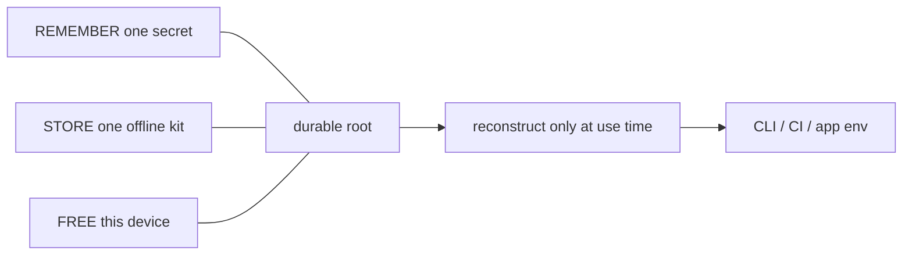
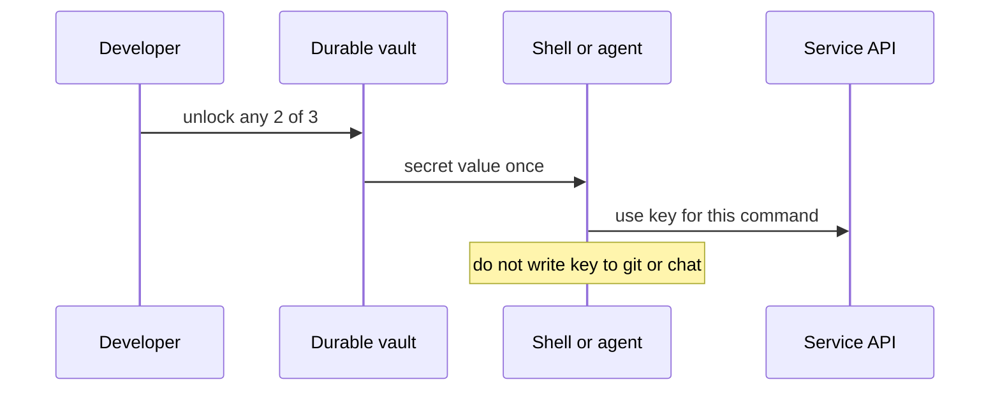

# Everyday secrets for developers

**Audience:** developers drowning in tools, SaaS, CI, cloud, and API keys.  
**Goal:** one **central recovery model** that stays self-sufficient (you can leave any vendor), plus **light distributed use** (open a secret only when a process needs it—not a second brain full of files).

If mess grows day by day, you do not need more passwords. You need a **boring recovery flow** and a **habit of not scattering keys**.

---

## 1. The pain (name it)

| Symptom | What usually caused it |
|---------|------------------------|
| Keys in shell history, screenshots, Slack, Notion | No single “put secret here” path |
| 12 password managers / 3 vaults / random USB sticks | No one recovery model |
| “I’ll fix MFA backup later” | No drill; first failure is production |
| New laptop = week of re-auth hell | Secrets bound only to one host, no offline share |
| Env files committed or copied forever | Runtime inject never adopted |
| Panic when one site rotates a key | No inventory; no owner for each secret |

**Central recovery** is not “upload everything to one SaaS.” It is: *if I forget the day-to-day unlock, I still have a planned path that I control.*

**Distributed delegation** is not “split keys across five apps.” It is: *the durable root stays rare; apps get short-lived or session-scoped material reconstructed at use time.*

---

## 2. One card (remember this only)

| Slot | Count | What | Where |
|------|-------|------|--------|
| **REMEMBER** | **1** | Passphrase (or one PM entry that is *that* passphrase) | Head or *one* password manager |
| **STORE offline** | **1** | Recovery kit / escrow / sealed backup | USB, paper, other house — **not only this laptop** |
| **FREE** | **0 effort** | This machine / OS unlock / device factor | Automatic |

```text
any 2 of { human secret, offline kit, this device }
```



**Honest bound:** lose two of the three and the secrets are gone. Crypto cannot invent a key from vacuum. Cloud-only “recovery email” is not self-sufficient if the vendor locks you out.

Full protocol for this repo’s tool: [keeper OPERATOR-MODEL](../tools/keeper/docs/OPERATOR-MODEL.md).

---

## 3. Central recovery (self-sufficient)

### Rules

1. **One durable vault root** for high-value material (MFA backups, master recovery codes, long-lived API roots you cannot rotate casually).
2. **Recovery does not require a second human secret** (no “knowledge question” as permanent second password).
3. **Recovery does not require the vendor** that sold you the password manager, the bank, or the cloud KMS as the only path.
4. **You have practiced the path once** (drill). “Healthy” or “setup complete” without a no-primary-secret open is theater.
5. **Offline kit is actually offline** — a file that only lives on the laptop is not offline.

### What to put in the durable vault

| Put here | Examples |
|----------|----------|
| **High-value, hard to re-issue** | MFA backup codes, account recovery codes, master seed for a password manager (if any), SSH CA / rare root tokens |
| **Root-of-trust for work** | Personal access tokens that mint shorter tokens; org break-glass |
| **Not day-to-day spam** | Do **not** stuff every `sk_test_…` you create this afternoon |

### What stays out of the durable vault

| Keep elsewhere or ephemeral | Why |
|-----------------------------|-----|
| CI inject secrets | Platform secret store + short TTL |
| Per-app `.env` for local dev | Generated or injected; not the only copy of a root |
| Session cookies | Ephemeral by nature |
| Public client IDs | Not secrets |

---

## 4. Distributed delegation (runtime, not ceremony)

**Idea:** durable factors unlock a root **only when needed**; processes receive **derived or short-lived** material.

| Layer | Holds | Lifetime |
|-------|--------|----------|
| Root / threshold | Passphrase wrap + offline share + device | Years |
| Named secret in vault | API root, MFA pack | Until rotated |
| Process env | `export API_KEY=$(keeper get name)` or agent inject | Process / session |
| CI | OIDC → short cloud token, or vault-injected job secret | Job minutes |



### Practical habits (multi-tool sprawl)

| Do | Don’t |
|----|--------|
| One inventory list: *name → owner → rotate-by → where recovered* | Scatter “final” keys in five notes apps |
| Prefer OIDC / workload identity over long-lived CI keys | Paste long-lived keys into every pipeline YAML |
| `direnv` / tool inject from vault at cwd | Commit `.env` with real values |
| Rotate by **revoking** old key after new works | Add key #2 and leave #1 forever |
| Agent/CLI: env or file fd, not argv | `tool --token sk-…` in shell history |

**Reconstruct at runtime** means: open the vault (or escrow path) when you need the value; do not keep a second plaintext cache “for convenience” on Desktop.

---

## 5. Day-one checklist (one sitting)

- [ ] Pick **one** remember secret (passphrase or one PM entry for the vault only).
- [ ] Create **one** offline recovery kit; copy **off** the machine; verify you can open without the day-to-day secret.
- [ ] Inventory top 10 secrets (MFA packs + API roots that hurt if lost).
- [ ] Move those into the durable vault; delete duplicate plaintext copies you no longer need.
- [ ] Wire local tools to **pull at use** (script, direnv, agent helper)—not permanent world-readable files.
- [ ] Calendar a **quarterly drill**: open vault without primary secret; rotate one low-risk key end-to-end.

---

## 6. Anti-patterns (PIASS generators)

| Anti-pattern | Why it hurts |
|--------------|--------------|
| Second “security question” password forever | Two things to forget |
| Status “healthy” implying always unlocked | Confusion; still need a factor to `get` |
| Public IP / “home network” as trust | Not a secret; attacker can be on-path or spoof |
| Escrow only on the same laptop | Not recovery |
| Every microservice root in chat “temporarily” | Becomes permanent |
| Five recovery stories (Google, Apple, bank, PM, friend) with no order | Panic path |
| Encrypting with a key you cannot store any safer than the plaintext | Fatal circularity—fix with threshold or accept custody tradeoff |

---

## 7. Using keeper in this repo (optional concrete tool)

This repository ships **keeper**: simple **any-2-of-3** threshold vault with hybrid PQ-sealed secrets.

| Need | Command sketch |
|------|----------------|
| Init + offline kit | `keeper init --escrow /media/usb/escrow.json` |
| Store | `keeper put api-root --value '…'` or `--file` |
| Daily use | `export KEEPER_PASSPHRASE=…` then `keeper get api-root` |
| Forgot passphrase | `keeper get api-root --escrow /media/usb/escrow.json` |
| Drill once | `keeper recover --escrow …` then `keeper status` |

Paths and bounds:

- [OPERATOR-MODEL.md](../tools/keeper/docs/OPERATOR-MODEL.md) — remember / store / free  
- [THREAT-MODEL.md](../tools/keeper/docs/THREAT-MODEL.md) — adversaries and invariants  
- [RECOVERY-CEREMONY.md](../tools/keeper/docs/RECOVERY-CEREMONY.md) — init / drill  
- [keeper README](../tools/keeper/README.md) — build and CLI  

Keeper is **one** implementation of the one-card model—not a requirement to adopt the rest of arch-machine. You may use another vault that obeys the same card (one secret, one offline kit, device free, open only at use).

Also: [docs/INDEX.md](INDEX.md) · [arch-design/keeper.md](../arch-design/keeper.md).

---

## 8. Minimal inventory template (copy)

```text
# secrets-inventory (no secret values in this file)
# name | kind | owner | rotate-by | recovery (vault name / escrow note)
# gh-pat-personal | api-root | me | 2026-10-01 | keeper:gh-pat
# aws-breakglass | mfa-pack | me | 2026-12-01 | keeper:aws-breakglass
```

Keep this inventory **without values** in git if you want; values only in the vault.

---

## 9. Plain rule

**One secret in your head, one kit in a drawer, machine is free—open secrets only when a tool needs them, and practice recovery before you need it.**

Mess is not destiny. Sprawl is the default; a central recovery card plus runtime inject is the fix.
