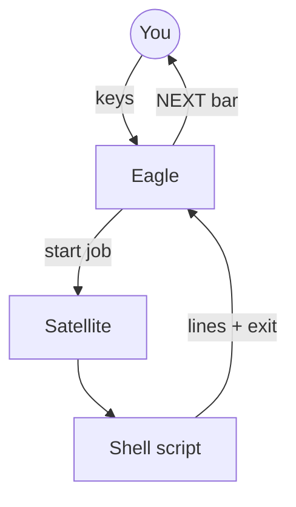
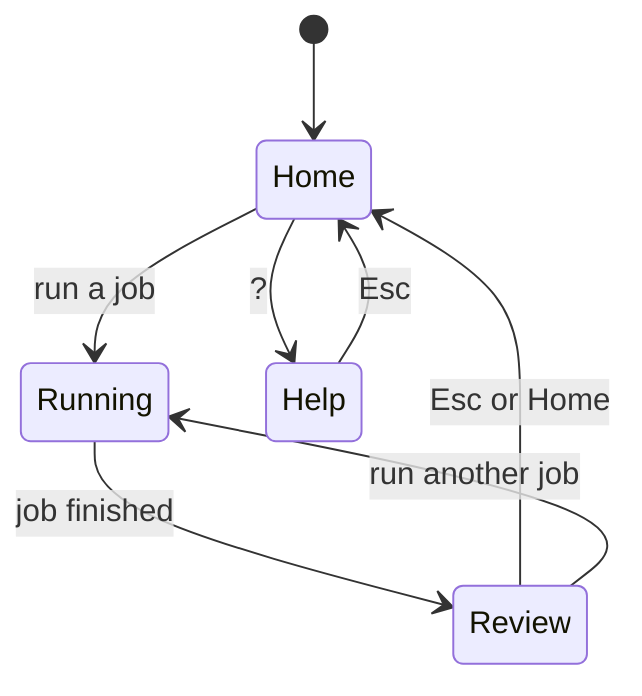
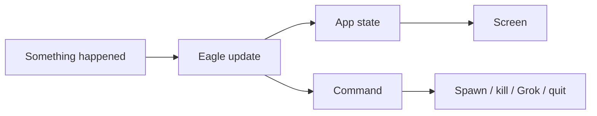

# archy — control plane (simple guide)

**archy** is the main screen you use to run maintenance on this machine.  
It does **not** reimplement package logic in Rust. It **steers** shell scripts and shows you what to do next.

Code: [`crates/archy/`](../crates/archy/). Agent skill: [eagle-satellite-elomaxz](../.agents/skills/eagle-satellite-elomaxz/SKILL.md).

**Why this shape** (X / design threads):

- [Eagle + Satellites](https://x.com/Peramanathan/status/2078680221059039361) — thin top controller; domains own full sub-flows
- [Offline satellites](https://x.com/Peramanathan/status/2078703537849241742) — start job async, verify exit later (no constant monitoring)
- [Structured loops over raw ReAct](https://x.com/Peramanathan/status/2067890630345494578) — named phases + bounded steps

---

## Grok plugin ↔ archy (cyclic)

You can enter the host from **Grok** or from **archy**; each can hand off to the other.

```text
  Grok Build + arch-machine plugin
       │  /arch-status  /arch-audit  /arch-control  /arch-init  /arch-expand
       ▼
  arch-machine (scripts + archy)
       │  G / p / Enter brief → grok --cwd ROOT "<preloaded prompt>"
       ▼
  Grok again (with job context)
```

| Start here | Use when | How |
|------------|----------|-----|
| **Grok + plugin** | Agent-driven status, audit, thin install, expand | Install plugin → `/arch-*` slash commands |
| **archy** | Local menu loop on the machine | Run archy → jobs → NEXT; press **`p`** / **`G`** to open Grok preloaded |

### Plugin install (Grok side)

```bash
grok plugin install "$HOME/Work/personal/plugins/arch-machine" --trust
# or: ln -sfn …/plugins/arch-machine ~/.grok/plugins/arch-machine
grok plugin enable arch-machine
```

Full cycle guide (plugin repo): `docs/CROSS-REF.md` under the [arch-machine Grok plugin](https://github.com/p10ns11y/plugins) (`arch-machine/` package), or locally:

`~/Work/personal/plugins/arch-machine/docs/CROSS-REF.md`

### From archy back into Grok

1. Run a job (e.g. Audit).  
2. `g` = co-pilot **brief** only (not live chat).  
3. `p` / Enter / `G` = suspend archy, write `logs/archy-grok-*.txt`, launch **interactive** Grok with composed prompt.  
4. Exit Grok → archy resumes. In that Grok session you can still run `/arch-*` if the plugin is enabled.

---

## What you see

```text
┌─ state ─────────────────────────────────────────┐
│ archy  Home › inventory   ✓ ok   brief:off light │
├─ menu ──────────────┬─ stdio ───────────────────┤
│ ▸ 1. Inventory      │  summary: … miss=0 …      │
│   2. Catalog …      │  ■ finished exit=0        │
└─────────────────────┴───────────────────────────┘
┌─ next ──────────────────────────────────────────┐
│ NEXT [a] Audit system   [r] Re-run  [p] Grok    │
└─────────────────────────────────────────────────┘
```

1. **Pick** a menu item  
2. **Watch** the script output (stdio)  
3. **Press** the highlighted next step (or Esc for Home)

---

## How control flow works (plain English)

Think of three roles:

| Role | Job |
|------|-----|
| **Eagle** | Small brain at the top. Reads keys and job results. Decides phase and next command. Does **not** know package names. |
| **Satellites** | Domain helpers (inventory, audit, install dry-run, …). Each knows how to start **its** script and what to suggest when done. |
| **Offline job** | “Start the script, stream the text, check the exit code.” No constant chat with the Eagle while it runs. |



---

## State machine (where you are)



| State | Meaning |
|-------|---------|
| **Home** | Choose from the menu |
| **Running** | Script is running; output scrolls |
| **Review** | Done; primary next action is highlighted |
| **Help** | Longer help text (`?`) |

---

## Message passing (Elm / Elomaxz style)

Same idea as the gum TUI (`lib/tui`):



| Word | Meaning |
|------|---------|
| **Msg** | Event: key, job line, job finished |
| **Update** | Change state; return a command |
| **Cmd** | Side effect: start satellite, cancel job, open Grok, quit |
| **View** | Draw only — no logic |

---

## Menu → real scripts

| Menu | Script / tool |
|------|----------------|
| Inventory | `maintenance/inventory.sh` |
| Catalog | `maintenance/catalog.sh` |
| Omarchy status | `maintenance/omarchy-status.sh` |
| Audit | `maintenance/security-audit.sh` (threat areas: malware · ports · supply · config) |
| Install dry-run | `install.sh --profile … --dry-run` |
| Evidence dry-run | `maintenance/extract-evidence.sh --dry-run` |
| Pkg update dry-run | `maintenance/package-actuate.sh` |

Dry-run must stay **dry** (no silent `sudo` install).

---

## Theme (simple)

Picked **once** at startup (not live OS chrome sync):

1. `ARCHY_THEME=light|dark`  
2. Omarchy theme background brightness  
3. Theme name  
4. Terminal `COLORFGBG`  
5. Default dark  

---

## Build and run

```bash
cargo build --release --manifest-path crates/archy/Cargo.toml
TINFOIL_ROOT="$PWD" cargo run --release --manifest-path crates/archy/Cargo.toml
```

Keys: ↑↓ menu · Enter run · Tab focus · `g` co-pilot brief · `G`/`p` launch **Grok with preloaded ask** (interactive `grok --cwd … "prompt"`) · Esc home · `?` help · `q` quit.  
Brief is not live ACP; full agent session is suspend-to-Grok with preload.

More detail: [crates/archy/README.md](../crates/archy/README.md).
