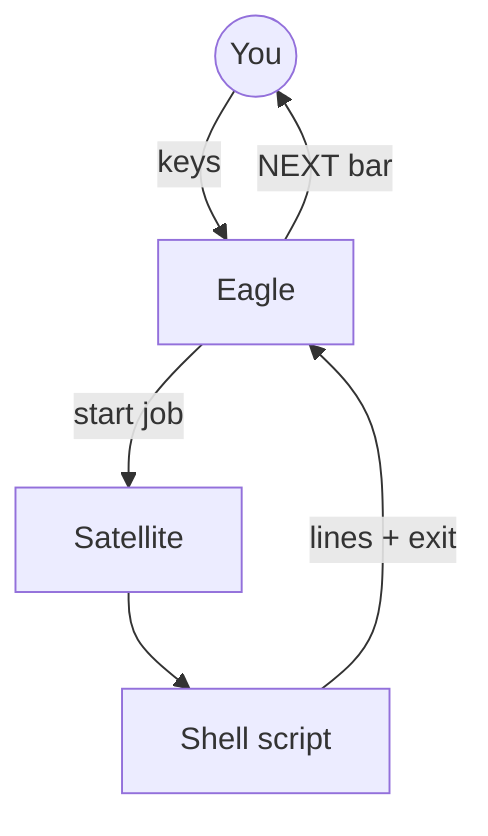
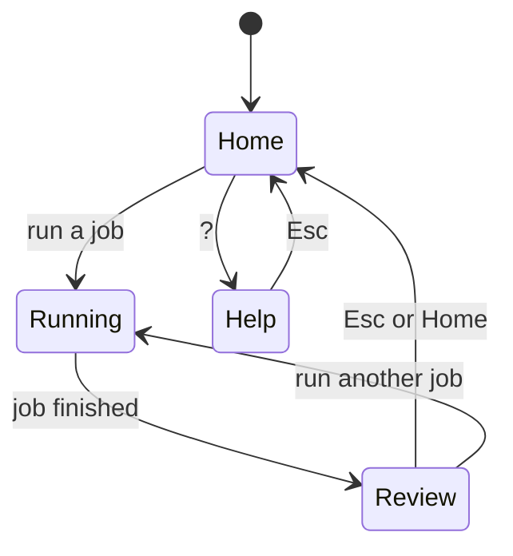
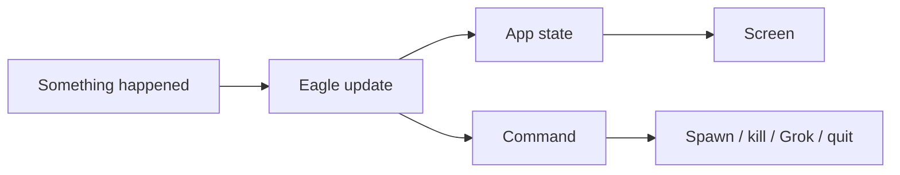

# archy — control plane (simple guide)

**archy** is the main screen you use to run maintenance on this machine.  
It does **not** reimplement package logic in Rust. It **steers** shell scripts and shows you what to do next.

Code: [`crates/archy/`](../crates/archy/). Agent skill: [eagle-satellite-elomaxz](../.agents/skills/eagle-satellite-elomaxz/SKILL.md).

---

## What you see

```text
┌─ state ─────────────────────────────────────────┐
│ archy  Home › inventory   ✓ ok   brief:off light │
├─ menu ──────────────┬─ stdio ───────────────────┤
│ ▸ 1. Inventory      │  summary: … miss=0 …      │
│   2. Catalog …      │  ■ finished exit=0        │
└─────────────────────┴───────────────────────────┘
┌─ next ──────────────────────────────────────────┐
│ NEXT [a] Audit system   [r] Re-run  [p] Grok    │
└─────────────────────────────────────────────────┘
```

1. **Pick** a menu item  
2. **Watch** the script output (stdio)  
3. **Press** the highlighted next step (or Esc for Home)

---

## How control flow works (plain English)

Think of three roles:

| Role | Job |
|------|-----|
| **Eagle** | Small brain at the top. Reads keys and job results. Decides phase and next command. Does **not** know package names. |
| **Satellites** | Domain helpers (inventory, audit, install dry-run, …). Each knows how to start **its** script and what to suggest when done. |
| **Offline job** | “Start the script, stream the text, check the exit code.” No constant chat with the Eagle while it runs. |



---

## State machine (where you are)



| State | Meaning |
|-------|---------|
| **Home** | Choose from the menu |
| **Running** | Script is running; output scrolls |
| **Review** | Done; primary next action is highlighted |
| **Help** | Longer help text (`?`) |

---

## Message passing (Elm / Elomaxz style)

Same idea as the gum TUI (`lib/tui`):



| Word | Meaning |
|------|---------|
| **Msg** | Event: key, job line, job finished |
| **Update** | Change state; return a command |
| **Cmd** | Side effect: start satellite, cancel job, open Grok, quit |
| **View** | Draw only — no logic |

---

## Menu → real scripts

| Menu | Script / tool |
|------|----------------|
| Inventory | `maintenance/inventory.sh` |
| Catalog | `maintenance/catalog.sh` |
| Omarchy status | `maintenance/omarchy-status.sh` |
| Audit | `maintenance/security-audit.sh` / tinfoil |
| Install dry-run | `install.sh --profile … --dry-run` |
| Evidence dry-run | `maintenance/extract-evidence.sh --dry-run` |
| Pkg update dry-run | `maintenance/package-actuate.sh` |

Dry-run must stay **dry** (no silent `sudo` install).

---

## Theme (simple)

Picked **once** at startup (not live OS chrome sync):

1. `ARCHY_THEME=light|dark`  
2. Omarchy theme background brightness  
3. Theme name  
4. Terminal `COLORFGBG`  
5. Default dark  

---

## Build and run

```bash
cargo build --release --manifest-path crates/archy/Cargo.toml
TINFOIL_ROOT="$PWD" cargo run --release --manifest-path crates/archy/Cargo.toml
```

Keys: ↑↓ menu · Enter run · Tab focus · `g` co-pilot brief · `G`/`p` launch Grok · Esc home · `?` help · `q` quit.

More detail: [crates/archy/README.md](../crates/archy/README.md).
