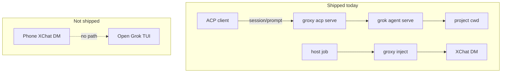
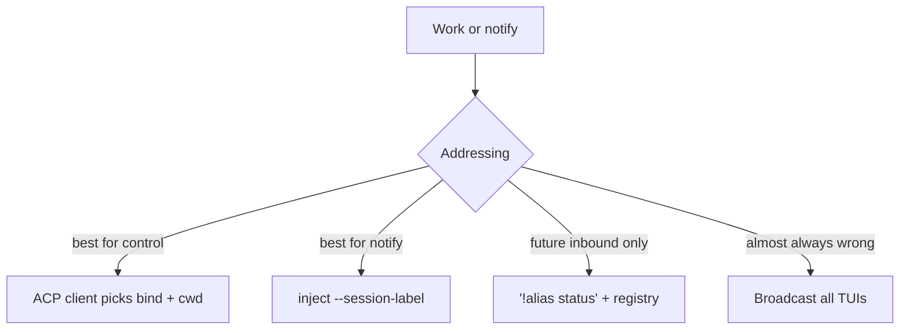
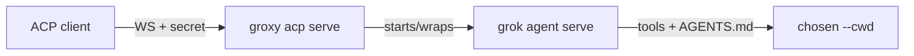
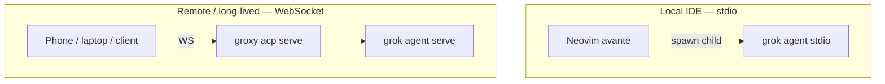
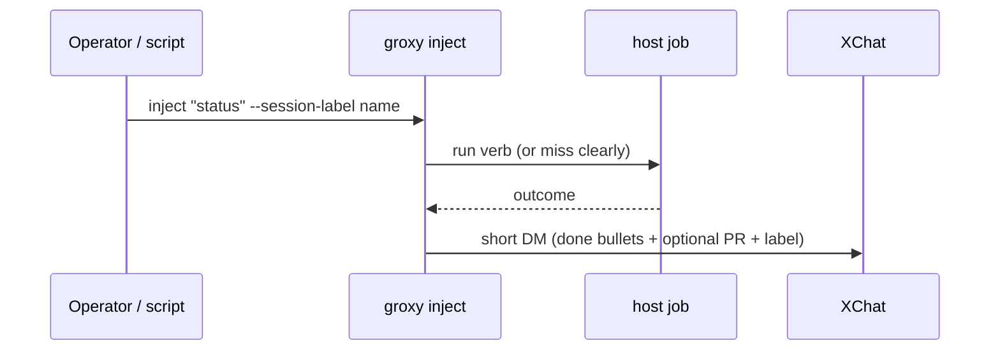
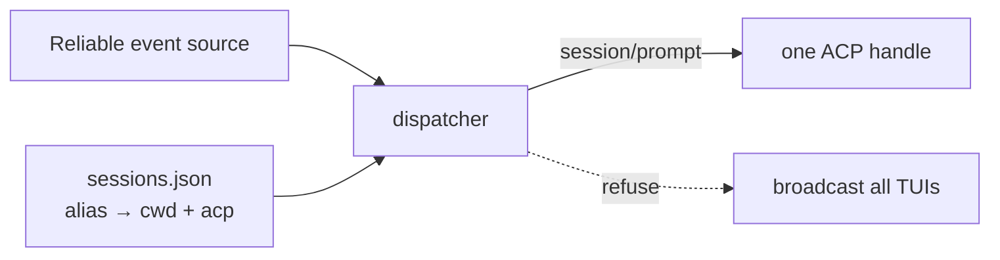
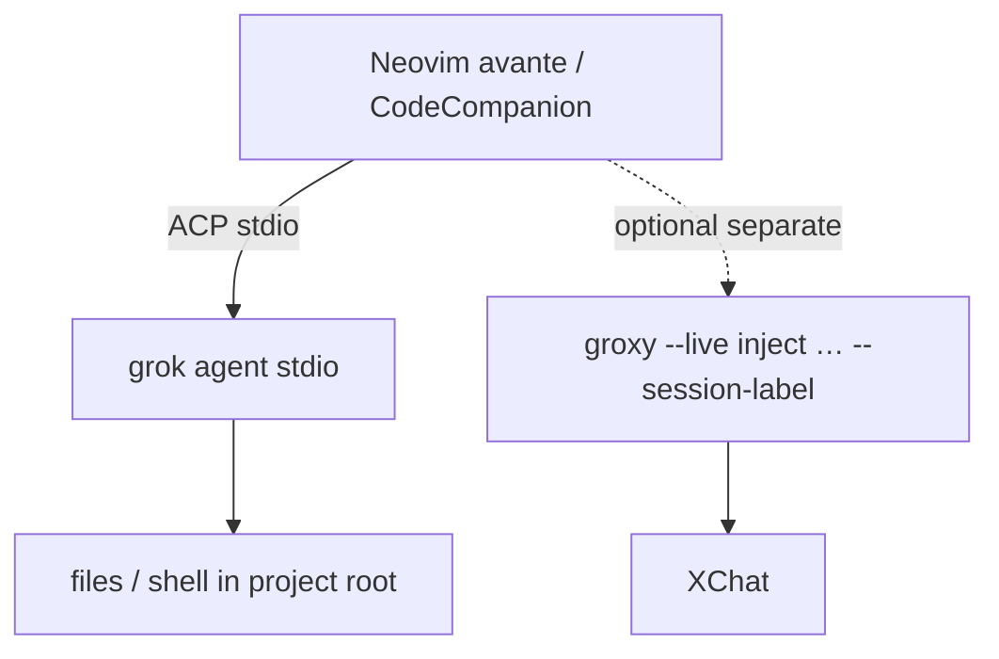

# groxy — multi-session Grok remote surfaces

Package: **`tools/groxy`** · Binary: **`groxy`** · Launch: **`bin/groxy`**  
Crate README: [tools/groxy/README.md](../tools/groxy/README.md)

**groxy** works for **any** Grok workspace on the laptop. It is not locked to arch-machine.  
Host verbs such as `inventory` only run when the workspace has those scripts.

Write clear rules. Do not pretend open Grok windows “hear” XChat.

---

## What it does (plain English)

You need two things from a remote surface:

1. **Control** — drive a Grok agent in a chosen project  
2. **Notify** — tell yourself on XChat that work finished  



| Direction | Tool | Role |
|-----------|------|------|
| **Control Grok** | `groxy acp serve` → `grok agent serve` | Production remote control |
| **Notify human** | `groxy inject` → `xurl dm` | Host → XChat only |
| **XChat → host** | ~~`dm_events` poll~~ | **Not supported** |

We do **not** build X Account Activity webhooks for inbound DMs. Access tier, ops cost, and **routing** still matter even with perfect delivery.

---

## Who is the DM for?

Several Grok processes can run at once:

| Process | What it is |
|---------|------------|
| Grok TUI A | Interactive chat, cwd = project X |
| Grok TUI B | Interactive chat, cwd = project Y |
| `grok agent serve` (ACP) | Controllable agent, one bind/cwd |
| `groxy inject` | One host job → one XChat notify |

**None of these listen to XChat by default.**  
A session only gets work when something **delivers** a prompt:

- You type in the TUI  
- An **ACP client** sends `session/prompt`  
- A script runs `grok -p …` (a **new** process — not “that open TUI”)

So even a perfect phone DM still needs a rule:

```text
incoming message  →  which session_id / cwd / agent?
```

Without that rule, “DM to Grok” has no target.

### How to address a session



| Scheme | Example | Meaning |
|--------|---------|---------|
| **Explicit (best)** | ACP client → agent for `/proj/A` | Client chooses the session |
| **Label on notify** | `--session-label proj-a` | Outbound DM names the workspace |
| **Keyword prefix** *(future inbound)* | `!a status` → alias `a` | Needs registry + reliable inbound |
| **Broadcast to all TUIs** | — | Almost always wrong |

There is no magic “listener on the DM.” Something must **register** (cwd, alias, ACP endpoint). Delivery is **push into that handle**, not ambient XChat.

---

## ACP — control any project

```bash
./bin/groxy acp explain
./bin/groxy acp status
# Any git repo, not only arch-machine:
./bin/groxy acp serve --cwd /path/to/any/project
```



- Default bind: `127.0.0.1:2419` + secret (`GROK_AGENT_SECRET` or `~/.local/state/groxy/acp-agent.secret`)
- Reach from another machine only over SSH/Tailscale — **not** the open internet without policy
- **Which chat?** The client targets a **specific** serve/cwd. That *is* the address.
- Many projects: many serves on different binds, or one agent with explicit cwd per `session/new`

`grok agent --leader` can share one backend among clients; clients still open distinct sessions.

### stdio (Neovim) vs `acp serve` (WebSocket)

These are **different jobs**. Daily Neovim/avante does **not** need `acp serve`.



| | **stdio** (avante / CodeCompanion) | **serve** (`groxy acp serve`) |
|--|------------------------------------|--------------------------------|
| **Transport** | Child process, pipes | WebSocket (`127.0.0.1:2419` + secret) |
| **Who starts the agent** | The IDE | You keep a long-lived server |
| **Lifetime** | One chat ↔ one agent process | Several clients can share one bind/cwd |
| **Best for** | Daily coding in Neovim | Remote / multi-client control |

**Use stdio when:** you edit in Neovim, the agent should die with the chat, nothing outside the editor drives that session.

**Use `acp serve` when:**

1. **Remote control** — SSH/Tailscale to a home agent on a fixed cwd  
2. **Headless** — machine runs agent; a thin client or script sends prompts  
3. **Long-lived** — reconnect without restarting via the editor  
4. **Multi-client** — more than one client on the **same** serve  
5. **Separate from notify** — inject = status only; serve = real control  

| Path | Job |
|------|-----|
| **avante + stdio** | Local IDE agent (daily path) |
| **groxy acp serve** | Optional remote control of a cwd |
| **groxy inject** | Host → XChat notify only |

### ACP secret: static on disk (rotate on leak)

The serve secret does **not** change on every restart. That is on purpose: loopback bind, long-lived serve, clients need a stable token.

| Source | Behavior |
|--------|----------|
| `~/.local/state/groxy/acp-agent.secret` | Created on first serve; **reused** until deleted (`0600`) |
| `GROK_AGENT_SECRET` / `--secret` | Overrides the file when set |
| Restart serve alone | **Same** secret |
| Generation | CSPRNG (`/dev/urandom`); not time+pid |

Auto-rotate every boot without a secure handoff only breaks clients. Rotate **on leak** (screenshot, `ps` argv, shared log), not on a timer.

**Harden:** do not paste secrets into PR screenshots or chat; prefer env/file over argv; status may show presence/length only.

**Rotate after a leak:**

```bash
# 1) stop serve
pkill -f 'groxy acp serve' 2>/dev/null || true
pkill -f 'grok agent serve' 2>/dev/null || true

# 2) drop persisted secret (and clear env if you use it)
rm -f ~/.local/state/groxy/acp-agent.secret
unset GROK_AGENT_SECRET

# 3) start again → NEW secret (or pass a fresh one)
./bin/groxy acp serve --cwd /path/to/workspace
# optional:
# ./bin/groxy acp serve --cwd /path/to/workspace --secret "$(openssl rand -hex 24)"
```

If `GROK_AGENT_SECRET` lives in systemd user env or shell rc, clear that too. After rotation, **all clients** must use the new secret.

---

## inject — notify with an optional label

```bash
# Workspace = cwd for host jobs (default: repo with tools/groxy, or GROXY_ROOT)
./bin/groxy --live inject "ping"
./bin/groxy --live inject "status" --session-label arch-machine

./bin/groxy --dry-run inject "ping" --session-label my-other-app
```



Outcome DMs can carry a **session label** so several projects that notify the same X account stay distinct.

Host verbs like `status` / `inventory` look for `maintenance/*.sh` under the workspace. Other projects without those scripts get a clear miss — use `run <prompt>` or ACP for general coding work.

---

## Myths about Grok TUI “listeners”

| Idea | Reality |
|------|---------|
| “All open Groks hear my DM” | False — no bus from X → TUI |
| “The focused window gets it” | Would need a **focus registry** + inbound transport |
| “ACP knows my XChat” | ACP has no X integration; the client sends prompts |
| “inject is inbound” | inject is **outbound** (host starts it) |

---

## If inbound XChat returns later (not now)

Minimum design (even without “webhooks” branding):



1. **Reliable event source** that delivers operator messages  
2. **Session registry**, e.g. `~/.local/state/groxy/sessions.json`  
   `{ "alias": "am", "cwd": "…", "acp": "ws://127.0.0.1:2419", "updated_at": … }`  
3. **Addressing in the DM**: `!am status` or a bound conversation  
4. **Dispatcher**: resolve alias → ACP `session/prompt` or `grok -p` in that cwd  
5. **Never** broadcast to every TUI  

Until (1) exists, shipping (2–5) only builds a dead control plane. That is why poll was removed. Roadmap: **SN-GROXY-3** (parked).

---

## Commands (current)

```bash
make groxy-test
./bin/groxy --help

# Notify
export GROXY_ALLOW_SELF=1
./bin/groxy --live inject "status" --session-label my-workspace

# Control (WebSocket ACP — any ACP client)
./bin/groxy acp serve --cwd /path/to/workspace
```

---

## IDE clients: Neovim (ACP) vs Cursor

| Client | ACP with Grok? | How |
|--------|----------------|-----|
| **Neovim** (avante.nvim / CodeCompanion) | **Yes** | Plugin spawns `grok agent stdio` |
| **Zed** | Yes | External agents |
| **Cursor Agents** | **No** | Cursor’s own stack; use terminal + ACP elsewhere |
| **Emacs** | Yes | agent-shell |

**Which chat is targeted?** The editor opens **one** ACP agent process per chat (stdio child). That process’s cwd is the workspace. A second Neovim ACP chat → a second agent (or leader mode) — not “all DMs go to the focused buffer.”



---

## Neovim setup guide (Grok via ACP)

### Prerequisites

1. **Neovim** 0.10+ (avante often wants 0.11+ — check plugin README).  
2. **Grok Build CLI** on `PATH` (`grok` works; auth via `grok login` or `XAI_API_KEY`).  
3. Optional: this repo’s `bin/groxy` for XChat notify only (not required for ACP).

Verify:

```bash
which grok
grok agent stdio --help   # or: grok agent --help
# optional:
./bin/groxy acp status
```

### Option A — avante.nvim (recommended Cursor-like UX)

[avante.nvim](https://github.com/yetone/avante.nvim) supports **ACP providers** via `acp_providers` + `provider = "…"`.

#### lazy.nvim

```lua
-- ~/.config/nvim/lua/plugins/avante-grok.lua  (or merge into your lazy specs)
return {
  "yetone/avante.nvim",
  event = "VeryLazy",
  build = "make",
  dependencies = {
    "nvim-lua/plenary.nvim",
    "MunifTanjim/nui.nvim",
  },
  opts = {
    provider = "grok-acp",
    acp_providers = {
      ["grok-acp"] = {
        command = "grok",
        args = {
          "agent",
          -- Optional: model / always-approve (see grok agent --help)
          -- "--model", "grok-build",
          -- "--always-approve",
          "stdio",
        },
        env = {
          -- Prefer logged-in CLI auth; or set key if you use API path:
          -- XAI_API_KEY = os.getenv("XAI_API_KEY"),
        },
      },
    },
    behaviour = {
      acp_follow_agent_locations = true,
      -- auto_approve_tool_permissions = true,  -- or false / list of tools
    },
  },
}
```

**Notes:**

- Prefer **`grok agent stdio`** for Neovim (plugin spawns the agent).  
  `groxy acp serve` is WebSocket-oriented; most Neovim plugins use **stdio** ACP, not WS.  
- Absolute command if needed: `command = vim.fn.expand("~/.grok/bin/grok")`.  
- Project rules: put `AGENTS.md` / `avante.md` in the project root.  
- Switch provider: `:AvanteSwitchProvider grok-acp`.

**Known interop (avante WARN spam — not a misconfig):**

Grok agent emits **proprietary** JSON-RPC notifications under `_x.ai/*`  
(e.g. `_x.ai/mcp/init_progress`, `_x.ai/mcp/server_status`, `_x.ai/mcp/servers_updated`)  
while MCP servers start. Stock [avante.nvim](https://github.com/yetone/avante.nvim)  
only handles `session/*` and `fs/*` and otherwise warns `Unknown notification method: …`.

| Classification | Details |
|----------------|---------|
| **Not** | Wrong provider, missing `grok` PATH, failed build, or broken ACP session |
| **Is** | Client whitelist vs agent protocol extension (noise; session/tools still work) |
| Mitigations | (1) Ignore `_x.ai/*` in a host post-setup hook; (2) wait for upstream; (3) trim MCP servers if unused in that chat |

Operator re-check: `tools/groxy/scripts/verify-nvim-avante.sh`.

#### Usage in Neovim

| Action | Typical |
|--------|---------|
| Open sidebar / ask | `:AvanteAsk` / leader maps from plugin |
| Chat | `:AvanteChat` |
| Toggle | `:AvanteToggle` |
| Zen-mode CLI feel | see avante README (`avante` alias) |

Confirm the agent is Grok: first message should use Grok tools/session (not Claude/Gemini keys).

---

### Option B — CodeCompanion.nvim

[CodeCompanion](https://github.com/olimorris/codecompanion.nvim) supports ACP adapters (plugin version matters).

Pattern (adjust names to your CodeCompanion version):

```lua
-- Sketch — verify adapter name against current CodeCompanion ACP docs
{
  "olimorris/codecompanion.nvim",
  dependencies = { "nvim-lua/plenary.nvim" },
  opts = {
    strategies = {
      chat = {
        adapter = "grok_acp",
      },
    },
    adapters = {
      grok_acp = function()
        return require("codecompanion.adapters").extend("acp", {
          name = "grok_acp",
          commands = {
            default = {
              "grok",
              "agent",
              "stdio",
            },
          },
        })
      end,
    },
  },
}
```

Keep the same principle: **`command = grok`**, **`args = { "agent", "stdio" }`**.

---

### Option C — Terminal-only (no plugin)

Inside Neovim `:terminal`:

```bash
cd %:p:h   " or project root
grok                    # full Grok Build TUI (not ACP)
# or headless one-shot:
grok -p "review this file" --cwd .
```

For ACP WebSocket (other clients, remote):

```bash
./bin/groxy acp serve --cwd "$PWD"
# then connect from Zed / custom WS client — not from avante’s stdio path
```

---

### Multi-project / multi-session in Neovim

| Goal | Approach |
|------|----------|
| One project | Open Neovim in that root; ACP agent inherits cwd |
| Second project | New Neovim (or tab) in other root → **another** ACP child |
| Shared backend | `grok agent --leader` (advanced) |
| Label XChat notify | `:! groxy --live inject "status" --session-label this-repo` |

There is still **no** link from phone XChat DMs into the Avante buffer unless you build registry + inbound later.

---

### Troubleshooting (Neovim + Grok ACP)

| Symptom | Check |
|---------|--------|
| Plugin starts Claude/Gemini instead | `provider` / adapter name points at `grok-acp` |
| `Unknown notification method: _x.ai/mcp/…` WARN spam | Grok proprietary ACP extensions; ignore `_x.ai/*` (host hook) or wait for upstream — **not** a broken install |
| `Sending message to fast!, API key is not yet set` | **Not** a missing XAI key for ACP. Stock avante sets `vim.g.avante_login=false` for ACP providers. Host `avante-grok.lua` re-asserts login. Restart nvim; `:AvanteSwitchProvider grok-acp` if needed |
| Do I need `acp serve` if avante works? | **No** for daily Neovim — avante uses **stdio**. Use serve for remote/long-lived/multi-client only |
| Leaked serve secret / rotate | Secret is **static** on disk; restart does not rotate. See [ACP secret](#acp-secret-static-on-disk-rotate-on-leak) |
| `command not found: grok` | PATH / `~/.grok/bin` in Neovim’s env (`:echo $PATH`) |
| Auth errors | `grok login` in a real shell; or `XAI_API_KEY` for the child `env` |
| Wrong project files | Open Neovim with `nvim /path/to/project` so cwd is correct |
| Permissions every tool call | avante `auto_approve_tool_permissions` or pass `--always-approve` to `grok agent` (powerful — local only) |

---

### Cursor (for contrast)

Cursor Agents **do not** speak Grok ACP. From Cursor: use the **terminal** for `grok` / `groxy acp serve`, or an external ACP client.

---

## Data hygiene

- No operator X ids in git.  
- `GROXY_ALLOW_SELF=1` or gitignored local allowlist.

## Modules

| Module | Role |
|--------|------|
| `acp_remote.rs` | Launch/status for `grok agent serve` (WS); Neovim usually uses **stdio** directly |
| `eagle.rs` | inject path: policy → job → package |
| `command_parse` / `allowlist` / `outcome_package` | Pure logic |
| `host_job.rs` | Optional workspace scripts + `grok -p` |
| `dm_adapter.rs` | Outbound `xurl dm` |
| `state_store.rs` | Seen event ids (dedupe) |

## Related

- Crate README: [tools/groxy/README.md](../tools/groxy/README.md)
- Grok agent mode: `~/.grok/docs/user-guide/15-agent-mode.md`
- ACP overview: [agentclientprotocol.com](https://agentclientprotocol.com)
- avante ACP: [yetone/avante.nvim#acp-support](https://github.com/yetone/avante.nvim#acp-support)
- CodeCompanion: [olimorris/codecompanion.nvim](https://github.com/olimorris/codecompanion.nvim)
- Control plane: [archy.md](archy.md) · [tools/archy/README.md](../tools/archy/README.md)
- Roadmap: [arch-design/coming-next.md](../arch-design/coming-next.md) (SN-GROXY-1/2 landed · SN-GROXY-3 parked)
