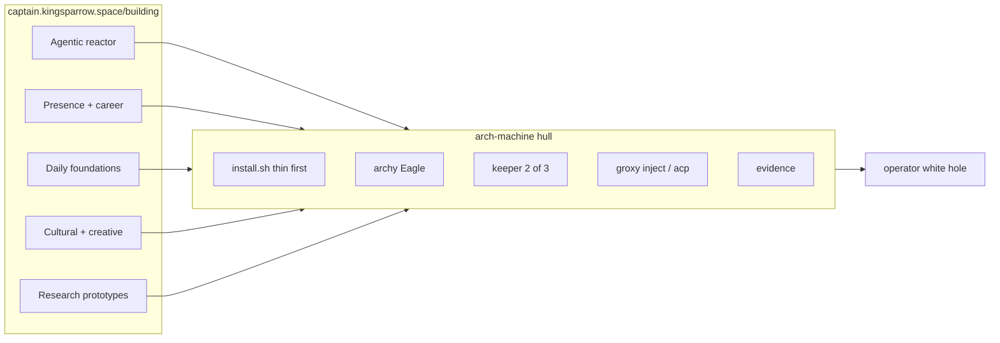

# Complementary composition

**Audience:** operator · implementer · agents  
**Mode:** explanation (why this hull exists)  
**Map:** [Building, landscape of the public stack](https://captain.kingsparrow.space/building)  
**Not:** a merge plan for other git repos into this tree

arch-machine is already on that map. It is the Daily foundations + infra row. The story is how the other public projects compose *onto* this hull, and why that mix is Diamond Age plus Culture, not a pick of one.

---

## Why both worlds

Niall Ferguson calls Neal Stephenson science fiction’s **arch-realist**. The foil is Iain M. Banks’ Culture, which Elon Musk had treated as the picture of AI abundance. Ferguson’s line is to forget effortless utopia and expect messy, unintended consequences. See [Elon’s Favorite Sci-Fi Prophet Was Wrong](https://niallferguson.substack.com/p/elons-favorite-sci-fi-prophet-was).

**Diamond Age (1995).** Matter compilers print goods from the Feed. The Source stays under a phyle. The Seed would compile locally and break that pipe. Nations give way to phyles. Nell’s Primer tutors a child. A human ractor still voices it. Compilers do not print character. Patents and the Feed keep most people on cheap rations. Stephenson names the tutor **pseudo-intelligence**, a product, not an oracle. [Wikipedia](https://en.wikipedia.org/wiki/The_Diamond_Age) · [The Atlantic on the Primer](https://www.theatlantic.com/technology/archive/2024/02/chatbots-ai-neal-stephenson-diamond-age/677364/) · [P2P Foundation on Feed vs Seed](https://blog.p2pfoundation.net/a-p2p-overview-of-neal-stephensons-diamond-age/).

**Culture machine.** Humanoids, drones, and Minds. Work that must happen is done by machines. “Money implies poverty.” Power sits with Minds that run ships and orbitals. Humans consult terminals. Banks placed humans between passengers, pets, and parasites, and also as the Minds’ reason to live. Remaining drama is Contact with poorer civilizations. [Wikipedia](https://en.wikipedia.org/wiki/The_Culture) · [The New Atlantis](https://www.thenewatlantis.com/publications/the-ambiguous-utopia-of-iain-m-banks) · [Banks, 2011](https://www.albedo1.com/the-iain-m-banks-interview-2011-falling-outside-the-normal-sci-fi-constraints/).

A [Banks vs Stephenson pairing](https://www.metavert.io/compare/iain-banks-vs-neal-stephenson) puts the fork in one sentence. Banks asks what we should build. Stephenson asks what we will actually build, given human nature.

This repo takes both. The hull, vault, drill, and evidence are Diamond Age. archy, groxy, `/arch-*`, and ensembly-shaped agent loops are Culture terminals. Complementary means the terminals never become the parent. `keeper` healthy still means you drilled once. It does not mean a Mind caught you.

---

## The public map

[Building](https://captain.kingsparrow.space/building) draws cluster bands into four docks (Career, Systems, Creative, Learning), then a Penrose white hole. A black hole captures. This hole emits. Projects fall in on the left. The operator is the exit. Shipped work comes out, not a gallery of clones.

`ensembly` is the operator loop. It uses Grok Bot, Grok Build, and the projects on that map as tools. Local kernel plus playable HITL. `mesh` is private cooking for devices and networks. It is not a public repo.

arch-machine is the workstation that can *host* that loop without swallowing every repo.

---

## What each project is on this hull

Compose means PATH, session, plugin, or optional module. It does not mean copy the other git tree into `modules/`.

| Project | Cluster on the map | On this hull |
|---------|--------------------|--------------|
| arch-machine | Daily foundations | The hull. Thin install, profiles, archy, groxy, keeper, evidence. |
| shellyxz.sh | Daily foundations | Shell kernel and PATH contract. Lives beside the installer, not as a dotfiles dump inside it. |
| elomaxz | Daily foundations | The Eagle pattern already in archy. Tagged messages, pure update, Cmd to satellites. |
| premflow | Daily foundations | Small C CLI for notes, tasks, pomodoro. Install to `~/.local/bin` on the host. |
| Adaptate | Daily foundations | npm validator when a JS consumer appears. Not a day-1 thin dep. |
| plugins | Agentic reactor | Grok plugins that coach real CLIs, including the arch-machine `/arch-*` plugin. |
| skills | Agentic reactor | Portable skills. This repo locks a pack in `skills-lock.json` and overlays in `.agents/overlays/`. |
| ensembly | Agentic reactor | Operator. Uses this hull as a tool. Does not replace archy. |
| agent-prompt-tuning-lab | Agentic reactor | Local transcripts to datasets and gold exemplars. Feeds skills. Stays privacy-first. |
| collab-finder | Agentic reactor | Desktop apply packs. Runs *on* the machine. Does not belong in `install.sh`. |
| devprofile | Presence + career | Public portfolio. Same rule. Career work uses the hull. The hull does not become the CV. |
| thepulimaangani metre | Cultural + creative | Tamil metre app. Optional host workload. |
| shelf-life writing | Cultural + creative | Books and companions. Writing happens on the host. |
| prototype-it-to-explain-itself | Research prototypes | Tiny teaching prototypes. Education, not production training. |
| mesh | Daily foundations | Private. Do not publish into this tree. |

---

## How the stack becomes the hull

Numbered because order matters. Each step is still true if you stop there.

1. **Thin host.** `./install.sh --thin`. Runtime under `/usr/share/tinfoil/`. No AUR brunch. Diamond Age Seed. You compile locally. You are not a client of someone else’s full profile.

2. **Control plane.** `archy` is the Primer that shows NEXT and runs a script. It is not a GSV Mind. Eagle receives messages. Satellites own jobs. Jobs start, stream, and exit.

3. **Ceremony.** `keeper` is any 2 of 3. Passphrase, offline escrow, device. `put-escrow` / `get-escrow` are the no-passphrase pair when the USB file is present. Healthy means recover worked once. An agent with `KEEPER_PASSPHRASE` in env is Special Circumstances with none of Banks’ niceness.

4. **Terminals.** `groxy inject` notifies. `groxy acp serve` controls a remote agent. Neovim uses `grok agent stdio`. Plugin `/arch-*` talks to this repo. Culture Contact, Diamond Age caps. No ambient DM that guesses which Grok window is “it”.

5. **Kernel contract.** shellyxz PATH and plugin isolation on the same machine. arch-machine install stays idempotent. Two kernels fighting is Feed politics. Pick one PATH story.

6. **Skills and plugins.** Pull the locked pack. Overlay only project tweaks. agent-prompt-tuning-lab may mint new skills from *your* transcripts. Do not paste generic prompt packs over lived workflow.

7. **Daily CLIs.** premflow and similar tools land on PATH. archy can steer them later. Until then they are host programs, not Eagle satellites.

8. **Career on the host.** collab-finder and devprofile stay their own apps. Slot 2 work happens here. Merging them into the installer would turn the hull into a résumé factory.

9. **Cultural root.** thepulimaangani, shelf-life writing, teaching prototypes. They run on the machine. They do not need a YAML profile until install friction is real.

10. **Evidence close.** `maintenance/extract-evidence.sh`. The white hole emits bundles, not vibes. Agents read logs. Humans still drill.

Stop condition. If a compose step needs the passphrase on argv, or skips keeper drill, or treats archy as an open session, it is Culture theater. Refuse it.

---

## Refuse vs build

| Refuse | Build toward |
|--------|----------------|
| Unattended vault without drill | Agent ops under 2 of 3 and files, not argv |
| Merging every map repo into this tree | PATH, plugin, optional module, or “runs on the host” |
| archy as parent of last resort | Eagle + satellite + NEXT |
| Publishing mesh | Private cooking stays private |
| Feed-only install (`npx` as the source of truth) | Thin local binaries and `--agent-expand` PATH |

Ferguson is right that copper, chips, and power are not free, and that PI leaks. Banks is still useful as the *shape* of terminals and Contact. The composition is a workstation that can host agents without pretending the agents already won.

---

## Open

Whether premflow becomes an archy satellite. Whether thepulimaangani ever gets an `install_*` hook. Whether ensembly’s HITL and archy’s NEXT should share a message type. Those are later PRs. This note does not schedule them.
