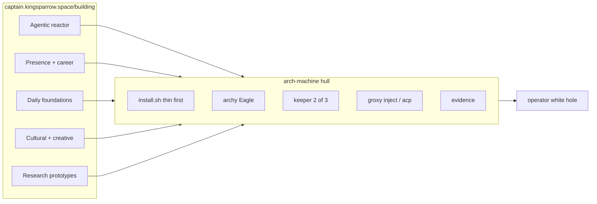

# Complementary composition

**Audience:** operator · implementer · agents  
**Mode:** explanation (why this hull exists)  
**Map:** [Building, landscape of the public stack](https://captain.kingsparrow.space/building)  
**Not:** a merge plan for other git repos into this tree

arch-machine is already on that map. It is the Daily foundations + infra row. Other public projects compose *onto* this hull. The literary frame is not a pick between Diamond Age and the Culture. They are two chapters of one manual: atoms get cheaper; people do not get simpler.

Operator source (same argument, public): [two-chapter manual](https://x.com/Peramanathan/status/2093930676223463676) · [do not wait for a Mind](https://x.com/Peramanathan/status/2093933409873584336).

---

## What arch names

**Arch** here is first the distro. Judd Vinet named Arch Linux for *the principal*, the same prefix as arch-enemy. Pronounce it `/ɑːrtʃ/` (archer), not ark. **arch-machine** is an Arch Linux workstation as a productized hull: thin install, profiles, control plane, vault, evidence.

**archy** is the named controller of that hull. The suffix *-archy* means rule (monarchy, anarchy). It steers scripts and points at NEXT. It is not a starship Mind.

Ferguson’s **arch-realist** (Stephenson as chief realist) is a separate intensifier. Happy collision, not the repo’s etymology. Omarchy is DHH’s Arch desktop. Related host, not this name.

The hybrid is already the human condition. Digital and virtual time, and the footprints they leave, did not wait for this installer. This repo does not invent the composition. It is a local Seed and a Primer-shaped loop *inside* a life that is already online.

---

## Two chapters, not rival prophets

Niall Ferguson says forget easy AI abundance, read Stephenson, the future will be messy. See [Elon’s Favorite Sci-Fi Prophet Was Wrong](https://niallferguson.substack.com/p/elons-favorite-sci-fi-prophet-was). Banks already said the road is ugly. He did not stop at the mess.

**Diamond Age (1995)** is the Culture still under construction. Matter compilers print food and goods. Poor thetes live on the free Feed. Rich Neo-Victorians live on manners and control of the Source. A stolen Primer raises Nell, a child the system would have discarded. Nanotech leaks. Compilers do not print character. [Wikipedia](https://en.wikipedia.org/wiki/The_Diamond_Age) · [The Atlantic on the Primer](https://www.theatlantic.com/technology/archive/2024/02/chatbots-ai-neal-stephenson-diamond-age/677364/) · [Feed vs Seed](https://blog.p2pfoundation.net/a-p2p-overview-of-neal-stephensons-diamond-age/).

**The Culture** is what life looks like if intelligence and machines actually scale: no money, almost no want, work optional. A **Mind** is not a chatbot. It is a superintelligent AI that *is* the ship or the habitat. Minds keep the lights on. They also run Special Circumstances when a crueler society needs a shove. Plenty at home, dirty hands abroad. [Wikipedia](https://en.wikipedia.org/wiki/The_Culture) · [The New Atlantis](https://www.thenewatlantis.com/publications/the-ambiguous-utopia-of-iain-m-banks) · [Banks, 2011](https://www.albedo1.com/the-iain-m-banks-interview-2011-falling-outside-the-normal-sci-fi-constraints/).

*Consider Phlebas* makes the theme blunt. Horza hates the Culture for handing the future to machines. He dies in the snow. The Mind lives, becomes a ship, and takes his name. Banks prints an appendix: billions dead, galactic needle barely moved. Abundance did not make the war kind. The war did not prove abundance was fake.

Fast map:

| Diamond Age (now / ugly middle) | Culture (if scale holds) |
|---------------------------------|--------------------------|
| Compilers | Minds that can make whatever you ask |
| Thetes on the Feed | Citizens who never need a job |
| Primer | A Mind as tutor and handler |
| Leaked mites | Special Circumstances blowback |

Musk bets we get from Nell’s alley to the orbital. Ferguson bets we stay in the alley with better gadgets. Argue the timeline. Do not pretend Banks forgot the mess. Culture is reachable if geopolitics, optimism, love, and care align. The long attractor is still that the Machine does the work that must happen. The operator stance in this century is not to wait for that parent.

---

## The Primer loop (this is the control plane)

Nell’s education is not a playlist. It is a closed loop that rewrites itself around whatever she can barely handle.

1. **World hits first.** Hunger, violence, a word she cannot read. Not theory.
2. **The book names it.** A drunk becomes a troll. A locked door becomes a riddle. Naming is the first skill. Literacy is gated behind curiosity.
3. **She acts inside the story.** Failure is cheap. The book will let her die in fiction and try again.
4. **She acts in the alley.** Same move, worse stakes.
5. **The book notices.** Success unlocks a harder layer. Failure reroutes. The tutor will not pretend she has passed.
6. **Round and round.** Each orbit a little higher. Transfer: story → street → better story.

Three human pieces, not the nanotech:

- **A voice that cares.** For a long stretch the “AI” is Miranda, an actress who reads night after night. Warmth is pedagogy. A cold sequencer will not make a neglected child come back.
- **Just-hard-enough.** Between boredom and panic. Too easy and she becomes a thete on a prettier Feed. Too hard and she slams the book.
- **Moral rehearsal.** She learns when not to become her mother’s chaos. Stories give a second family with standards.

Hackworth built the Primer for an equity lord’s granddaughter. Nell gets a stolen copy. Same loop, different starting wealth. Adaptive learning is how a person climbs. Who owns the tutor decides how many Nells get to climb.

**archy** is this loop on a workstation, not a Mind. Keys and job lines are the world-hit. The TUI names the job. Dry-run and NEXT are cheap fiction. The shell satellite is the alley. Evidence is the book noticing. `keeper` drill is the exam the tutor will not fake. Grok `/arch-*` and a human operator are Miranda: a voice that comes back. Treat every model as leverage, not as a parent.

Hope is not a mood. It is a training plan. Copy the method without waiting for a magic book: pick a live problem, fail safely, do the real thing within a day, record what broke, raise difficulty, add one person who shows up again. Hit, name, rehearse, attempt, adjust. Plenty is a Primer if you open it, and a Feed if you only eat.

Do not become the thete.

---

## The public map

[Building](https://captain.kingsparrow.space/building) draws cluster bands into four docks (Career, Systems, Creative, Learning), then a Penrose white hole. A black hole captures. This hole emits. Projects fall in on the left. The operator is the exit. Shipped work comes out, not a gallery of clones.

`ensembly` is the operator loop. It uses Grok Bot, Grok Build, and the projects on that map as tools. Local kernel plus playable HITL. `mesh` is private cooking for devices and networks. It is not a public repo.

arch-machine is the workstation that can *host* that loop without swallowing every repo.

---

## What each project is on this hull

Compose means PATH, session, plugin, or optional module. It does not mean copy the other git tree into `modules/`.

| Project | Cluster on the map | On this hull |
|---------|--------------------|--------------|
| arch-machine | Daily foundations | The hull. Thin install, profiles, archy, groxy, keeper, evidence. |
| shellyxz.sh | Daily foundations | Shell kernel and PATH contract. Lives beside the installer, not as a dotfiles dump inside it. |
| elomaxz | Daily foundations | The Eagle pattern already in archy. Tagged messages, pure update, Cmd to satellites. |
| premflow | Daily foundations | Small C CLI for notes, tasks, pomodoro. Install to `~/.local/bin` on the host. |
| Adaptate | Daily foundations | npm validator when a JS consumer appears. Not a day-1 thin dep. |
| plugins | Agentic reactor | Grok plugins that coach real CLIs, including the arch-machine `/arch-*` plugin. |
| skills | Agentic reactor | Portable skills. This repo locks a pack in `skills-lock.json` and overlays in `.agents/overlays/`. |
| ensembly | Agentic reactor | Operator. Uses this hull as a tool. Does not replace archy. |
| agent-prompt-tuning-lab | Agentic reactor | Local transcripts to datasets and gold exemplars. Feeds skills. Stays privacy-first. |
| collab-finder | Agentic reactor | Desktop apply packs. Runs *on* the machine. Does not belong in `install.sh`. |
| devprofile | Presence + career | Public portfolio. Same rule. Career work uses the hull. The hull does not become the CV. |
| thepulimaangani metre | Cultural + creative | Tamil metre app. Optional host workload. |
| shelf-life writing | Cultural + creative | Books and companions. Writing happens on the host. |
| prototype-it-to-explain-itself | Research prototypes | Tiny teaching prototypes. Education, not production training. |
| mesh | Daily foundations | Private. Do not publish into this tree. |

---

## How the stack becomes the hull

Numbered because order matters. Each step is still true if you stop there.

1. **Thin host.** `./install.sh --thin`. Runtime under `/usr/share/tinfoil/`. No AUR brunch. Seed, not Feed. You compile locally. You are not a client of someone else’s full profile.

2. **Control plane.** `archy` is the Primer loop: name the hit, cheap rehearsal, alley job, notice the result. It is not a GSV Mind. Eagle receives messages. Satellites own jobs. Jobs start, stream, and exit.

3. **Ceremony.** `keeper` is any 2 of 3. Passphrase, offline escrow, device. `put-escrow` / `get-escrow` are the no-passphrase pair when the USB file is present. Healthy means recover worked once. An agent with `KEEPER_PASSPHRASE` in env is Special Circumstances with none of Banks’ niceness.

4. **Terminals.** `groxy inject` notifies. `groxy acp serve` controls a remote agent. Neovim uses `grok agent stdio`. Plugin `/arch-*` talks to this repo. Contact with Diamond Age caps. No ambient DM that guesses which Grok window is “it”.

5. **Kernel contract.** shellyxz PATH and plugin isolation on the same machine. arch-machine install stays idempotent. Two kernels fighting is Feed politics. Pick one PATH story.

6. **Skills and plugins.** Pull the locked pack. Overlay only project tweaks. agent-prompt-tuning-lab may mint new skills from *your* transcripts. Do not paste generic prompt packs over lived workflow.

7. **Daily CLIs.** premflow and similar tools land on PATH. archy can steer them later. Until then they are host programs, not Eagle satellites.

8. **Career on the host.** collab-finder and devprofile stay their own apps. Slot 2 work happens here. Merging them into the installer would turn the hull into a résumé factory.

9. **Cultural root.** thepulimaangani, shelf-life writing, teaching prototypes. They run on the machine. They do not need a YAML profile until install friction is real.

10. **Evidence close.** `maintenance/extract-evidence.sh`. The white hole emits bundles, not vibes. Agents read logs. Humans still drill.

Stop condition. If a compose step needs the passphrase on argv, or skips keeper drill, or treats archy as a parent, it is Culture theater. Refuse it.

---

## Refuse vs build

| Refuse | Build toward |
|--------|----------------|
| Waiting for a Mind to raise you | Primer loop: hit, name, rehearse, attempt, adjust |
| Unattended vault without drill | Agent ops under 2 of 3 and files, not argv |
| Merging every map repo into this tree | PATH, plugin, optional module, or “runs on the host” |
| archy as parent of last resort | Eagle + satellite + NEXT |
| Feed-only install (`npx` as the source of truth) | Thin local binaries and `--agent-expand` PATH |
| Publishing mesh | Private cooking stays private |
| Pretending Banks is naive and Stephenson is the only realist | Two chapters. Argue the timeline. Train in the alley. |

The rise is already running. Goods get cheaper. Attention and character do not. Be Nell in the alley, not a spectator of orbitals.

---

## Open

Whether premflow becomes an archy satellite. Whether thepulimaangani ever gets an `install_*` hook. Whether ensembly’s HITL and archy’s NEXT should share a message type. Those are later PRs. This note does not schedule them.
