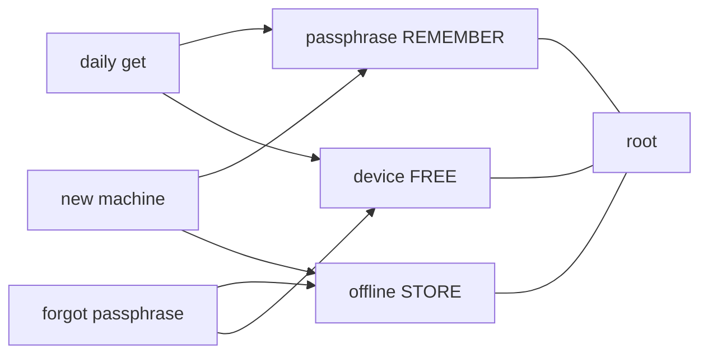

# Operator model — forgetfulness-proof (as far as crypto allows)

## The one card (memorize this, nothing else)

| Slot | What | Where | If you lose it |
|------|------|-------|----------------|
| **REMEMBER** | **One** passphrase | Head or *one* password-manager entry | Use escrow on this machine |
| **STORE** | **One** escrow file | USB / paper QR / *other* house — **never only on this laptop** | Still unlock with passphrase on this machine |
| **FREE** | Device fingerprint | Automatic | New PC: need passphrase **and** escrow |

**There is no second secret. No knowledge question. No “healthy means open.”**

```text
any 2 of { passphrase, offline escrow, device }
```



---

## What “passphrase” actually is

- It **unwraps one Shamir share** (scrypt). It is **not** the root key by itself.
- The root lives only after **two** shares combine.
- We do **not** store your passphrase. We store a **scrypt wrap** of share #1 under the vault root (`passphrase.wrap` style blob). Steal the wrap → attacker still needs offline share **or** this machine’s device share.

---

## Why `status` healthy ≠ `get` open (and the fix)

| Old pain | Cause | Now |
|----------|-------|-----|
| recover → healthy, get still wants passphrase | “healthy” only meant *drill proven*; get always used passphrase path | **`get NAME --escrow file`** opens without passphrase |
| Two secrets forever | knowledge + passphrase both required | knowledge **removed** from default |
| k=3 always | needed 3 factors every time | **k=2 of 3** |

---

## Daily flow (normal)

```bash
export KEEPER_ROOT=~/.local/share/keeper   # or default
export KEEPER_PASSPHRASE='…'              # or KEEPER_PASSPHRASE_FILE
keeper put mfa --value '…'
keeper get mfa                            # passphrase only
keeper status                             # healthy after one recover drill
```

## Forgot passphrase (same machine)

```bash
keeper get mfa --escrow /media/usb/keeper-escrow.json
# or prove drill:
keeper recover --escrow /media/usb/keeper-escrow.json
```

## Partial loss matrix (honest)

| You still have | You can |
|----------------|---------|
| P + D | daily unlock |
| O + D | unlock without P (same machine) |
| P + O | unlock on new machine (vault files + escrow) |
| Only P | **no** (device or escrow required) |
| Only O | **no** |
| Only D | **no** (stolen laptop alone must not open vault) |
| Nothing | **dead** — crypto cannot invent a key from vacuum |

**Forgetfulness-proof** here means: *you may forget the passphrase* if escrow is safe offline; *you may lose the USB* if you still know the passphrase on this machine; *you may not forget both and lose the machine*.

That is the real bound. Anything claiming “remember nothing, store nothing, survive everything” is lying or shipping the key to a cloud vendor (different threat model).

---

## Anti-PIASS rules we keep

1. **One** human secret.  
2. **One** offline artifact.  
3. Device free.  
4. Public IP / GeoIP never a factor.  
5. No secrets on CLI argv.  
6. Disk cannot lower k below 2.

---

## Init checklist (once)

1. `export KEEPER_PASSPHRASE=…` (strong; or store **only** that one string in a password manager).  
2. `keeper init --escrow ~/Desktop/keeper-escrow.json`  
3. **Copy escrow off the machine** (USB). Delete local copy if you want.  
4. `keeper put …`  
5. `keeper recover --escrow /media/usb/…` once → healthy.  
6. Daily: only passphrase for `get`/`put`.
