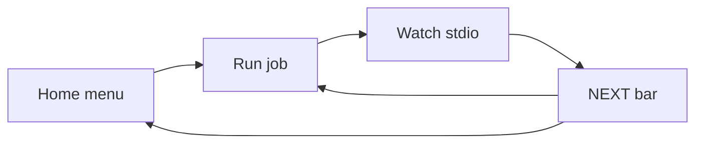
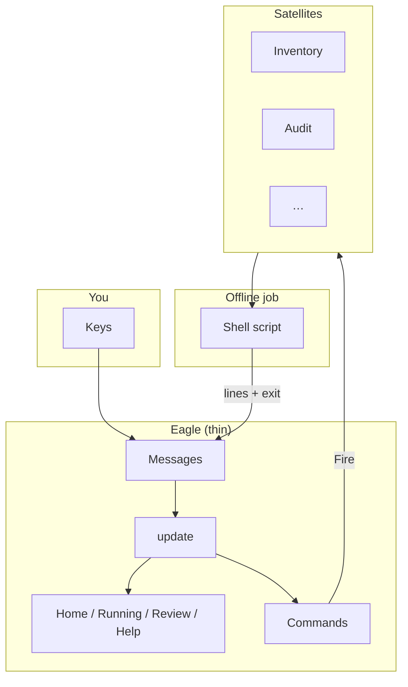
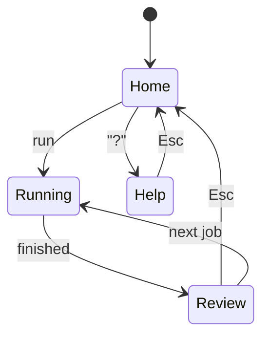

# archy — your control plane

**archy** is the main app you open to run maintenance on this machine.

- You stay oriented: **pick → watch output → do the next step**
- Real work stays in **shell scripts** and **`install.sh`**
- Rust only **steers** and draws a calm screen

Full walkthrough with diagrams: [docs/archy.md](../../docs/archy.md)  
Agent skill: [eagle-satellite-elomaxz](../../.agents/skills/eagle-satellite-elomaxz/SKILL.md)

### Grok plugin ↔ this TUI (cycle)

```text
Grok (/arch-*)  ──►  arch-machine / archy
     ▲                      │
     └──── G / p preload ───┘
```

| Direction | Action |
|-----------|--------|
| **Grok → host** | Enable **arch-machine** plugin → `/arch-status`, `/arch-audit`, `/arch-control`, … |
| **archy → Grok** | After a job: `g` brief, then `p` / Enter / `G` (preloaded interactive Grok) |

Plugin path on this host: `~/Work/personal/plugins/arch-machine`  
Cycle guide: [docs/archy.md § Grok plugin](../../docs/archy.md) · plugin `docs/CROSS-REF.md`

---

## Operator flow



After a job, the **amber NEXT** item is the best next step. Secondaries stay muted.  
Inventory is smart: missing tools → install dry-run; upgrades → pkg dry-run; clean → audit.

---

## Architecture (simple)

**Eagle** = thin top brain. **Satellites** = one domain each. **Messages** = everything that happens.

Design notes (public threads):

- [Eagle + Satellites — orchestrator of orchestrators](https://x.com/Peramanathan/status/2078680221059039361)
- [Offline satellites — fire → work → verify (no heartbeats)](https://x.com/Peramanathan/status/2078703537849241742)
- [Structured loops over raw ReAct (outer state machine)](https://x.com/Peramanathan/status/2067890630345494578)

In-repo skill: [eagle-satellite-elomaxz](../../.agents/skills/eagle-satellite-elomaxz/SKILL.md) · guide: [docs/archy.md](../../docs/archy.md).



| Piece | Plain English |
|-------|----------------|
| Eagle | Routes events; never hard-codes package scripts |
| Satellite | Owns one job (build command + “what next?”) |
| Offline job | Start script → stream text → check exit (no heartbeat spam) |
| Msg / Cmd | Elm-style message passing (Elomaxz / TEA) |
| Phase | State machine: where you are on screen |

Same idea as the older gum TUI: `lib/tui/{messages,model,update,view}.sh`.

### State machine



### Source map

```text
main.rs        → loop: draw, tick, keys, perform commands
eagle.rs       → update(message) → command
fsm.rs         → phases
msg.rs / cmd.rs → events and effects
satellites/    → menu + each job’s script + finish plan
jobs.rs        → spawn / stream / poll exit
ui.rs          → draw only
```

---

## Build

```bash
cargo build --release --manifest-path tools/archy/Cargo.toml
# binary: tools/archy/target/release/archy

TINFOIL_ROOT=$PWD cargo run --release --manifest-path tools/archy/Cargo.toml
TINFOIL_ROOT=$PWD cargo run --manifest-path tools/archy/Cargo.toml -- --grok-split
```

## Keys

| Key | What it does |
|-----|----------------|
| ↑↓ / j k | Move menu or scroll output |
| Enter | Run · in brief: launch Grok · on NEXT: primary |
| Tab | Focus: menu → stdio → brief → next |
| g | Toggle co-pilot **brief** (not a live chat) |
| G / p | Launch Grok (suspends the TUI) |
| Esc | Back to Home |
| Ctrl+C | Cancel job · or quit if idle |
| q | Quit from Home |
| ? | Help |

## Co-pilot (Grok)

| Mode | Meaning |
|------|---------|
| Brief (`g`) | Side panel only — suggested ask. **Not** live ACP chat. |
| Launch (`G` / Enter in brief / NEXT `[p]`) | Suspends archy; writes context + prompt files; runs **interactive** `grok --cwd <root> "<composed prompt>"` so the session is **preloaded** (not empty Build). `G` adds `--fullscreen`. |

Env: `ARCHY_ROOT`, `ARCHY_GROK_ASK`, `ARCHY_GROK_CONTEXT_FILE`, `TINFOIL_ROOT`.  
Files: `logs/archy-grok-context.txt`, `logs/archy-grok-prompt.txt`.  
Not default: bare `grok`, or headless `grok -p` (single-turn only). ACP-in-split is not shipped yet.

## Theme (startup only)

Ratatui cannot fully copy the OS theme. Light vs dark is chosen once:

1. `ARCHY_THEME=light|dark`
2. Omarchy `colors.toml` background brightness
3. Theme name
4. `COLORFGBG`
5. Default **dark**

No live phase hot-reload. See `?` help.

## Menu → backends

| Menu | Backend |
|------|---------|
| Inventory | `maintenance/inventory.sh` |
| Catalog | `maintenance/catalog.sh` |
| Omarchy status | `maintenance/omarchy-status.sh` |
| Audit | `security-audit` / tinfoil |
| Install dry-run | `install.sh --profile … --dry-run` |
| Evidence | `extract-evidence.sh --dry-run` |
| Actuate dry-run | `package-actuate.sh` |

**Iron peak:** logic lives under `maintenance/`. This crate only steers.

## Wire as default `tinfoil tui`

When `archy` is on `PATH`, the Go dispatcher can start it first (`bin/tinfoil.go`). Gum stays fallback. (PATH install: SN-ARCHY-1.)

## Tests

```bash
cargo test --manifest-path tools/archy/Cargo.toml
```
