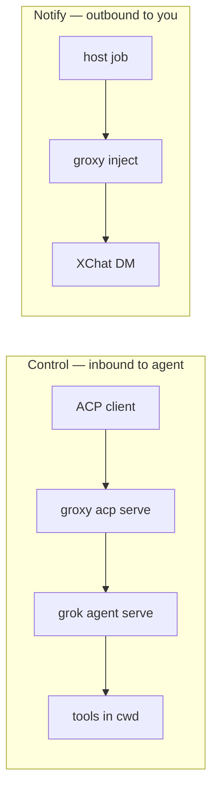
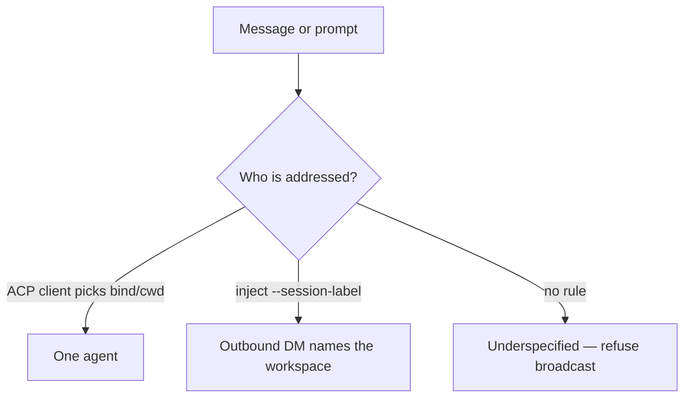

# groxy — notify + remote control for Grok

**groxy** is a thin helper for **any** Grok workspace on this machine.

- **inject** — run a host job, then send a short **notify** to XChat  
- **acp serve** — start a Grok agent you can **control** over the network (loopback by default)

It does **not** make open Grok windows listen to phone DMs. That needs a real inbound path and a session registry (not shipped).

Full guide: [docs/groxy.md](../../docs/groxy.md)  
Launch: [`bin/groxy`](../../bin/groxy) · package: `tools/groxy`

---

## Two jobs, two directions



| Goal | Command | Direction |
|------|---------|-----------|
| **Control** a project | `./bin/groxy acp serve --cwd /path` | You (or a client) drive the agent |
| **Notify** after work | `./bin/groxy --live inject "status" --session-label name` | Host → XChat only |
| Phone DM → “which of my 3 Groks?” | *not productized* | Needs inbound + registry |

```text
ACP client  ── picks agent/cwd ──►  grok agent serve  ──►  that project   ✅
inject      ── optional label  ──►  XChat notify                          ✅
Phone DM    ── ambient “right window” ──────────────────────────────────  ❌
```

---

## Quick start

```bash
# Tests
make groxy-test

# Control this checkout (WebSocket ACP; secret on first run)
./bin/groxy acp serve --cwd "$PWD"

# Notify (dry-run first; live needs xurl + allowlist)
./bin/groxy --dry-run inject "ping" --session-label arch-machine

export GROXY_ALLOW_SELF=1
./bin/groxy --live inject "status" --session-label arch-machine
```

**stdio vs serve:** daily Neovim/avante uses `grok agent stdio` (child of the editor).  
You do **not** need `acp serve` for that. Use serve for remote / long-lived / multi-client control.

---

## Who is the message for?

Several Grok processes can run at once. None of them share a magic bus from XChat.



| How you address | Example | Use |
|-----------------|---------|-----|
| **ACP client** | connect to serve for `/proj/A` | Best for control |
| **Session label** | `--session-label proj-a` | Best for multi-project notify |
| **Broadcast all TUIs** | — | Almost always wrong |

---

## Layout

```text
src/main.rs           CLI: inject, acp, demo
src/acp_remote.rs     acp explain / status / serve
src/eagle.rs          inject path: policy → job → package
src/host_job.rs       optional workspace scripts + grok -p
src/allowlist.rs      who may trigger notify paths
src/outcome_package.rs  short XChat text (done bullets + PR)
src/dm_adapter.rs     xurl send (live) or dry-run files
src/state_store.rs    seen event ids (dedupe)
scripts/              operator checks (e.g. Neovim avante)
extras/neovim/plugins/grok-acp-plugin/   Lazy spec for Grok ACP **stdio** (avante)
```

Same **Eagle** idea as archy: a thin top path routes work; host scripts and Grok do the real job.

---

## Build and test

```bash
cargo build --manifest-path tools/groxy/Cargo.toml
cargo test  --manifest-path tools/groxy/Cargo.toml
# or:
make groxy-test

./bin/groxy --help
./bin/groxy acp explain
```

`bin/groxy` prefers a release binary, then debug, then builds with cargo.

---

## Safety (short)

| Rule | Why |
|------|-----|
| Default is **dry-run** for inject | No surprise live DMs |
| Live needs allowlist / `GROXY_ALLOW_SELF=1` | No open relay |
| Serve binds **127.0.0.1** by default | Not the open internet |
| Secret is **static** on disk | Clients need a stable token; rotate on leak |
| No live DM poll | Inbound was rate-limited and never routed |

Secret file: `~/.local/state/groxy/acp-agent.secret` (mode `0600`).  
Rotate: stop serve → delete file → start again. Details in [docs/groxy.md](../../docs/groxy.md).

---

## Related

| Topic | Where |
|-------|--------|
| Full operator guide + Neovim | [docs/groxy.md](../../docs/groxy.md) |
| Local control plane | [tools/archy/README.md](../archy/README.md) · [docs/archy.md](../../docs/archy.md) |
| Roadmap cards SN-GROXY-* | [arch-design/coming-next.md](../../arch-design/coming-next.md) |
| Old path name | [docs/xchat-remote.md](../../docs/xchat-remote.md) → this package |
