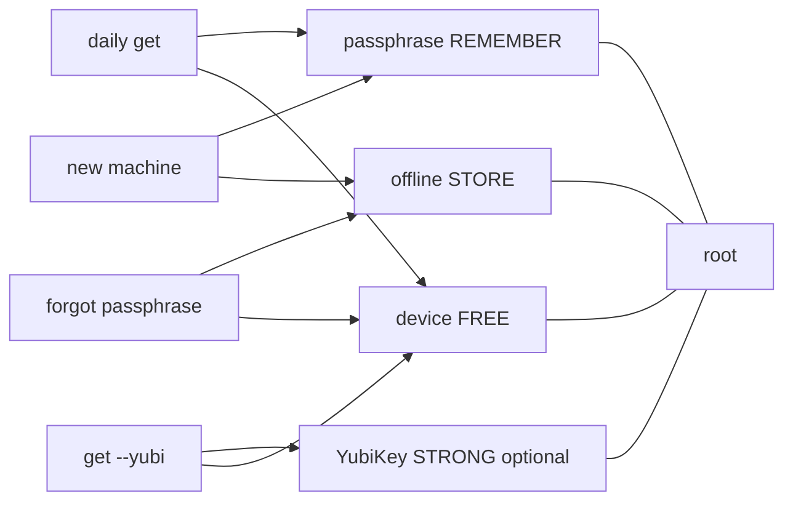

# Operator model — forgetfulness-proof (as far as crypto allows)

**Broader advice (API keys, multi-tool sprawl, runtime inject):** [Everyday secrets for developers](../../../docs/SECRETS-EVERYDAY.md).

## The one card (memorize this, nothing else)

| Slot | What | Where | If you lose it |
|------|------|-------|----------------|
| **REMEMBER** | **One** passphrase | Head or *one* password-manager entry | Use escrow or **YubiKey + device** |
| **STORE** | **One** escrow file | USB / paper QR / *other* house — **never only on this laptop** | Still unlock with passphrase on this machine |
| **FREE** | Device fingerprint | Automatic | New PC: need passphrase **and** escrow |
| **STRONG (optional)** | YubiKey HMAC-SHA1 slot | Hardware key you touch | Still need a *second* factor — **Yubi alone never opens** |

**There is no second secret. No knowledge question. No “healthy means open.”**  
**YubiKey is share release only** — it does not KDF the root by itself.

```text
any 2 of { passphrase, offline escrow, device [, yubikey if enrolled] }
```



---

## What “passphrase” actually is

- It **unwraps one Shamir share** (scrypt). It is **not** the root key by itself.
- The root lives only after **two** shares combine.
- We do **not** store your passphrase. We store a **scrypt wrap** of share #1 under the vault root (`passphrase.wrap` style blob). Steal the wrap → attacker still needs offline share **or** this machine’s device share.

---

## Why `status` healthy ≠ `get` open (and the fix)

| Old pain | Cause | Now |
|----------|-------|-----|
| recover → healthy, get still wants passphrase | “healthy” only meant *drill proven*; get always used passphrase path | **`get NAME --escrow file`** opens without passphrase |
| Two secrets forever | knowledge + passphrase both required | knowledge **removed** from default |
| k=3 always | needed 3 factors every time | **k=2 of 3** |

---

## Daily flow (normal)

```bash
export KEEPER_ROOT=~/.local/share/keeper   # or default
export KEEPER_PASSPHRASE='…'              # or KEEPER_PASSPHRASE_FILE
keeper put mfa --value '…'
keeper get mfa                            # passphrase + device
keeper status                             # healthy after one recover drill
```

## Strong path (optional YubiKey)

```bash
# once: rewrites escrow to n=4 (copy new escrow offline again)
export KEEPER_PASSPHRASE='…'
keeper enroll-yubikey --escrow /media/usb/keeper-escrow.json
# daily strong (touch key; no passphrase):
keeper get mfa --yubi
# CI/tests without hardware:
export KEEPER_YUBI_MOCK_SECRET='test-only-seed'
# prove solo hardware cannot open:
keeper yubi-probe
```

## Forgot passphrase (same machine)

```bash
keeper get mfa --escrow /media/usb/keeper-escrow.json
# store without passphrase (USB escrow + this device; never argv — use --file or loop prompts):
keeper put-escrow mfa --escrow /media/usb/keeper-escrow.json --file /path/to/600-file
# or loop: put-escrow mfa
# or prove drill:
keeper recover --escrow /media/usb/keeper-escrow.json
# or if Yubi enrolled: get mfa --yubi  (Yubi + device)
```

## Partial loss matrix (honest)

| You still have | You can |
|----------------|---------|
| P + D | daily unlock |
| O + D | unlock without P (same machine) |
| P + O | unlock on new machine (vault files + escrow) |
| Only P | **no** (device or escrow required) |
| Only O | **no** |
| Only D | **no** (stolen laptop alone must not open vault) |
| Nothing | **dead** — crypto cannot invent a key from vacuum |

**Forgetfulness-proof** here means: *you may forget the passphrase* if escrow is safe offline; *you may lose the USB* if you still know the passphrase on this machine; *you may not forget both and lose the machine*.

That is the real bound. Anything claiming “remember nothing, store nothing, survive everything” is lying or shipping the key to a cloud vendor (different threat model).

---

## Anti-PIASS rules we keep

1. **One** human secret.  
2. **One** offline artifact.  
3. Device free.  
4. Public IP / GeoIP never a factor.  
5. No secrets on CLI argv (prefer `keeper loop` / non-echo prompts / `--file`).  
6. Disk cannot lower k below 2.  
7. `healthy` only means recover drill worked once — not an open session.

---

## Preferred UX: interactive loop

```bash
keeper loop --practice   # first time
keeper                   # onboard or menu; secrets via prompts only
```

Passphrase and secret values are read with **non-echo** prompts. They never need to sit in shell history. Env/`KEEPER_PASSPHRASE_FILE` remain for automation only.

---

## Init checklist (once)

1. Prefer `keeper loop` (prompts for passphrase) **or** `export KEEPER_PASSPHRASE=…` / passphrase file.  
2. `keeper init --escrow /run/media/$USER/USB/keeper-escrow.json` (USB path, not only Desktop).  
3. **Copy escrow off the machine** (second offline place).  
4. `keeper put …` (prompt or `--file`, not `--value`).  
5. `keeper recover --escrow /media/usb/…` once → healthy.  
6. Daily: only passphrase for `get`/`put` (or Yubi strong path).  
7. Reimage / new PC: restore vault files → `keeper rebind --escrow …` → copy new escrow → `recover` once.
